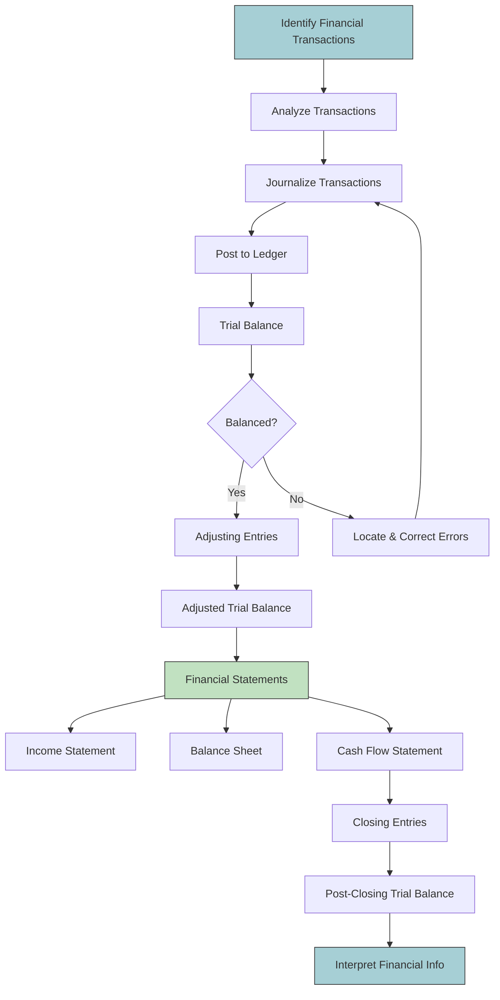

The **main books of account** are essential records used in accounting to systematically document financial transactions. These books form the foundation for preparing financial statements and help ensure accuracy, transparency, and accountability in financial reporting.

Here are the **main books of account**, their **purposes**, and the types of **entries** they contain:

---

### 1. **Journal (Book of Original Entry)**
- **Purpose**: To record all financial transactions in chronological order as and when they occur.
- **Contains**:
  - Date of transaction
  - Accounts involved (debit and credit)
  - Amounts of each debit and credit
  - A brief description/narration of the transaction

> This is the first book where transactions are recorded using **double-entry bookkeeping** principles.

#### Types of Journals:
- **General Journal**: For non-routine or adjusting entries (e.g., depreciation, accruals).
- **Special Journals**: Used for frequent, repetitive transactions:
  - Sales Journal: Credit sales
  - Purchases Journal: Credit purchases
  - Cash Receipts Journal: All cash received
  - Cash Payments/Disbursements Journal: All cash paid

---

### 2. **Ledger (Book of Final Entry)**
- **Purpose**: To classify and summarize all journal entries under individual accounts.
- **Contains**:
  - Individual accounts (e.g., Cash, Accounts Receivable, Sales, etc.)
  - Each account shows all debits and credits affecting it
  - Running balances for each account

> The **ledger** organizes transactions into categories (assets, liabilities, equity, revenue, expenses), making it easier to prepare financial statements.

---

### 3. **Cash Book**
- **Purpose**: To record all **cash receipts and payments** (including bank transactions).
- **Contains**:
  - Date of transaction
  - Particulars (description of transaction)
  - Amounts received (debit side) or paid (credit side)
  - Balance carried forward

> The Cash Book serves both as a **journal** and a **ledger account** (usually part of the ledger). It can be:
- Simple Cash Book (single column)
- Two-column Cash Book (cash and bank)
- Three-column Cash Book (cash, bank, and discount)

---

### 4. **Purchases Book (Purchases Journal)**
- **Purpose**: To record all **credit purchases of goods** made by the business.
- **Contains**:
  - Date of purchase
  - Name of supplier
  - Invoice number
  - Amount
  - Account credited (usually Accounts Payable)

> Cash purchases are not recorded here; they go into the Cash Book.

---

### 5. **Sales Book (Sales Journal)**
- **Purpose**: To record all **credit sales of goods** made by the business.
- **Contains**:
  - Date of sale
  - Customer name
  - Invoice number
  - Amount
  - Account debited (usually Accounts Receivable)

> Cash sales are recorded in the Cash Book, not in the Sales Book.

---

### 6. **Returns Inwards Book (Sales Returns Book)**
- **Purpose**: To record goods returned **to the business** by customers (i.e., returns from credit sales).
- **Contains**:
  - Date of return
  - Customer name
  - Details of goods returned
  - Amount
  - Account debited (usually Sales Returns or Contra Revenue)

> Reduces sales previously recorded in the Sales Book.

---

### 7. **Returns Outwards Book (Purchases Returns Book)**
- **Purpose**: To record goods returned **by the business** to suppliers (i.e., returns on credit purchases).
- **Contains**:
  - Date of return
  - Supplier name
  - Details of goods returned
  - Amount
  - Account credited (usually Purchase Returns or Contra Expense)

> Reduces purchases previously recorded in the Purchases Book.

---

### 8. **Bill Receivable Book**
- **Purpose**: To record bills of exchange **received** from debtors (customers).
- **Contains**:
  - Date of bill receipt
  - Debtor's name
  - Due date of bill
  - Amount
  - Maturity date

> Useful for tracking receivables that are formalized through bills.

---

### 9. **Bill Payable Book**
- **Purpose**: To record bills of exchange **accepted** by the business in favor of creditors (suppliers).
- **Contains**:
  - Date of bill acceptance
  - Creditor's name
  - Due date of bill
  - Amount
  - Liability details

> Tracks obligations backed by bills of exchange.

---

### Summary Table:

| Book of Account           | Purpose                                | Type of Entries Recorded                     |
|---------------------------|----------------------------------------|----------------------------------------------|
| Journal                   | Record transactions chronologically    | All transactions initially recorded here     |
| Ledger                    | Classify journal entries by account    | Debits and credits per account               |
| Cash Book                 | Record cash receipts & payments        | Cash/Bank receipts and disbursements         |
| Purchases Book            | Record credit purchases                | Goods bought on credit                       |
| Sales Book                | Record credit sales                    | Goods sold on credit                         |
| Returns Inwards Book      | Record goods returned by customers     | Sales returns (from credit sales)            |
| Returns Outwards Book     | Record goods returned to suppliers     | Purchase returns (on credit purchases)       |
| Bills Receivable Book     | Track bills received from debtors      | Formal receivables via bills of exchange     |
| Bills Payable Book        | Track bills accepted to creditors      | Formal payables via bills of exchange        |

---

These books together ensure that an organization maintains a clear, organized, and auditable trail of all financial activities. Depending on the size and complexity of the business, some companies may consolidate or automate these processes using accounting software (like QuickBooks, Xero, Tally, etc.), but the underlying structure remains the same.
