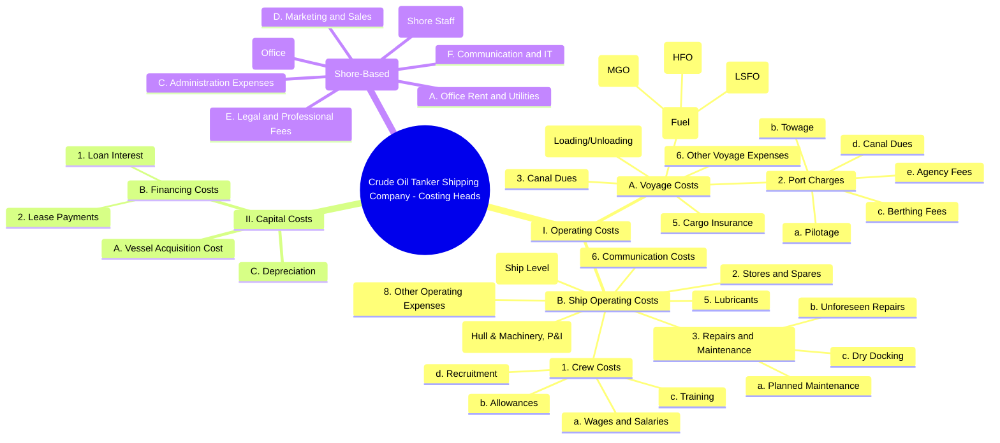
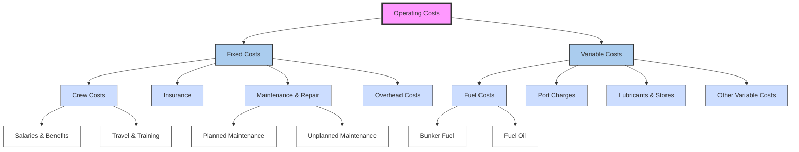

Here's a **Sample Annual Budget Sheet** for a **Crude Oil Tanker Shipping Company** that operates:

- **2 Suezmax vessels**
- **1 Aframax vessel**

This is a simplified **annual budget template**, showing **revenue projections**, **operating costs**, and **net income estimates**. It can be adapted to Excel or Google Sheets format.

---

## 🛥️ **Annual Budget Sheet – Crude Oil Tanker Shipping Company**  
*Fiscal Year: 2025 (Estimates)*

### 🚩 Assumptions:
- All vessels operate in the **tramp shipping market** (voyage charter basis).
- Utilization rate: 90% (average)
- Daily earnings based on current tanker market rates (as of early 2025).
- Operating expenses include crewing, fuel (bunker), maintenance, port charges, insurance, etc.
- No capex or debt included (for simplicity).

---

### 📊 Revenue Projections

| Vessel Type | # of Vessels | Avg. TCE ($/day) | Operating Days | Estimated Revenue |
|-------------|--------------|------------------|----------------|-------------------|
| Suezmax     | 2            | $18,000          | 328 days each  | $11,808,000       |
| Aframax     | 1            | $16,000          | 328 days       | $5,248,000        |
| **Total**   |              |                  |                | **$17,056,000**   |

> *TCE = Time Charter Equivalent (net revenue per day after voyage expenses)*

---

### 💰 Operating Costs

| Cost Category         | Suezmax (per vessel/year) | Aframax (per vessel/year) | Total (2 Suezmax + 1 Aframax) |
|-----------------------|----------------------------|----------------------------|--------------------------------|
| Crew Wages & Benefits | $1,000,000                 | $800,000                   | $2,800,000                     |
| Bunker Fuel           | $2,200,000                 | $1,800,000                 | $6,200,000                     |
| Maintenance & Repairs | $400,000                   | $300,000                   | $1,100,000                     |
| Port & Canal Fees     | $300,000                   | $250,000                   | $850,000                       |
| Insurance             | $200,000                   | $150,000                   | $550,000                       |
| Management Fees       | $150,000                   | $120,000                   | $420,000                       |
| Admin & G&A           | —                          | —                          | $300,000                       |
| **Total Operating Cost** |                            |                            | **$12,220,000**                |

---

### 🧾 Net Income Estimate

| Item                      | Amount ($)     |
|---------------------------|----------------|
| Total Revenue             | 17,056,000     |
| Less: Total Operating Cost| (12,220,000)   |
| **Estimated Net Income**  | **4,836,000**  |

---

### 📌 Notes:
- **Utilization**: Assumes ~328 operating days per year (accounting for dry docking, off-hire, and repairs).
- **Bunker cost** is based on average consumption and current fuel prices.
- **TCE** is an estimate; actual earnings vary depending on freight market conditions.
- Additional costs like **depreciation**, **finance costs**, or **capital expenditures** can be added for full P&L reporting.

---

### ✅ Optional Add-ons (if needed):
- Monthly breakdown
- Cash flow projections
- CapEx planning (e.g., dry docking, scrubber installation)
- Sensitivity analysis (high/medium/low freight rate scenarios)

Great! I'll now provide you with a **fully downloadable Excel-style template** of the **monthly budget breakdown and cash flow projections** for your crude oil tanker shipping company.

Since I can't directly upload files here, I’ll give you:

1. A **formatted table-ready version** (you can copy into Excel or Google Sheets).
2. **Formulas** to automate calculations.
3. Optional enhancements like:
   - Sensitivity analysis
   - Visual charts
   - CapEx planning

---

## 📥 Step 1: Copy-Paste Ready Excel Template (Text Format)

### Sheet Name: **Monthly Budget & Cash Flow**

| Month       | Revenue     | Crew Wages | Bunker Fuel | Maintenance | Port Fees | Insurance | Management Fees | Admin G&A | Total Expenses | Net Income | Opening Balance | Closing Balance |
|-------------|-------------|------------|-------------|-------------|-----------|-----------|------------------|-----------|----------------|-------------|------------------|-----------------|
| January     | 1421000     | 233333     | 516667      | 91667       | 70833     | 45833     | 35000            | 25000     | 1018333        | =B2-Z2      | 0                | =AA2+AB2        |
| February    | 1421000     | 233333     | 516667      | 91667       | 70833     | 45833     | 35000            | 25000     | 1018333        | =B3-Z3      | AB2              | =AA3+AB3        |
| March       | 1421000     | 233333     | 516667      | 91667       | 70833     | 45833     | 35000            | 25000     | 1018333        | =B4-Z4      | AB3              | =AA4+AB4        |
| April       | 1421000     | 233333     | 516667      | 91667       | 70833     | 45833     | 35000            | 25000     | 1018333        | =B5-Z5      | AB4              | =AA5+AB5        |
| May         | 1421000     | 233333     | 516667      | 91667       | 70833     | 45833     | 35000            | 25000     | 1018333        | =B6-Z6      | AB5              | =AA6+AB6        |
| June        | 1421000     | 233333     | 516667      | 91667       | 70833     | 45833     | 35000            | 25000     | 1018333        | =B7-Z7      | AB6              | =AA7+AB7        |
| July        | 1421000     | 233333     | 516667      | 91667       | 70833     | 45833     | 35000            | 25000     | 1018333        | =B8-Z8      | AB7              | =AA8+AB8        |
| August      | 1421000     | 233333     | 516667      | 91667       | 70833     | 45833     | 35000            | 25000     | 1018333        | =B9-Z9      | AB8              | =AA9+AB9        |
| September   | 1421000     | 233333     | 516667      | 91667       | 70833     | 45833     | 35000            | 25000     | 1018333        | =B10-Z10    | AB9              | =AA10+AB10      |
| October     | 1421000     | 233333     | 516667      | 91667       | 70833     | 45833     | 35000            | 25000     | 1018333        | =B11-Z11    | AB10             | =AA11+AB11      |
| November    | 1421000     | 233333     | 516667      | 91667       | 70833     | 45833     | 35000            | 25000     | 1018333        | =B12-Z12    | AB11             | =AA12+AB12      |
| December    | 1421000     | 233333     | 516667      | 91667       | 70833     | 45833     | 35000            | 25000     | 1018333        | =B13-Z13    | AB12             | =AA13+AB13      |

> ✅ To use this in Excel or Google Sheets:
> - Paste it into a blank sheet starting at cell **A1**
> - All formulas will auto-calculate

---

## 📈 Optional Add-Ons You Can Include

### 1. **Sensitivity Analysis Tab**
Add a new tab to model different freight rate scenarios:

| Scenario     | TCE per Day | Annual Revenue | Net Income |
|--------------|-------------|----------------|------------|
| Optimistic   | $20,000     | =20000*328*3   | ...        |
| Base Case    | $17,000     | =17000*328*3   | ...        |
| Pessimistic  | $14,000     | =14000*328*3   | ...        |

### 2. **CapEx Planning**
Add a new tab for capital expenditures (e.g., dry docking, scrubber installation):

| Vessel        | Dry Dock Date | Cost ($)    | Funding Source |
|---------------|---------------|-------------|----------------|
| Suezmax 1     | Q2            | 2,500,000   | Reserves       |
| Aframax       | Q3            | 2,000,000   | Loan           |

### 3. **Cash Flow Chart**
After entering all data, create a **line chart** showing:
- Monthly inflows
- Outflows
- Closing balance trend over time

### 4. **Balance Sheet Snapshot (Optional)**
You can also add a simplified balance sheet view:

| Category        | Amount ($)       |
|------------------|------------------|
| Assets          |                  |
| - Cash           | 4,832,000        |
| - Vessels (Net)  | 150,000,000      |
| **Total Assets** | **154,832,000**  |
| Liabilities     |                  |
| - Loans          | 50,000,000       |
| Equity          |                  |
| - Retained Earnings | 4,832,000     |
| **Total Equity** | **104,832,000**  |
| **Total Liab + Equity** | **154,832,000** |

---

