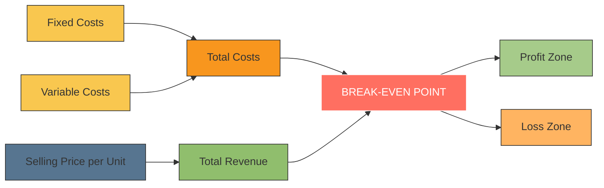
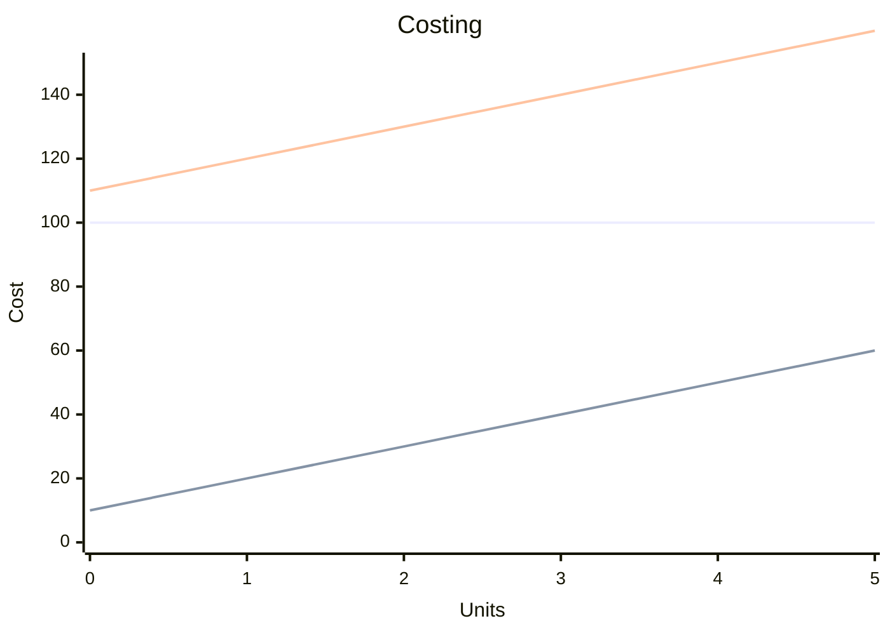

A firm reaches the **break-even point (BEP)** when its **total revenues equal total costs**, meaning it is neither making a profit nor incurring a loss.

---

## 🎯 **Definition: Break-Even Point (BEP)**

> The **break-even point** is the level of output or sales at which a business's **total revenue equals total costs** (fixed + variable). At this point, the firm covers all its expenses but earns **zero profit**.

---

## 📈 When Does a Firm Reach Break-Even Point?

A firm reaches break-even when:

$$
\textbf{Total Revenue} = \textbf{Total Costs}
$$

Where:
- **Total Revenue** = Selling price per unit × Number of units sold  
- **Total Costs** = Fixed Costs + Variable Costs

---

## 🔢 How to Calculate Break-Even Point

There are two common ways to calculate the break-even point:

### 1. **Break-Even Quantity (Units)**
$$
\text{Break-Even Quantity} = \frac{\text{Fixed Costs}}{\text{Selling Price per Unit} - \text{Variable Cost per Unit}}
$$

This tells you how many units must be sold to cover all costs.

---

### 2. **Break-Even Sales (Monetary Value)**
$$
\text{Break-Even Sales} = \frac{\text{Fixed Costs}}{\text{Contribution Margin Ratio}}
$$
Where:
- Contribution Margin Ratio = $\frac{\text{Contribution per Unit}}{\text{Selling Price per Unit}}$

This gives the amount of revenue needed to reach break-even.

---

## 🧮 Example:

Let’s say:
- Fixed Costs = ₹50,000/month
- Variable Cost per Unit = ₹10
- Selling Price per Unit = ₹25

### Step 1: Contribution per Unit
$$
₹25 - ₹10 = ₹15
$$

### Step 2: Break-Even Quantity
$$
\frac{₹50,000}{₹15} ≈ 3,333 \text{ units}
$$

So, the firm must sell **3,333 units** per month to **break even**.

---

## 📊 Graphical Representation (Break-Even Chart)

You can visualize the break-even point on a graph where:
- X-axis = Units Sold
- Y-axis = Amount (Revenue / Cost)
- Two lines intersect:
  - **Total Revenue Line**
  - **Total Cost Line**

The **point of intersection** is the **break-even point**.

---

## 🧩 Components Involved in Break-Even Analysis:

| Term | Description |
|------|-------------|
| **Fixed Costs** | Costs that do not change with output (e.g., rent, salaries) |
| **Variable Costs** | Costs that vary directly with output (e.g., raw materials) |
| **Selling Price** | Price per unit charged to customers |
| **Contribution Margin** | Selling price per unit minus variable cost per unit |

---

## ✅ Importance of Break-Even Point

| Use | Explanation |
|-----|-------------|
| **Pricing Decisions** | Helps determine optimal selling price |
| **Profit Planning** | Shows how many units need to be sold to start earning profit |
| **Cost Control** | Highlights impact of fixed and variable costs |
| **Risk Assessment** | Indicates how much sales can fall before losses occur |
| **Investment Decisions** | Useful for evaluating new products or projects |

---

## ⚠️ Limitations of Break-Even Analysis

- Assumes fixed and variable costs remain constant (not always true)
- Only applicable to one product or a constant mix of products
- Ignores changes in market demand and external factors
- Based on estimates, so may not reflect real-world complexity

---

## 📌 Summary

| Factor | Description |
|--------|-------------|
| **What is BEP?** | Point where Total Revenue = Total Cost |
| **Why important?** | Determines minimum sales to avoid losses |
| **How calculated?** | Using fixed costs, variable costs, and selling price |
| **Used in** | Pricing, budgeting, decision-making |

---

