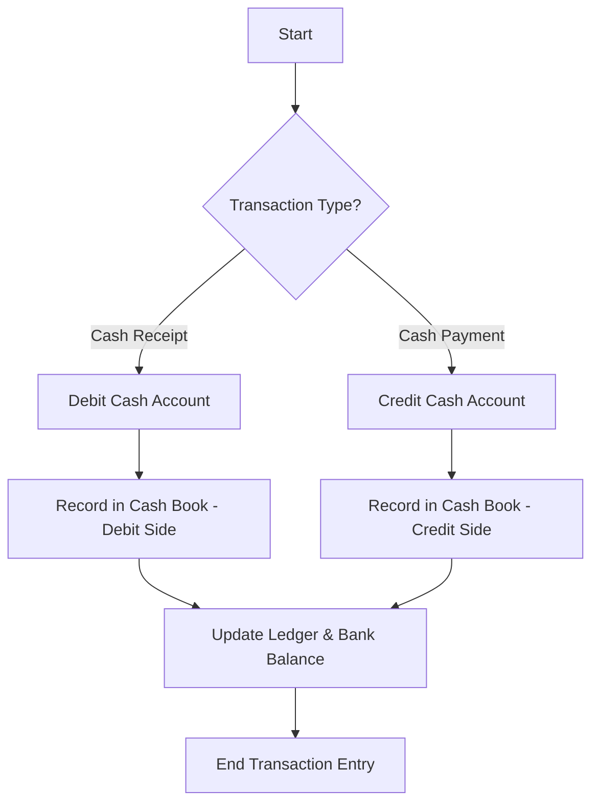

A **Cash Book** is a fundamental accounting record, and its importance in the accounting system cannot be overstated. Here are the key reasons why it is **necessary to have a Cash Book**:

---

### ✅ 1. **Records All Cash Transactions**
- The Cash Book serves as a **primary record** for all **cash receipts and payments**, including both physical cash and bank transactions.
- It ensures that every inflow and outflow of cash is systematically recorded.

---

### ✅ 2. **Acts as Both a Journal and a Ledger**
- Unlike other books of account, the Cash Book functions as:
  - A **journal** – because entries are made in chronological order.
  - A **ledger account** – because it shows balances just like a ledger (e.g., cash or bank balance).
- This dual function reduces the need for separate entries in the journal and ledger for cash-related transactions.

---

### ✅ 3. **Provides Up-to-Date Cash Position**
- The Cash Book gives a **real-time view** of how much cash is available with the business.
- Helps in managing day-to-day expenses and prevents cash shortages or mismanagement.

---

### ✅ 4. **Helps in Bank Reconciliation**
- Since most businesses use bank accounts for transactions, the Cash Book often includes a **bank column**.
- This makes it easier to compare with the **bank statement** and perform **bank reconciliation** to detect discrepancies or errors.

---

### ✅ 5. **Supports Internal Control and Fraud Prevention**
- Recording all cash transactions in one place improves **transparency** and accountability.
- Makes it easier to trace unauthorized or incorrect payments, thus helping in **fraud detection and prevention**.

---

### ✅ 6. **Facilitates Quick Reference**
- Because cash transactions are frequent, having them in a dedicated book allows for **quick access** and reference without going through multiple ledgers or journals.

---

### ✅ 7. **Basis for Financial Statements**
- Accurate cash records contribute to reliable financial reporting.
- Cash flow information from the Cash Book helps in preparing the **Statement of Cash Flows**.

---

### ✅ 8. **Useful for Small Businesses**
- Especially in small businesses that rely heavily on cash transactions, the Cash Book is often the **only formal accounting record** used.
- It simplifies the accounting process and may even eliminate the need for a full double-entry system.

---

### 🧾 Types of Cash Books:
To suit different business needs, Cash Books come in various formats:
- **Simple Cash Book**: One column for cash.
- **Two-Column Cash Book**: Cash and bank columns.
- **Three-Column Cash Book**: Cash, bank, and discount columns.
- **Petty Cash Book**: For recording small, routine expenses.

---

### 📌 Summary

| Purpose | Why It Matters |
|--------|----------------|
| Records cash inflows/outflows | Tracks liquidity |
| Dual function (journal + ledger) | Saves time and effort |
| Shows real-time cash position | Supports financial decisions |
| Enables bank reconciliation | Ensures accuracy |
| Prevents fraud | Improves internal control |
| Simplifies accounting | Especially useful for small businesses |

---

### 💡 Conclusion:
The Cash Book is essential because it provides an organized, transparent, and timely record of all cash activities — which is crucial for effective financial management, decision-making, and maintaining accurate accounting records.

