```mermaid
graph TD
    A[Classification of Costs] --> B[By Nature]
    A --> C[By Function]
    A --> D[By Behavior]
    A --> E[By Controllability]
    A --> F[By Normality]
    A --> G[By Relevance to Decision-Making]
    A --> H[By Inventory Treatment]
    A --> I[Other Classifications]

    %% By Nature
    B --> B1[Materials]
    B --> B2[Labour]
    B --> B3[Expenses]

    %% By Function
    C --> C1[Production Cost]
    C --> C2[Administration Cost]
    C --> C3[Selling & Distribution Cost]
    C --> C4[R&D Cost]
    C --> C5[Finance Cost]

    %% By Behavior
    D --> D1[Fixed Cost]
    D --> D2[Variable Cost]
    D --> D3[Semi-Variable Cost]

    %% By Controllability
    E --> E1[Controllable Cost]
    E --> E2[Uncontrollable Cost]

    %% By Normality
    F --> F1[Normal Cost]
    F --> F2[Abnormal Cost]

    %% By Relevance
    G --> G1[Opportunity Cost]
    G --> G2[Sunk Cost]
    G --> G3[Incremental/Differential Cost]
    G --> G4[Avoidable Cost]
    G --> G5[Joint Cost]

    %% By Inventory Treatment
    H --> H1[Product Cost]
    H --> H2[Period Cost]

    %% Other Classifications
    I --> I1[Direct vs Indirect Cost]
    I --> I2[Standard vs Actual Cost]
    I --> I3[Marginal Cost]
    I --> I4[Imputed Cost]

    style A fill:#4CAF50,stroke:#fff,color:#fff
    style B fill:#2196F3,stroke:#fff,color:#fff
    style C fill:#2196F3,stroke:#fff,color:#fff
    style D fill:#2196F3,stroke:#fff,color:#fff
    style E fill:#2196F3,stroke:#fff,color:#fff
    style F fill:#2196F3,stroke:#fff,color:#fff
    style G fill:#2196F3,stroke:#fff,color:#fff
    style H fill:#2196F3,stroke:#fff,color:#fff
    style I fill:#2196F3,stroke:#fff,color:#fff
```

Costs can be classified in **multiple ways**, depending on the purpose of classification — such as **cost control, decision-making, financial reporting, or performance evaluation**. Here are the most common **ways to classify costs** in accounting and management:

---

## 📚 1. **By Nature (Element)**
This classification groups costs based on what they are spent on.

### ✅ Types:
| Classification | Description | Example |
|----------------|-------------|---------|
| **Materials** | Cost of raw materials or components used in production | Steel, fabric, wood |
| **Labour** | Wages and salaries paid to employees | Factory workers, supervisors |
| **Expenses** | Other costs not related to materials or labour | Rent, utilities, insurance |

---

## 🧾 2. **By Function (in a business)**
This classification organizes costs based on the part of the business where they occur.

### ✅ Types:
| Classification | Description | Example |
|----------------|-------------|---------|
| **Production/Manufacturing Cost** | Costs incurred during manufacturing | Direct materials, factory rent |
| **Administration Cost** | Costs related to general management | Office salaries, admin staff |
| **Selling & Distribution Cost** | Costs incurred to sell and deliver goods | Advertising, transport, sales commission |
| **Research & Development (R&D)** | Costs for developing new products/services | Product testing, prototype development |
| **Finance Cost** | Interest and other finance-related expenses | Loan interest, bank charges |

---

## 🔁 3. **By Behavior (with changes in activity level)**
How costs behave when the volume of output or activity changes.

### ✅ Types:
| Classification | Description | Behavior |
|----------------|-------------|----------|
| **Fixed Cost** | Remains constant regardless of output | Rent, manager’s salary |
| **Variable Cost** | Changes directly with output level | Raw materials, direct wages |
| **Semi-variable / Mixed Cost** | Part fixed, part variable | Electricity bill (fixed line rent + usage charge) |

---

## 🎯 4. **By Controllability**
Used in cost management to determine who is responsible for controlling which costs.

### ✅ Types:
| Classification | Description | Example |
|----------------|-------------|---------|
| **Controllable Costs** | Can be influenced by a manager’s decisions | Labour hours, material usage |
| **Uncontrollable Costs** | Cannot be directly controlled by a manager | Allocated head office costs |

---

## 🧩 5. **By Normality**
Refers to whether the cost is expected under normal operating conditions.

### ✅ Types:
| Classification | Description | Example |
|----------------|-------------|---------|
| **Normal Cost** | Expected and unavoidable cost at normal capacity | Regular factory overheads |
| **Abnormal Cost** | Not normally incurred; due to inefficiencies | Idle time, spoilage, theft |

---

## 💡 6. **By Relevance to Decision-Making**
Used in managerial accounting for planning and decision-making.

### ✅ Types:
| Classification | Description | Use Case |
|----------------|-------------|----------|
| **Opportunity Cost** | Benefit foregone by choosing one option over another | Choosing to invest in A instead of B |
| **Sunk Cost** | Past cost that cannot be recovered | Already incurred R&D cost |
| **Incremental / Differential Cost** | Difference in cost between alternatives | Comparing two machines |
| **Avoidable Cost** | Can be eliminated if an activity is stopped | Advertising for a discontinued product |
| **Joint Cost** | Common cost incurred before split-off point | Cost incurred before separating joint products |

---

## 🏗 7. **By Inventory Treatment**
Used in financial accounting to determine how costs are treated in inventory valuation.

### ✅ Types:
| Classification | Description | Treated As |
|----------------|-------------|------------|
| **Product Cost** | Directly related to producing goods | Included in inventory value (asset) |
| **Period Cost** | Not tied to production | Expensed in the period incurred (e.g., selling expense) |

---

## 🧮 8. **Other Classifications**
These are more specialized classifications used in specific contexts.

| Classification | Description |
|----------------|-------------|
| **Direct vs Indirect Costs** | - **Direct**: Traceable to a specific product or department (e.g., direct materials)  - **Indirect**: Shared across multiple products (e.g., factory overhead) |
| **Standard Cost** | Pre-determined estimated cost used for budgeting and variance analysis |
| **Actual Cost** | Real cost incurred during production |
| **Marginal Cost** | Additional cost of producing one more unit |
| **Imputed Cost** | Notional cost not involving actual cash outflow (e.g., owner's salary if working in own business) |

---

## 📌 Summary Table

| Classification Basis | Main Categories |
|----------------------|-----------------|
| By Nature | Materials, Labour, Expenses |
| By Function | Production, Administration, Selling, R&D, Finance |
| By Behavior | Fixed, Variable, Semi-variable |
| By Controllability | Controllable, Uncontrollable |
| By Normality | Normal, Abnormal |
| By Relevance | Opportunity, Sunk, Incremental, Avoidable, Joint |
| By Inventory Treatment | Product, Period |
| Others | Direct/Indirect, Standard, Actual, Marginal, Imputed |

---

