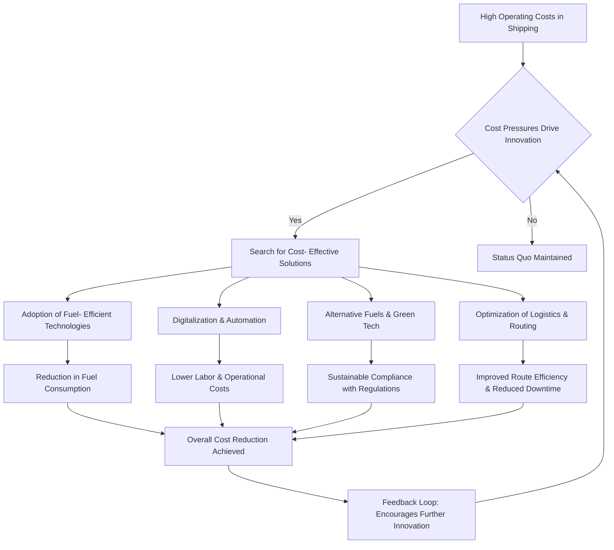

Cost has undeniably been a powerful and often dominant factor driving innovation and technological development across various aspects of the shipping industry.1 The inherent nature of shipping, operating on tight margins and facing intense global competition, necessitates a constant pursuit of efficiency and cost reduction. This pursuit manifests in various technological advancements aimed at optimizing resource utilization, streamlining processes, and ultimately lowering the overall cost per unit of cargo transported. However, while cost is a significant driver, it is not the only factor.2 Regulatory pressures (environmental and safety), market demands (speed, reliability), and geopolitical influences also play crucial roles.
Here's a discussion with examples of how cost has influenced innovations and technological developments in the specified areas:
### (a) Cargo Handling:
Cost has been a primary motivator for numerous innovations in cargo handling, aiming to reduce labor costs, minimize turnaround time in ports (thereby reducing port fees and vessel idle time), and prevent damage to cargo (reducing insurance claims).3
- Containerization: This is perhaps the most transformative innovation driven by cost efficiency.4 Standardized containers drastically reduced the time and labor required for loading and unloading break- bulk cargo. Specialized container cranes, straddle carriers, and automated stacking systems further optimized port operations, lowering handling costs per ton significantly.
- Bulk Handling Automation: For commodities like coal, iron ore, and grains, automated conveyor systems, ship loaders, and unloaders have replaced manual labor, leading to faster loading/unloading rates and reduced manpower costs. Examples include continuous screw conveyors and grab unloaders with sophisticated control systems.
- Ro- Ro (Roll- on/Roll- off) Technology: Designed to handle wheeled cargo like vehicles and trailers, Ro- Ro vessels and specialized ramps significantly reduce loading and unloading time compared to lifting individual units.5 This minimizes port stay duration and associated costs.
- Automated Guided Vehicles (AGVs) in Ports: The increasing adoption of AGVs in container terminals aims to reduce labor costs, improve efficiency, and enhance safety in yard operations.6 These driverless vehicles transport containers between the quayside and storage areas.
- Digitalization and IoT in Cargo Tracking: Real- time tracking of cargo using sensors, RFID tags, and IoT platforms improves visibility, reduces losses due to damage or misplacement, and optimizes inventory management, all contributing to lower overall costs.7
Extent of Truth: Cost has been a very dominant factor in cargo handling innovations. The direct link between faster turnaround times, reduced labor, and lower damage rates to significant cost savings makes it a compelling driver.8 However, safety regulations and the need to handle increasingly diverse and specialized cargo types also influence the design and implementation of these technologies.
### (b) Speed of the Ship:
The relationship between the speed of a ship and cost is complex. While higher speed can lead to faster transit times and potentially more voyages per year (increasing revenue), it also significantly increases fuel consumption, which is a major operational cost. Innovations in ship speed have been heavily influenced by the trade- off between these factors.
- Hull Design Optimization: Streamlined hull forms, bulbous bows, and improved hull coatings (anti- fouling) have been developed to reduce drag and improve fuel efficiency at higher speeds. Computational Fluid Dynamics (CFD) plays a crucial role in optimizing hull designs for specific operating speeds.9
- Engine Technology: The development of more powerful and fuel- efficient marine diesel engines has enabled ships to achieve higher speeds without proportionally increasing fuel consumption.10 Innovations include common rail injection systems and turbocharging technologies.
- Alternative Fuels: The pursuit of lower- cost and environmentally friendly fuels like LNG, methanol, and ammonia is indirectly linked to speed. While not directly increasing speed, their adoption aims to reduce fuel costs in the long run, potentially making higher speeds more economically viable in the future, especially if regulations on conventional fuels become stricter and more expensive.
- Route Optimization: Sophisticated weather routing software and real- time data analysis help ships choose optimal routes that minimize resistance from waves and currents, allowing them to maintain desired speeds with lower fuel consumption.11
Extent of Truth: Cost is a significant factor, but the influence on ship speed is nuanced. The balance between the potential revenue gains from faster transit and the increased fuel costs is constantly evaluated. Market demands for faster delivery times (especially for containerized goods) and the cost of capital tied up during longer voyages also play a role. Environmental regulations aimed at reducing emissions are increasingly influencing ship design and operating speeds, sometimes even leading to "slow steaming" as a cost- saving and emission- reducing strategy.12
### (c) Navigation:
Innovations in navigation have been driven by the need to improve safety (reducing the risk of collisions and groundings, which can be incredibly costly), enhance efficiency (optimizing routes and arrival times, saving fuel), and reduce crew workload (lowering personnel costs).13
- GPS and Electronic Chart Display and Information Systems (ECDIS): These technologies have revolutionized navigation, providing precise vessel positioning and real- time chart information.14 They reduce reliance on manual plotting and the risk of human error, leading to safer and more efficient voyages, ultimately saving costs associated with accidents and delays.15
- Automatic Identification System (AIS): AIS enhances situational awareness by broadcasting and receiving information about nearby vessels.16 This helps prevent collisions, reducing potential damage and insurance costs.
- Radar and Sonar Technology: Advanced radar systems with features like Automatic Radar Plotting Aids (ARPA) and sonar systems aid in collision avoidance and navigation in restricted waters or poor visibility, minimizing the risk of costly accidents.17
- Integrated Bridge Systems (IBS): IBS consolidates various navigation and control functions into a single workstation, improving efficiency and reducing the number of personnel required on the bridge.18
- Autonomous Shipping Technology: The development of autonomous vessels aims to further reduce crew costs and potentially optimize fuel consumption through AI- powered route planning and ship control.19 While still in its early stages, cost reduction is a significant long- term driver.
Extent of Truth: Cost is a major driver in navigational innovations, particularly concerning safety and efficiency. Accidents and delays can be incredibly expensive, making investments in advanced navigation technology justifiable. The potential for reduced crew costs with autonomous systems is also a significant long- term economic incentive.20 Regulatory requirements for certain navigational equipment also play a crucial role alongside cost considerations.
### (d) Design of Ship:
Cost permeates every aspect of ship design, from the initial hull form to the selection of materials and onboard systems. The goal is to build a vessel that is efficient to operate, maintain, and has a long lifespan, thereby minimizing the total cost of ownership.
- Fuel- Efficient Hull Designs: As mentioned earlier, hydrodynamic optimization using CFD is crucial in designing hulls that minimize resistance and reduce fuel consumption over the vessel's lifetime, representing a significant cost saving.21
- Lightweight Materials: The use of lighter materials like high- strength steel and composites can reduce the vessel's weight, leading to lower fuel consumption and potentially increased cargo capacity, both impacting operational costs and revenue.22
- Modular Construction: Building ships in modular sections can reduce construction time and costs in shipyards.23 Faster build times translate to earlier revenue generation.
- Energy- Efficient Systems: Innovations in onboard systems like waste heat recovery, efficient lighting (LEDs), and optimized HVAC (heating, ventilation, and air conditioning) systems aim to reduce energy consumption and lower operating costs.24
- Lifecycle Cost Analysis: Ship designers increasingly employ lifecycle cost analysis to consider not just the initial building cost but also the long- term operating, maintenance, and eventual scrapping costs, ensuring a cost- effective overall design.
- Standardization: Where possible, standardizing ship designs and components can lead to economies of scale in shipbuilding and reduced maintenance costs due to readily available spare parts and familiar systems.25
Extent of Truth: Cost is arguably the most pervasive factor in ship design. Every decision, from the overall dimensions and hull form to the selection of onboard equipment, is heavily influenced by its impact on the total cost of ownership. While regulatory requirements (e.g., safety and environmental standards) dictate certain design features, the industry constantly seeks cost- effective ways to meet these regulations and optimize vessel performance from an economic standpoint.
Conclusion:
Cost has been a dominant and pervasive force driving innovation and technological development across cargo handling, ship speed, navigation, and ship design within the shipping industry. The intense competitive pressure and the significant operational expenses, particularly fuel and labor, necessitate a constant focus on efficiency and cost reduction.26 However, it is crucial to recognize that cost is not the sole determinant. Regulatory frameworks, safety concerns, environmental sustainability goals, and market demands for speed and reliability also exert considerable influence. Often, these factors are intertwined with cost considerations, as compliance with regulations or meeting market demands can also have significant cost implications. Therefore, while cost is a powerful engine of innovation in shipping, it operates within a complex web of other crucial drivers.

