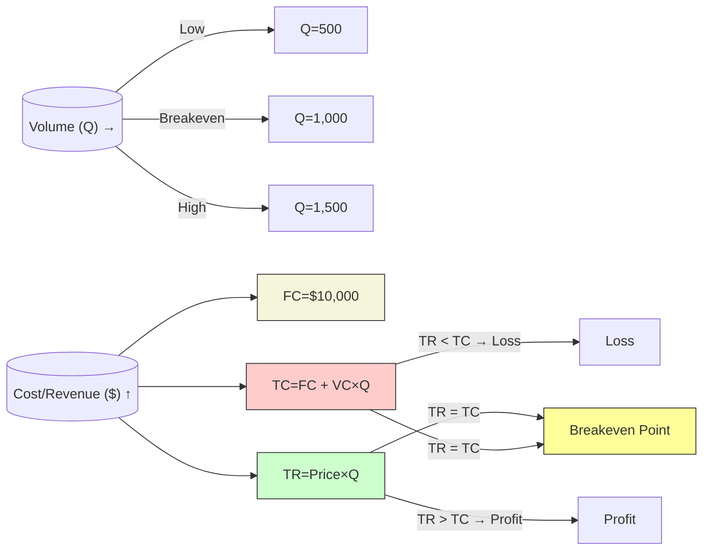
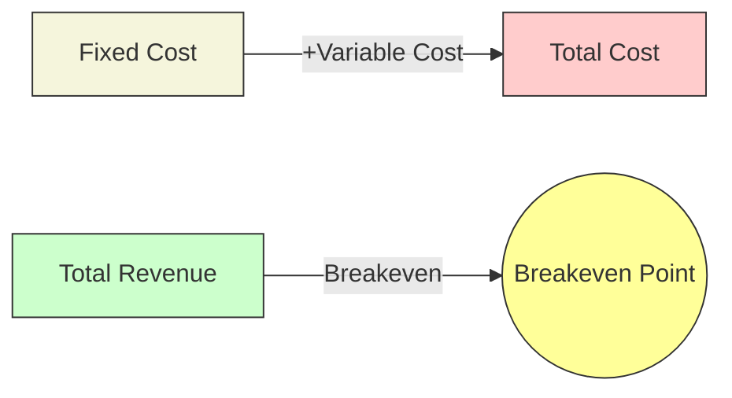

### **Simple Costing: Fixed vs. Variable Costs, Breakeven Point, and Profit Analysis**  

Understanding **fixed costs, variable costs, breakeven point, and profit** is crucial for pricing decisions and financial planning. Below is a breakdown with **formulas, examples, and graphs**.

---

## **1. Fixed Costs vs. Variable Costs**  
| **Cost Type** | **Definition** | **Examples** |  
|--------------|--------------|-------------|  
| **Fixed Costs (FC)** | Costs that **do not change** with production volume. | Rent, salaries, insurance, depreciation. |  
| **Variable Costs (VC)** | Costs that **vary directly** with production volume. | Raw materials, labor per unit, packaging. |  

### **Total Cost (TC) Formula**  
$$
TC = FC + (VC \times Q)
$$  
- **\(Q\)** = Quantity produced/sold  
- **\(VC\)** = Variable cost per unit  

---

## **2. Breakeven Point (BEP)**  
The **breakeven point** is where **Total Revenue (TR) = Total Cost (TC)**, meaning **no profit or loss**.  

### **Breakeven Formula**  
$$
BEP\ (in\ units) = \frac{FC}{SP - VC}  
$$  
- **\(SP\)** = Selling Price per unit  
- **\(VC\)** = Variable Cost per unit  

### **Breakeven Revenue**  
$$
BEP\ (in\ \$) = BEP\ (units) \times SP  
$$  

---

## **3. Profit Calculation**  
Profit occurs when **Total Revenue > Total Cost**.  

### **Profit Formula**  
$$
Profit = (SP \times Q) - [FC + (VC \times Q)]  
$$  
Or:  
$$
Profit = (SP - VC) \times Q - FC  
$$  

---

## **4. Graphical Representation**  

### **Breakeven Chart**  
Below is a **cost-volume-profit (CVP) graph**:  

```plaintext
          | Revenue/Cost ($)
          |
          |   / Total Revenue (TR = SP × Q)
          |  /
          | / 
          |/________ Breakeven Point (BEP)
          |        /|
          |       / |
          |______/  |
          |    /   |
          |   /    |
          |  /     |
          | /      | Total Cost (TC = FC + VC × Q)
          |/_______|________________
          |        Fixed Cost (FC)
          |________________________
                     Quantity (Q)
```




#### **Key Points:**  
1. **Fixed Cost (FC)** is a horizontal line (doesn’t change with quantity).  
2. **Total Cost (TC)** starts at FC and slopes upward (due to VC).  
3. **Total Revenue (TR)** starts at 0 and increases with sales.  
4. **Breakeven Point (BEP)** is where **TR = TC**.  
5. **Profit Area** = TR > TC (right of BEP).  
6. **Loss Area** = TR < TC (left of BEP).  

---

## **5. Example Calculation**  
**Scenario:**  
- Fixed Costs (FC) = **\$10,000**  
- Variable Cost per unit (VC) = **\$5**  
- Selling Price per unit (SP) = **\$15**  

### **Breakeven Point (Units)**  
$$
BEP = \frac{10,000}{15 - 5} = 1,000\ units  
$$  

### **Breakeven Revenue**  
$$
BEP\ (\$) = 1,000 \times 15 = \$15,000  
$$  

### **Profit if 1,500 Units Sold**  
$$
Profit = (15 - 5) \times 1,500 - 10,000 = \$5,000  
$$  

---

## **6. Impact of Changing Costs & Prices**  
| **Change** | **Effect on Breakeven** |  
|------------|------------------------|  
| **↑ Fixed Costs** | BEP increases (more units needed to cover costs) |  
| **↑ Variable Costs** | BEP increases (profit per unit decreases) |  
| **↑ Selling Price** | BEP decreases (each unit contributes more profit) |  

---

## **7. Practical Applications**  
- **Pricing Strategy:** Adjust \(SP\) to lower BEP.  
- **Cost Control:** Reduce \(FC\) or \(VC\) to improve profitability.  
- **Profit Targets:** Calculate required sales volume for desired profit.  

### **Target Profit Formula**  
$$
Q = \frac{FC + Target\ Profit}{SP - VC}  
$$  

---

## **Conclusion**  
- **Fixed Costs** remain constant; **Variable Costs** change with production.  
- **Breakeven Point (BEP)** is where revenue covers all costs.  
- **Profit** = Revenue – Total Costs.  
- **Graphs** help visualize the relationship between costs, volume, and profit.  

Would you like a **real-world case study** or an **Excel template** for calculations? Let me know!
