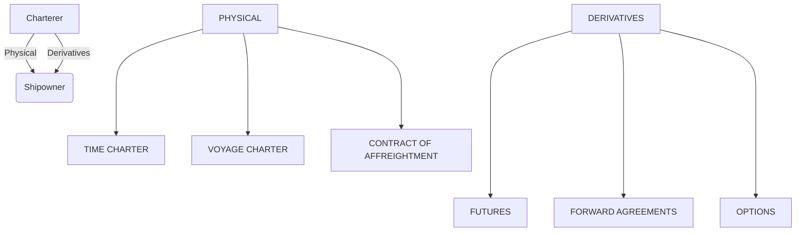

Shipowners and charterers involved in bulk commodity transportation rely heavily on the daily variations in shipping freight rates. The challenge is how interested parties may manage the high volatility and freight risk to reduce the negative impact of fluctuations on the profitability of a vessel's employment agreement.

The freight market functions exactly like any other market, such as commodities or the stock exchange. The movement of freight prices is determined by the availability of vessels and seaborne demand. Freight rates are determined by supply and demand imbalances, as well as other external factors such as weather, geopolitical events, and commodity prices. Oversupply of ships with fewer available cargoes leads to lower freight prices, whereas more cargo and fewer ships promote an increasing trend. The equilibrium between vessel supply and demand-cargoes maintains a stable sentiment in freight rates, with no large losses or revenue for shipping companies.

It is important to distinguish the difference between the **physical** market and contracts, such as period time charters and contracts of "affreightment" with the **hedging** using derivatives or paper contracts, such as freight futures, forward, and options on freight rates. The benefits of having a futures market in freight rates were recognised by the shipping industry early in the 1960s, however, such a market was eventually established in 1985. The Baltic Exchange commenced publication of a daily freight index in January 1985. The freight index initially consisted of 13 voyage routes covering a variety of cargoes from 14,000 metric tons up to 120,000 metric tons, and this was developed as a settlement mechanism for the establishment of the BIFFEX futures contract.

The Baltic Exchange's freight shipping indices have long been considered as the most dependable indicators of market conditions in the shipping industry. Forward freight agreements (FFAs)superseded futures contracts in the late 1990s, and by 2006, they had become the primary derivatives tool.

The value of freight derivatives determines the future value of freight rates for the seaborne transportation of dry bulk and oil cargoes. The process for arranging an FFA is similar to that of time charter contracts; the main difference is that no physical commitment is required. As a basis for the settlement of the contracts, the Baltic Exchange publishes the settlement of indices on a daily basis.

Freight derivatives are of great importance to shipowners and charterers, allowing them to manage the freight risk and hedge against the fluctuations of freight rates in line with the supply of ships and the relevant demand of a ship’s employment. The other main types of derivatives including FFAs are futures, options, swaps.

## The Freight Derivatives Market 
The freight derivatives market, in contrast to the physical, also bears a lot of practical problems to be resolved. It is important to highlight that there are large sums of money involved as well as high risks, and the market must be liquid enough to allow contracts to be placed reasonably quickly. In the physical freight market, liquidity is not an issue because ships have to be fixed, but freight derivatives are optional with no guarantees for trading willingness, so the inefficiency of counterparties may be a risk. In addition, there is a much higher credit risk compared to the physical market, where time charter contracts can be terminated if the charterer does not pay the hire. To mitigate this risk, in 2006 and 2007, the practice of passing FFA trades to clearinghouses gathered momentum in response to growing concern about the credit risk inherent in the pure over-the-counter market for FFAs.

## The mechanism of a Forward Freight Agreement (FFA)
Forward Freight Agreements are actually futures contracts that allow shipping market participants to trade on an expected future level of freight rates. They are derived from the physical, spot freight market, widely used in the dry bulk and tanker freight segments. The futures market provides a mechanism of vessels’ supply and demand and reflects the current expectations of the market of the level of spot freight rates in the future. For instance, if future prices are higher than current spot freight rates, the market will reflect an expected increased demand for vessels and seaborne transportation and vice versa.

## What is a Forward Freight Agreement?
FFA is a contract between two counterparties to settle a freight rate for a specified quantity of cargo for one of the major dry bulk or tanker shipping routes at a certain date in the future. The underlying route can be any of the routes that constitute the indices produced by the Baltic Exchange. FFA contracts are settled in cash on the difference between the contract price and an appropriate settlement price. This is usually the average rate of the route over the last seven days of a month, or the average hire rate over a month for the selected time charter routes.

## Where are FFA contracts trading?
The FFAs are trading over the counter market (OTC) on the terms and conditions of the Forward Freight Agreement Broker Association (FFABA) standard contracts. These are contracts negotiated between a broker and two counterparties (shipowner - charterer), in a manner similar to a conventional physical market negotiation. 

The mechanism of FFAs is mainly used for hedging purposes by charterers and shipowners although they can also be used for the purposes of speculating on the future direction of freight rates. Hedging with FFAs is based on the principle that the physical freight rates and FFA rates move in line over time. Therefore, shipowners are mainly sellers of FFAs when freight rates decrease, and charterers become buyers of FFAs. The benefits of FFAs lie in the fact that shipowners and charterers bear opposite freight risks, the upward direction of rates favors shipowners, while the downward charterers.

It is important to underline that hedging with FFAs is an expectation of freight rates at some time in the future, i.e. a month from now or later, and there is no physical delivery. FFA is a financially settled contract and the price settled is known as a contract for the difference between the change in the physical market and the change in the FFA market. Other main elements of an FFA contract are the agreed route, period of settlement, contract size. At the expiration of the contract on the settlement date, if the agreed price is higher than the settlement price, then the seller pays the difference to the buyer, and the opposite, if the agreed price is lower than the settlement price.

The buying or selling of a contract depends on the direction of freight rates in the next months or period of time i.e three or six months. The FFA market is mainly traded in months/quarters and the buying or selling of contracts can take place within this period of time. On a daily basis, bids and offers are quoted via FFA brokers to shipping market participants as the daily freight rates are decreasing or increasing. 

FFA contracts are also traded on time charter trips and routes according to the average rate of the time charter routes for each of the Baltic freight indices. The FFA market has witnessed considerable growth since its establishment as the benefits of freight risk reduction are valuable to shipping market participants. FFAs are an almost perfect selection of hedging as they lock in at a forward rate when the hedge is placed. FFA contracts cannot be bought or sold back to the counterparty prior to the settlement date; in this case, FFA traders may be in a disadvantageous position and not be able to close FFA positions if the FFA market moves against them.

Overall, FFAs are principal-to-principal contracts between a buyer and a seller to settle a freight or hire rate and may be tailor-made to the requirements of each trade, while the parties can introduce their own variations to the contract on the basis that these are mutually agreed.  Such variations include the trading cargo quantity, the introduction of different methods for the calculation of the settlement price. Finally, FFA contracts are traded directly between principals with no physical delivery since freight is intangible. The counterparties in each contract must agree to do business with each other, which means that each party is exposed to some element of risk in case the other party defaults.

## Futures and Options
The freight derivatives are traded either as freight futures or options at different expiry dates, while the clearing is taking place at major clearinghouses, under specific requirements. For the dry FFA contracts, the clearing exchanges are the European Energy Exchange (EEX) and the Singapore Exchange (SGX). In the dry bulk segment, FFA contracts are for the most common vessel sizes, Capesize, Panamax, and Supramax.

## What’s the difference between Futures and Options?
Freight option contracts are financial agreements with the same main characteristics as futures contracts, i.e. different expiry dates on the forward curve starting from the first month and up to six calendar years, cleared on a regulated financial exchange. The main difference is that there are two types of freight options contracts: call options and put options.

**A call option** is a contract that gives its buyer the right, but not the obligation, to buy an underlying asset (freight rate) from the seller (or writer) of the call option at a certain price known as the strike price at a certain expiration date. On the other hand, **a put option** gives its holder the right, but not the obligation, to sell the underlying asset to the writer of the put option at a certain strike price and expiration date.

## FFA -The Dry Bulk Freight Market, Signal indicators versus FFAs 
As mentioned earlier not all freight routes are liquid in the FFA market. Dry bulk FFA contracts for Capesize, Panamax, and Supramax have significant liquidity. The Baltic Exchange publishes daily the assessments for the main trading routes with the highest percentage of importance on each vessel size, reflecting the performance of shipping rates. These assessments are used for the calculation of the settlement price of an FFA contract of one month.

## Vessel Supply & Demand - Freight Rates 
The vessel supply evolution determines the supply curve of seaborne transportation, thus the daily information on vessels' availability at key loading areas is crucial for the evolution of freight rates in line with the demand for shipping services. The demand is connected to the industrial production levels linked to raw materials and the economic growth in developed and developing economies. In this section, we will focus on how with the Signal Ocean Data on vessel supply you can monitor the performance of freight rates along with the vessel’s availability and supply trend. We used for the purposes of this analysis the most important dry bulk vessel size, the Capesize at the major loading area in Brazil with a destination to China.

We examined the correlation of spot freight rates in the spot and futures market along with the development of Capesize supply. In the plotted graph, we see the impact of vessel supply on spot freight rates and the corresponding FFA contract 1 month forward.

The synthetic one month forward curve:  Spot Capesize Freight Market - FFA and Evolution of Vessels Supply Brazil - China. Data Source: SSY

 The Signal Ocean Platform | Capesize Supply Trend - Market Rates $/t and FFA for Brazil - China, data provided by SSY
Graph 1: The Signal Ocean Platform | Capesize Supply Trend - Market Rates $/t and FFA for Brazil - China, data provided by SSY
The Signal Ocean FFA Report | Overview of FFA prices across all routes and contracts
Options and Futures rates are shown through graphs in all main dry bulk ship sizes, Capesize, Panamax, Supramax, and Handysize, for all key trading routes, per month, quarter and year, for the expired and non-expired contracts. The forward prices are quoted for the spot ($/t)-Image 1 and time charter rates ($/d)- Image 2. Additionally, with the Signal Ocean FFA Report (Available for our Paid plans) powered by SSY, you can monitor the bid and offer FFA quotes, and FFA prices comparisons between the current month, one month forward, two months forward, one quarter ahead, and two quarters ahead. 

Signal Ocean Platform, FFA data by SSY: Spot Market
Capesize/ Routes- Tubarao/Beilun and Baoshan | W Australia/ Beilun and Baoshan | Bolivar/Rotterdam

Panamax/ Routes- Skaw-Gib/Far East | Japan-SK-NOPAC round voyage)

The Signal Ocean Platform FFA Report, for Capesize C3 route, Spot Market
Image 1: The Signal Ocean Platform FFA Report, for Capesize C3 route, Spot Market
‍Signal Ocean Platform, FFA data by SSY: Time Charter Market
Cape 5tc - The freight future settlement prices are based on the Capesize time charter index by the Baltic Exchange (weighted average of spot rates on 5 benchmark routes) 

Panamax 82 5tc - The freight future settlement prices based on the Panamax (82,000dwt) time charter index by the Baltic Exchange (weighted average of spot rates on 5 benchmark routes) 

Supramax 58 10tc - The freight future settlement prices based on the Supramax (58,000dwt) time charter index by the Baltic Exchange (weighted average of spot rates on 10 benchmark routes) 

Handysize 38 7tc - The freight future settlement prices based on the Handysize (38,000dwt) time charter index by the Baltic Exchange (weighted average of spot rates on 7 benchmark routes) 
