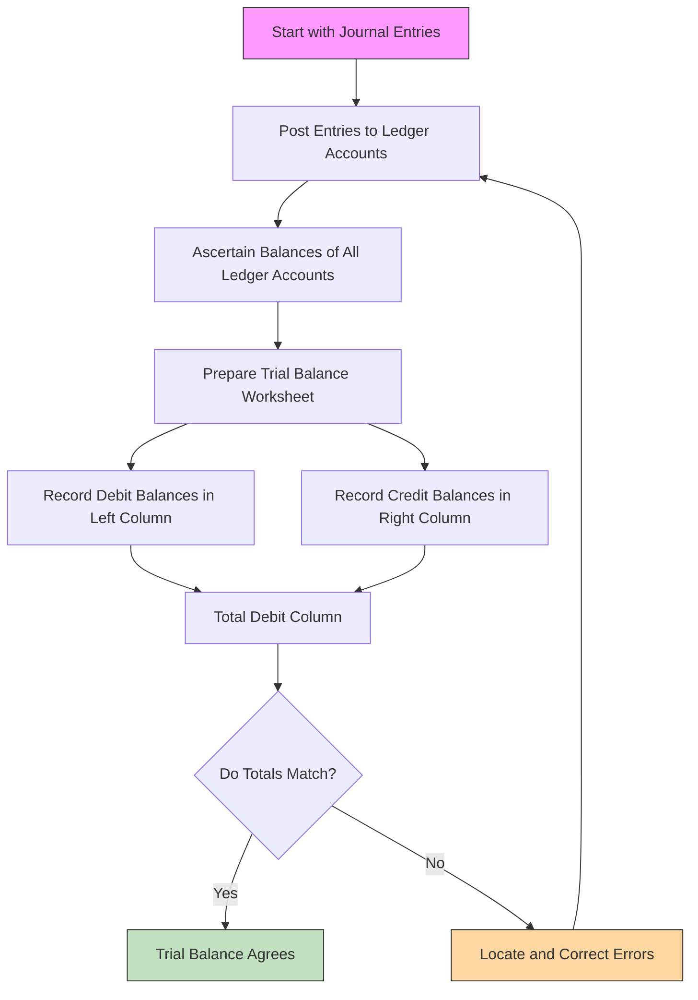

The **Trial Balance** is a crucial step in the accounting process. It serves as a **summary of all ledger account balances** at a specific point in time and helps ensure that the **double-entry system has been followed correctly**.

---

## 🎯 **Purpose of a Trial Balance**

### 1. **To Check Arithmetical Accuracy**
- The main purpose of a trial balance is to verify that:
  > **Total Debit Balances = Total Credit Balances**
- This confirms that for every debit entry, there was a corresponding credit entry (and vice versa), ensuring no mathematical errors in recording transactions.

### 2. **Basis for Financial Statements**
- It provides a summarized list of all accounts and their balances, which is used to prepare financial statements like:
  - Income Statement
  - Balance Sheet

### 3. **Error Detection**
- If the trial balance does not agree (i.e., debit total ≠ credit total), it indicates an error somewhere in the books.
- Common errors include:
  - Omission of posting
  - Wrong amount posted
  - Wrong side posting (e.g., debiting instead of crediting)
  - Errors in calculation

### 4. **Helps in Final Accounts Preparation**
- Acts as a **working base** for preparing final accounts.
- Saves time by consolidating all ledger balances in one place.

---

## 🧮 **How Is a Trial Balance Arrived At?**

It is prepared **after all journal entries have been posted to the ledger** and involves the following steps:

### 🔹 Step-by-Step Process:

| Step | Action |
|------|--------|
| 1 | **Post all journal entries to the ledger** Each transaction is classified into individual accounts (e.g., Cash A/c, Sales A/c). |
| 2 | **Determine the balance of each ledger account** Calculate whether the account has a debit or credit balance. |
| 3 | **List all ledger account balances** Create a table with two columns: one for **Debit Balances** and one for **Credit Balances**. |
| 4 | **Total both sides** Sum up the debit column and the credit column. |
| 5 | **Check for equality** If totals match → trial balance is said to be "agreed". If not, errors need to be located and corrected. |

---

## 📋 **Format of a Trial Balance**

| S.No. | Account Name        | Debit Balance | Credit Balance |
|-------|---------------------|---------------|----------------|
| 1     | Cash A/c            | ₹ 50,000      |                |
| 2     | Bank A/c            | ₹ 20,000      |                |
| 3     | Debtors A/c         | ₹ 30,000      |                |
| 4     | Creditors A/c       |               | ₹ 25,000       |
| 5     | Capital A/c         |               | ₹ 60,000       |
| 6     | Sales A/c           |               | ₹ 40,000       |
| 7     | Purchases A/c       | ₹ 45,000      |                |
| ...   | ...                 | ...           | ...            |
|       | **Total**           | ₹ 1,45,000    | ₹ 1,45,000     |

> ✅ When the totals are equal, the Trial Balance is said to "agree".

---

## ⚠️ Limitations of Trial Balance

Even if the Trial Balance agrees, it **does not guarantee that there are no errors**, because some errors do **not affect the agreement** of the trial balance, such as:
- **Compensating errors**
- **Errors of omission**
- **Errors of principle**
- **Wrong entries on both sides**

These must be detected through deeper analysis or audit.

---

## ✅ Summary

| Aspect | Description |
|--------|-------------|
| **Purpose** | To check arithmetic accuracy and assist in preparing financial statements |
| **Prepared after** | Posting journal entries to the ledger |
| **Method** | List all ledger account balances and compare total debits and credits |
| **Outcome** | Helps detect errors; basis for financial reporting |
| **Limitation** | Does not catch all types of errors |

---

