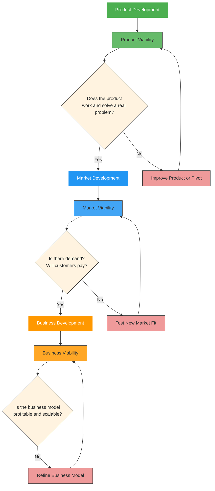

The **three key viability milestones** are essential checkpoints in the lifecycle of a business or project that help determine whether it is **sustainable, scalable, and investable**. These milestones are especially relevant for startups, entrepreneurs, and new ventures, but they also apply to any business innovation.

---

## ✅ The 3 Viability Milestones

### 1. **Product Viability**
- **What it means**: Whether your product or service works and solves a real problem.
- **Key Questions**:
  - Does the product function as intended?
  - Does it solve a real customer pain point?
  - Is there demand for the product?
- **Indicators**:
  - Successful prototype or MVP (Minimum Viable Product)
  - Positive user feedback
  - Low defect or failure rate
- **Goal**: Prove that your product can exist and deliver value.

---

### 2. **Market Viability**
- **What it means**: Whether there’s a large enough market willing to pay for your product.
- **Key Questions**:
  - Who is the target customer?
  - How big is the market opportunity?
  - Are customers willing to pay for the solution?
- **Indicators**:
  - Customer acquisition success
  - Market research validation
  - Initial sales or pre-orders
- **Goal**: Prove that there's a **real market demand** and a viable customer base.

---

### 3. **Business Viability**
- **What it means**: Whether the business model is sustainable and profitable long-term.
- **Key Questions**:
  - Can the business scale profitably?
  - Is the cost structure manageable?
  - What is the revenue model and unit economics?
- **Indicators**:
  - Positive cash flow or path to profitability
  - Sustainable gross margins
  - Scalable operations and distribution
- **Goal**: Prove that the business can grow and be **financially sustainable** over time.

---

## 📌 Summary Table

| Milestone | Focus | Goal | Key Validation |
|----------|-------|------|----------------|
| **Product Viability** | Product Functionality | Build a working product | Product works, solves a problem |
| **Market Viability** | Customer Demand | Validate market fit | Customers want it and will pay |
| **Business Viability** | Financial Sustainability | Ensure profitable growth | Business model works at scale |

---

## 💡 Why These Milestones Matter:

- They help **entrepreneurs and investors** understand the stage of development.
- They guide **resource allocation** — where to focus time, money, and effort.
- They serve as **go/no-go decision points** before scaling or seeking investment.

---

