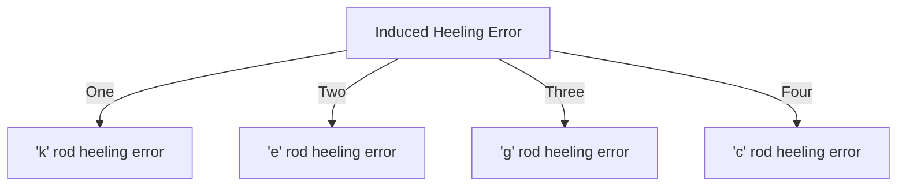

## Hard Iron Deviation

* 1 A ship built in North /South direction will have only PB.

* 2 A ship built in East/West direction will have only PC.

* 3 The heading \(180^\circ \) away from the direction in which it was built is called the direction of **Natural Zero**

* 4 The heading in which the ship was built and natural zero course are called **Neutral Courses**

* 5 No deviation on Neutral Courses.

* 6 Maximum deviation \(90^\circ\) away from it ( Westerly for left side and Easterly for right side).

* 7 Maximum Hard Iron Deviation \( \sqrt( PB^2+PC^2)\).

* 8 Angle \(\theta\) between meridian and Neutral course \[ \tan \theta = \frac{PC}{PB}\]

* 9 **Hard Iron deviation in any heading = maximum deviation due to hard iron + angle between ship's head and natural zero**

* 10 **Hard Iron deviation (\ \propto \frac{1}{H}\)**.

* 11 The angle of ship's head is measured clockwise from ship's Natural Zero.

## Heeling Error

* 1 Heeling error consists of two parts Permanent Heeling Error and Induced heeling error .\( HE = PHE +IHE \)

* 2 \( PHE \propto cos (compass course) \propto i(angle of heel) \propto \frac{1}{H} \)

* 3 IHE is composed of-

### k rod heeling error

*1 \( IHE_k \propto cos (compass course) \propto i ( angle of heel) \propto Z \propto \frac {1}{H}\)
*2 If Directive force is large then \(IHE_k\) is small.

### e rod heeling error

*1 \[ IHE_e \propto cos (compass course) \propto i (angle of heel) \propto Z \frac {1}{H}\]

### g rod heeling error

*1 \[ IHE_g \propto cos^2 (compass course) \propto i(angle of heel)\] No effect of Latitude change.

### c rod heeling error

*1 \[ IHE_c \propto sin^2 (compass course) \propto i (angle of heel)\]

## Heeling error correction

**\(\lambda_1\)** is the ratio between the mean directive force at the compass position , towards magnetic North and the directive force ashore, before the spheres are placed to correct the Coefficient D.

**\(\lambda_2\)** is the same ratio after coefficient D has been correctly compensated by the spheres.It is also called the **Ship's Multiplier.**

\[\lambda_2 > \lambda_1\] always.

**The soft iron spheres always increase the mean directive force.**

**\(\mu\)** is the ratio between the mean vertical force at the compass position and the vertical force ashore **before** correction of heeling error.

**\(\mu_2\)** is the ratio between the mean vertical force at the compass position and the vertical force ashore **after** the correction of the heeling error.

**The target of heeling error correction \(\lambda_2 = \mu_2\)**

## Vertical force instrument

\[ \frac{Z_aboard}{Z_ashore}= \frac{d_1}{d}= \mu\]

The heeling error correction done on Easterly / Westerly heading.

## Directive Force

Directive force is maximum when heading towards the Blue Pole.

Presuming Ship to be in Northern Hemisphere with +P,+Q,+a rod +c rod and +e rod.

Directive force on Northerly heading:

\[H+P+aH+cZ\]

This means
H = Horizontal Field of Earth at the Latitude.
P = Induction force in the fore and aft direction.
aH = a rod as induced by Horizontal field of Earth.
cZ = c rod induced by Vertical field.
 on East : \[ H-Q+eH \]
 on South: H-P+aH-cZ
 on west : H+Q+eH.

 \[Mean Directive Force = H + \frac{a+e}{2}H\]

 \[\lambda = 1+\frac{a+e}{2}\]
 \[ \lambda_2 = 1+e_2\]

## Horizontal Vibrating Needle

\[H \propto \frac{1}{T^2} \propto n^2\] 

Where H = Horizontal field of Earth.
T = time period of vibrations of the horizontal needle.
n = number of vibrations of the needle counted in a fixed time.

Mean DF on board = Mean of \(H_1 cos \delta \) on any number of equidistant magnetic headings.\(delta \) = deviations.

Where \(H_E\) = Horizontal component of Earth's Field , ashore.
\(H_1\)= Horizontal component , on board , in the direction of the compass North.

\[ \lambda_2 = \frac{H_B}{H_s}= \frac{T_s^2}{T_b^2} cos \delta\]