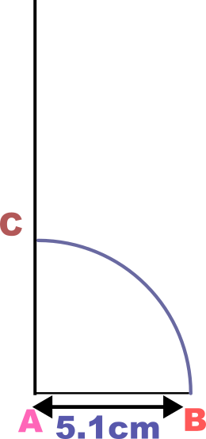
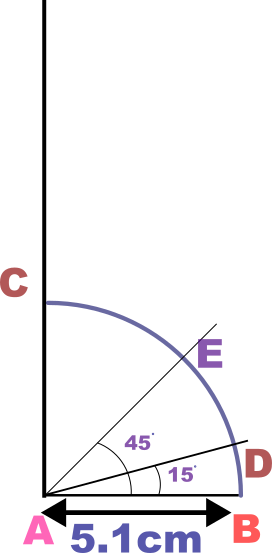
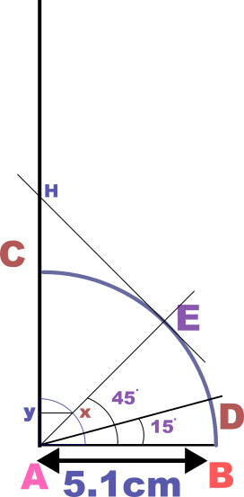
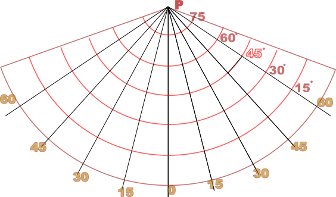

## Draw one standard parallel conical projection on RF: = 1:125000000 where Standard Parallel = \(45^\circ\) latitude extension =\(0^\circ -75^\circ\N \)Logitudinal extension \( 60^\circ E - 60^\circ W \), class interval =\( 15^\circ \)

### Ans - STEP 1
Assuming Earth's Radius to be 6350km = 635000000cm

\[R = \frac {635000000}{125000000}= 5.08 cm \approx 5.1 cm \]

* Draw a line AB of length 5.1 cm horizontally .
* Drop a perpendicular from point C to the line AB at point A.

### STEP 2
* Make an arc of \(90^\circ\) between AB and AC of Radius 5.1cm and center at A.
### STEP 3
* Draw an angle \(45^\circ\) to line AB called AE , center at A.( ** this is the standard parallel of Latitude ** )
* Draw an angle \(15^\circ\) to line AB called AD , center at A.( ** this is the class interval ** )

### STEP 4
* Mark off BD ( take the distance along the arc between B and D)
* Draw a circle with center A with radius BD 
* Mark the point where the circle cuts the line AE. Call it X.
* Drop a perpendicular from X to the line AC. Call it Y.
### STEP 5
* Draw a tangent to the arc at E and produce it towards AC extended until both of them meet.
* Mark the above point H.

### STEP 6
* Choose a suitable empty space in the middle of the paper and draw a vertical line.
* Mark the top of the line P.
* Taking center at P draw an arc with radius HE from STEP 5.
### STEP 7
* Mark off distance BD from STEP 4 on the vertical line passing through P above and below the arc of the standard parallel done in STEP 6 .
* Draw arcs through each of them with center as P.
### STEP 8
* Mark off distance XY from STEP 4 on the arc of the standard parallel arc.
* Join P with the markings on the standard parallel arc.

