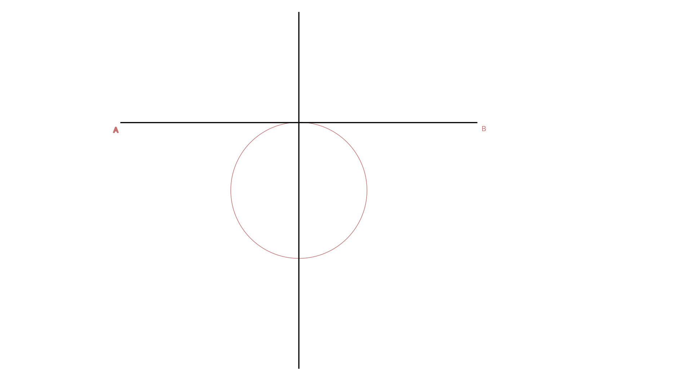
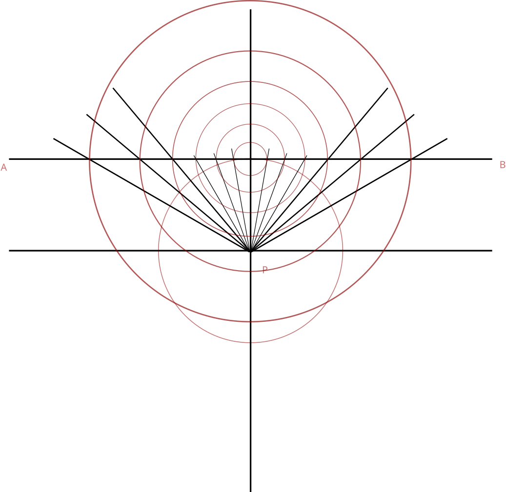

## Draw a gnomonic Azimuthal graticule , tangent at equator , \(0^\circ,10^\circ,20^\circ,30^\circ, N \) , Longitude \(30^\circ W\) to \(30^\circ E\) , Interval is \(10^\circ \) using a suitable scale.

Since no scale mentioned , we presume a scale where earth's radius = 5 cm.
### STEP 1 
* Draw a circle with center at P .
* Draw two lines one vertical and one horizontal meeting at center P.
* Extend the vertical line by at least double the radius.
* Draw a tangent AB at the point where the vertical line meets the circle.Let this point be called C.

### STEP 2
* Draw a line at an angle \(10^\circ\) on both sides of the vertical ending at the tangent to the circle.
* Keep drawing lines both sides of the vertcal at \(20^\circ,30^\circ,40^\circ,50^\circ,60^\circ\) angles to the vertcal and ending on the tangent to the circle.

### STEP 3
* Draw Concentric circles with center C and radius equal to the distance from center to each of the points where the concentric circles meet the tangent line AB

### STEP 4
* Draw tangents from P to the first of concentric circles at the point F where the first circle.

