## 1. Select the tangent point

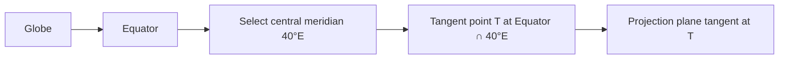

## 2. Establish the tangent plane

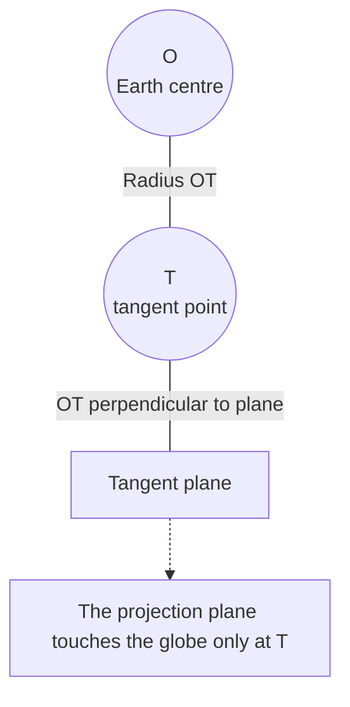

A more geometrical side view is:

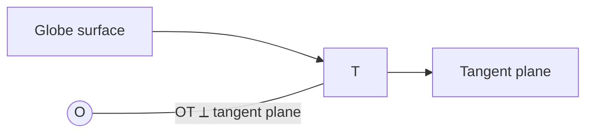

## 3. Mark the globe meridians

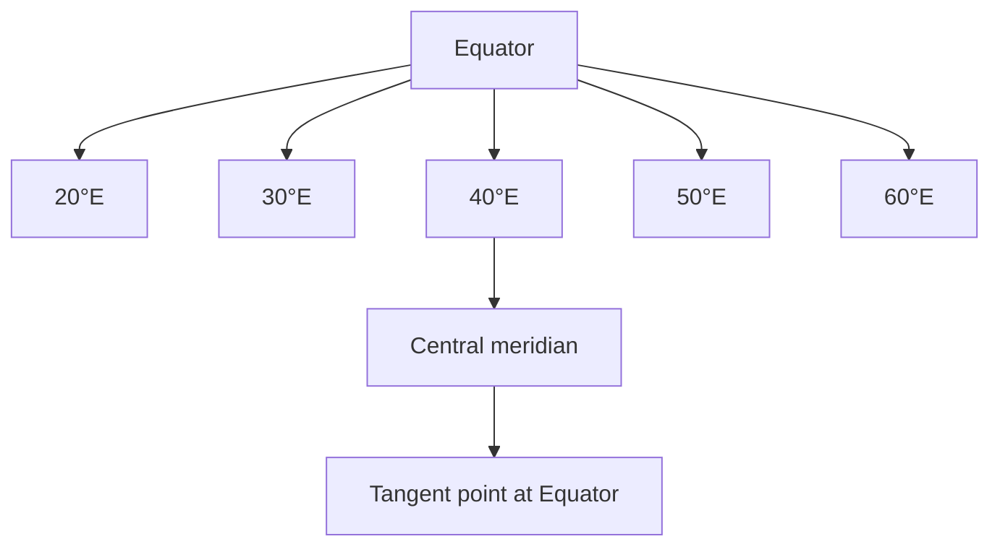

The meridian arrangement is:

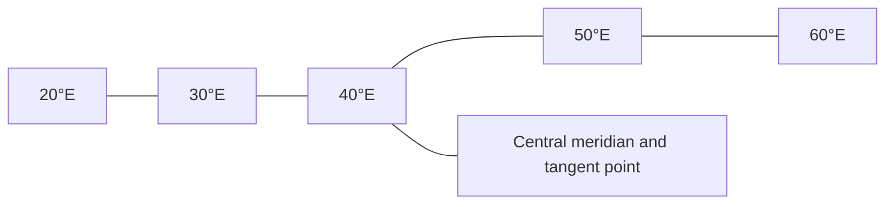

## 4. Project the equator

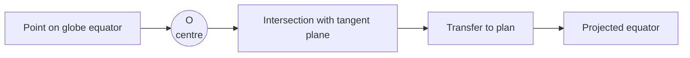

For several equatorial points:

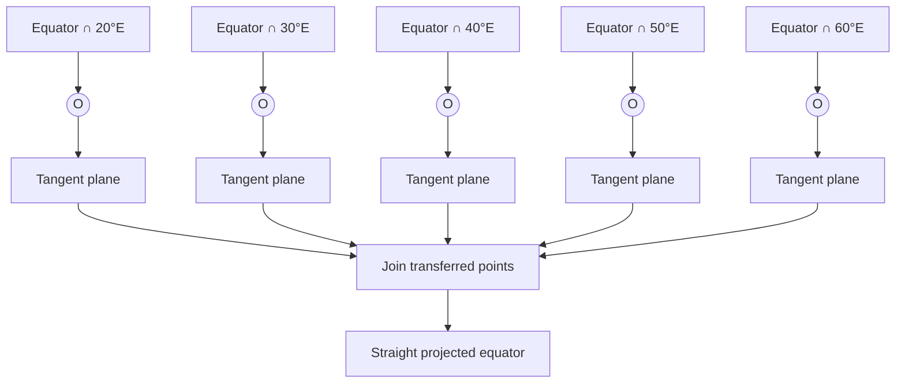

## 5. Construct the projected meridians

For the complete set:

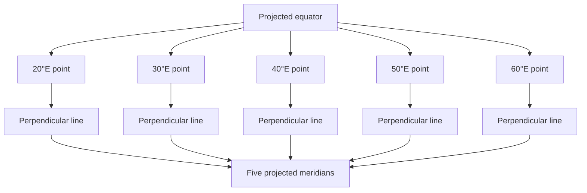

The central meridian is identified separately:

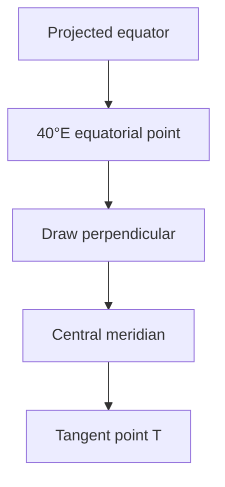

## 6. Project the \(30^\circ N\) parallel

For the five required meridians:

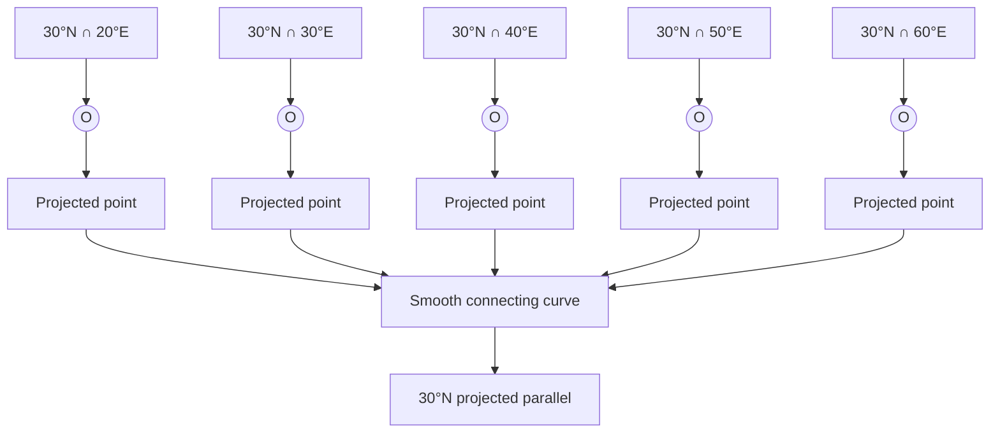

## 7. Project the \(30^\circ S\) parallel

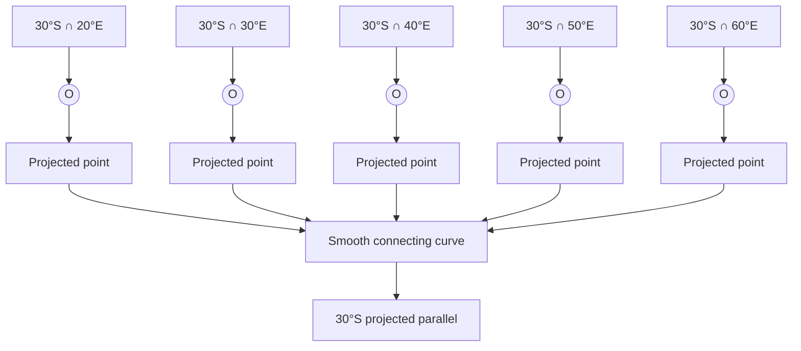

## 8. Descriptive-geometry transfer

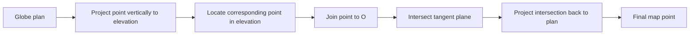

For each graticule intersection:

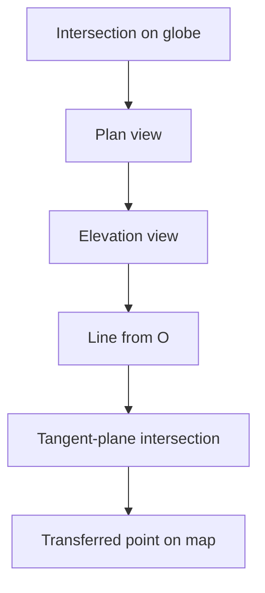

## 9. Final construction sequence

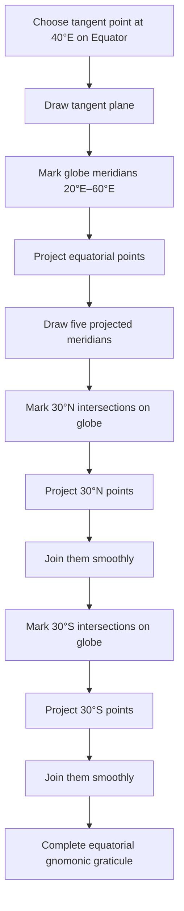

## 10. Final schematic graticule

This is only a conceptual Mermaid representation; it is not geometrically to scale.

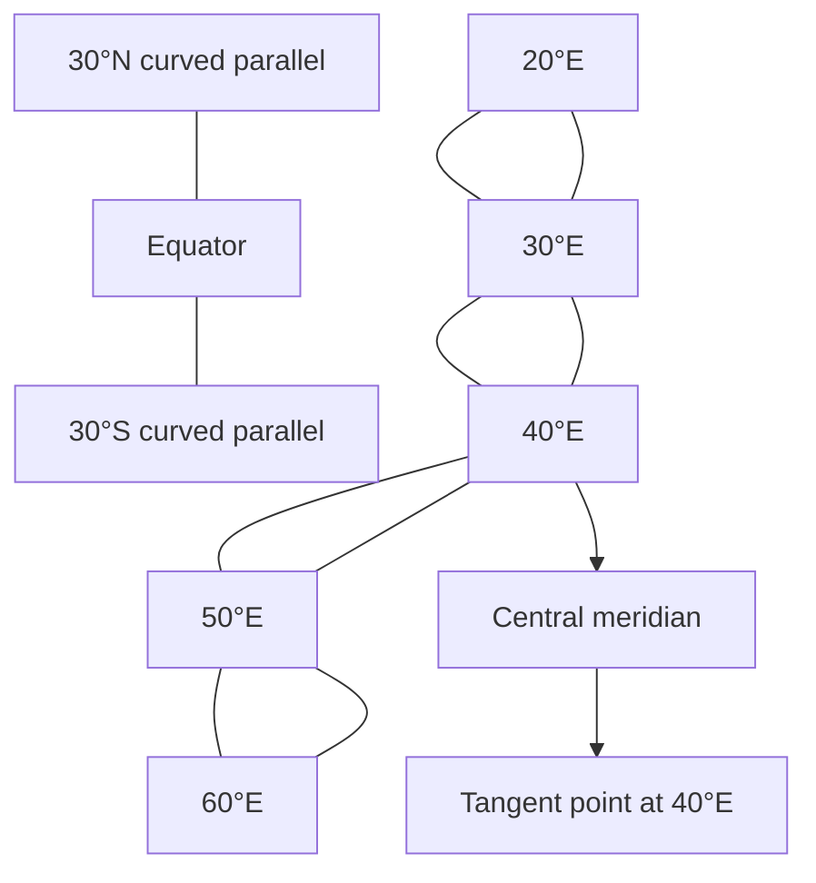

The operational rule represented by all the diagrams is:

> Select a point on the globe, join it to the globe’s centre, extend that line to the tangent plane, and transfer the intersection to the map. Repeat for every required graticule intersection.