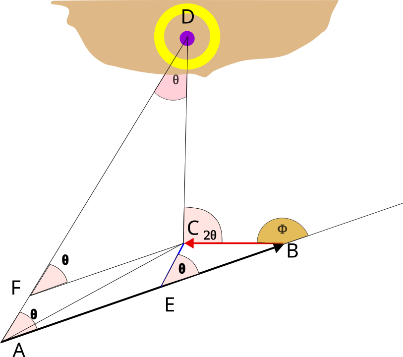

## The problem of doubling the angle on the bow with set due to current to find the distance from the light house at the time of second observation.

### Step 1

A vessel while moving on a course steered represented by line \(\bar AB \) observes the bearing of a light house at D. After a certain duration, the vessel again observes the same light house at a bearing  which is **double** the relative bearing at position A. The \( \bar BC \) represents the vessel's drift during the duration of steaming between the two observations. The construction is done accordingly.

### Step 2

 From C line parallel to AB is drawn until it cuts line AD at F.CE is drawn parallel to AD until it cuts the line AB at E. AC is joined.
 \[ FC = CD = AE = (AB -BE) \]
 and 
 \[ \angle EAD = \angle CFD\ = \angle CEB \] because FC parallel to AB, because AD parallel to EC.
 Let \(\Phi\) = the relative angle between drift direction and course steered

### Step 3

In \( \triangle BCE \), Applying Sine formula,\[ \frac{sin(\angle(BCE))}{BE} = \frac {sin(\angle (CBE))}{EC} = \frac {sin (\angle BEC)}{BC}\].
We know \(\angle DAB = \angle BEC = \theta \) as DA is parallel to CE.
We also the the distance of BC = drift of the ship during the interval between the two observations = d (assumed).
Then from above equation.\[ \frac {sin (\theta)}{d}= \frac {sin \angle BCE}{BE} \]
Now \[ \angle BCE  = 180\degree - \theta -( 180 \degree - \Phi )\] because line EB extended is \(180 \degree\) and in \( \triangle BCE \)sum of all angles\(180 \degree\)
\[ \therefore \angle BCE = \Phi -\theta \]
\[ \therefore \frac { sin (\theta)}{d}= \frac{sin(\Phi - \theta) }{BE}\]
\[ \therefore BE = \frac { d \times  sin(\Phi - \theta)}{sin (\theta)}\]
\[ \therefore AE = AB(known) - BE (determined) \]
AE = CD = distance off the light house at the time of second observation.
This was the required solution.
