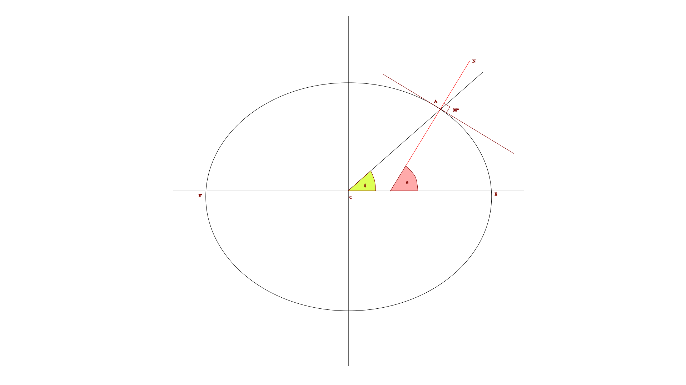

## Geocentric and Geodetic Latitude

Knowing a as semi-major axis and b as semi minor axis 

the function of an ellipse = \((\frac {x^2}{a^2}) + (\frac{y^2}{b^2}) = 1 \)

At A the Geocentric Latitude is \(\Phi\) where \[ y = tan(\Phi) \times x\]
\[ \therefore Gradient_A \propto (\frac {1}{a^2}, \frac{tan(\Phi)}{b^2})\]
\[cos \theta = \sqrt (1 + (\frac {a}{b})^4 \times tan(\Phi))^2 \]

\[ \therefore \theta = tan^-1 (\frac{a}{b})^2 tan (\Phi)\]

## Meridional Part

Meridional part is a unit of distance equal to the increased length of a Meridian on a Mercator Chart measured from the Equator to the parallel of Latitude and is expressed as minutes in the longitude scale.

## Co Ordinate Systems

1.Heights are measured above sea level (MSL) which is an equipotential surface called Geoid.
2.Topographic maps, markers etc: height above or below mean sea level = orthometric height.
3.Height above or below a reference ellipsoid = ellipsoidal height.
4.Difference between two = geoid height.
h = ellipsoid height 
N = geoid Height
H = orthometric height 
H = h + N

