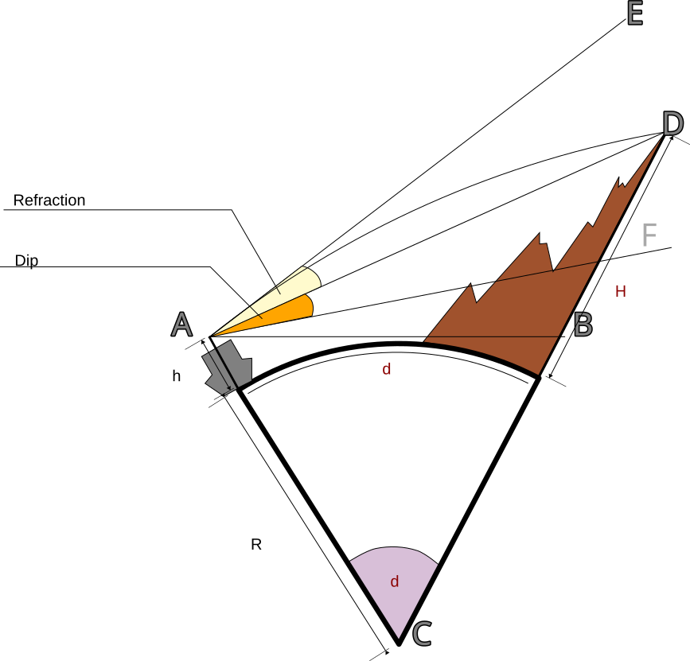

## Problems regarding Vertical Sextant Angle

Most Probably the given Data includes 

1. Height of eye.
2. Distance of the mountain from the ship.
3. Vertical Sextant Angle of the mountain Top.
4. We will need to find out the height of the mountain.

***

Let the height of the eye = h
Let the distance of the mountain top from vessel be d
Let the height of the mountain = H
Let \(\alpha\) be observed sextant angle
Let 'r' be the  angle of refraction

### **Presumptions**

Radius of Earth : 6350 km = 6350000m
Refraction is approximately = 8% of the distance to the object.
dip = \(dip = 1.76 \sqrt(h) \)

### Step 1

\[CD = R + H \]
\[CA = R + h \]
\[r = \frac{8}{100} \times d = 0.08d\]
\[ Sext_Alt \pm index error = Obs_Alt = \alpha \]
\[ Obs_Alt - Dip = Apparent_Alt \]

### Step 2

In \( \triangle CAD \) ,

\[ \angle CAD = 90\degree + \alpha - r \]
and since all angles in a triangle add to \(180 \degree \) and \( \angle ACD = d\)
\( \therefore \angle CDA = 180\degree - (\angle CAD + \angle ACB)\)
\[ \therefore \angle CDA = 180\degree - ( 90 \degree + \alpha - r) - d\]

### Step 3

In \( \triangle CAD\)

Applying the sin formula:

\[ \frac {\angle CAD}{CD} = \frac {\angle CDA}{CA}= \frac {\angle ACD}{AD}\]

\[ \therefore \frac{90\degree +\alpha -r}{R+H}= \frac {(180\degree - ( 90 \degree + \alpha - r) - d)} {R+h} \]

\[ \therefore \frac {R+h}{R+H}= \frac {sin ( 90\degree - ( d +\alpha -r))}{sin(90\degree -\alpha +r)} = \frac { cos (d+\alpha -r)}{cos (\alpha +r)}\]

\( \therefore\) from given values H can be worked out.
