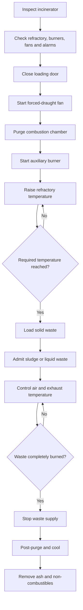
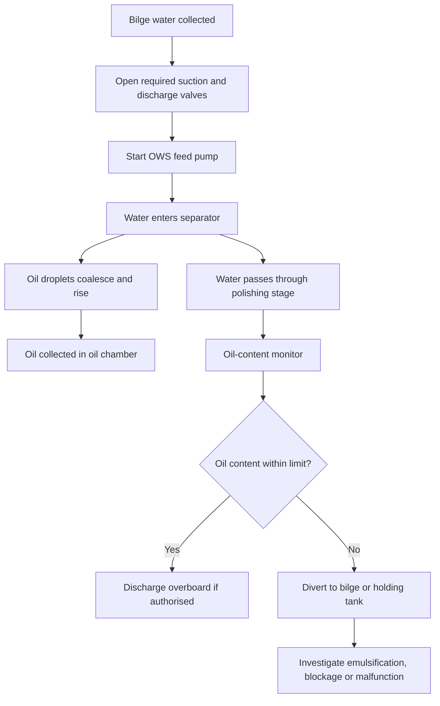
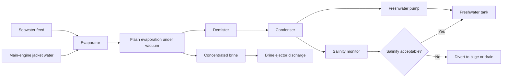
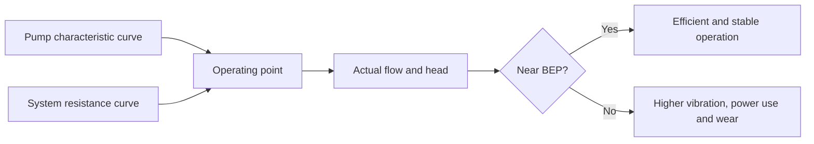
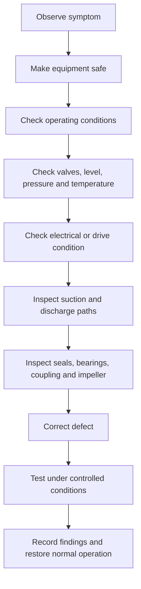

# EM 203: Concise Revision Notes

## 1. Boiler systems

A marine boiler converts the chemical energy of fuel or exhaust gas into steam energy for ship services. Boilers may be classified by the direction of gas and water flow, pressure, heat source, and construction.

### Boiler types

| Type | Gas/water arrangement | Main characteristics |
|---|---|---|
| Smoke-tube or fire-tube boiler | Hot gases pass through tubes; water surrounds the tubes | Low pressure, lower evaporation rate, compact steam demand, large steam storage |
| Water-tube boiler | Water flows through tubes; hot gases surround the tubes | High pressure, high evaporation rate, compact, rapid response, requires good water treatment |
| Composite boiler | Oil-fired furnace combined with exhaust-gas heating | Produces steam from both fuel firing and main-engine exhaust heat |
| Exhaust-gas economizer | Feed water is heated by main-engine exhaust gas | Reduces auxiliary fuel consumption |

A smoke-tube boiler generally has greater water and steam storage, whereas a water-tube boiler has lower storage and therefore requires more continuous control.

### Main water-tube boiler components

- Steam drum: Separates steam from the steam–water mixture and provides water inventory.
- Water drum or headers: Distributes water to generating tubes and collects precipitated solids.
- Downcomers: Large, unheated pipes carrying relatively cool water from the steam drum to lower headers.
- Riser tubes: Heated tubes carrying the steam–water mixture back to the steam drum.
- Water-wall tubes: Absorb furnace heat and protect the furnace casing.
- Screen tubes: Protect the superheater from direct radiant heat.
- Superheater tubes: Raise saturated steam temperature above saturation temperature.
- Economizer: Preheats feed water using exhaust-gas energy.
- Refractory and insulation: Protect casing and personnel, reduce heat loss, and direct gas flow.

### Natural circulation

Natural circulation is produced by the density difference between the cooler water in the downcomers and the hotter steam–water mixture in the riser tubes.

The circulation driving head is approximately \( \Delta P = gH(\rho_d-\rho_r) \), where \(H\) is the circulation height, \(\rho_d\) is downcomer-fluid density, and \(\rho_r\) is riser-mixture density.

### Boiler heat balance

The useful heat transferred to water and steam is \( Q = \dot{m}(h_2-h_1) \).

Boiler efficiency is \( \eta_b = \frac{\text{heat absorbed by water and steam}}{\text{heat supplied by fuel}} \times 100 \).

For fuel consumption, \( \dot{m}_f = \frac{\dot{m}_s(h_s-h_{fw})}{\eta_b \, CV} \), where \(CV\) is the fuel calorific value.

Equivalent evaporation from and at \(100^\circ\text{C}\) is \( EE = \dot{m}_s\frac{h_s-h_{fw}}{h_{fg,100}} \).

### Boiler mountings

Boiler mountings are fittings attached directly to the pressure parts for safe operation.

Essential mountings include:

- Two safety valves.
- One main steam stop valve.
- Two independent feed-check valves.
- Two water-level gauges or equivalent arrangements.
- One pressure gauge.
- Salinometer cock or valve.
- Bottom blowdown valve.
- Scum blowdown valve.
- Low-water-level alarm and fuel shut-off device.

### Safety-valve requirements

A safety valve should lift at a pressure not exceeding approximately \(3\%\) above the approved working pressure.

For a boiler with working pressure \(P_w\), the maximum setting is \(P_{set}=1.03P_w\).

Example: for \(P_w=7\ \text{bar}\), \(P_{set,\max}=7.21\ \text{bar}\).

The second safety valve is set within the permitted difference from the first valve. The valves must be tested using the approved gagging and easing arrangements; excessive tightening of the gag may bend the valve spindle.

### Boiler pressure testing

Hydrostatic test pressure is generally \(P_h=1.5P_{MAWP}\), where \(P_{MAWP}\) is the maximum allowable working pressure.

The test water should be at a suitable temperature, and the pressure is maintained long enough for visual inspection of pressure parts and joints. There must be no unacceptable leakage, permanent deformation, or plastic yielding.

During an accumulation test, boiler pressure should not rise more than \(10\%\) above the maximum allowable working pressure under full firing with the steam stop valve shut.

### Boiler preparation for firing

1. Clean the furnace, burner windbox, pressure parts, and gas passages.
2. Confirm that refractory and insulation are intact.
3. Check that manholes are tight and safety-valve gags have been removed.
4. Open instrument root valves and verify controls.
5. Open the steam-drum vent.
6. Open pressure-gauge valves.
7. Close blowdown and drain valves.
8. Fill the boiler until the gauge-glass level is approximately \(25\)–\(50\ \text{mm}\) above the normal reference.
9. Verify the gauge-glass operation.
10. Purge the furnace before admitting fuel.

### Boiler shutdown

1. Operate soot blowers where practicable.
2. Shut down the burner.
3. Continue forced-draught operation briefly to purge combustible gases.
4. Maintain a visible water level.
5. Open the drum vent at the specified pressure.
6. Change from heavy fuel oil to diesel oil if required.
7. Stop and isolate the fuel system after purging.
8. Allow natural cooling where possible.

Never cool a hot boiler rapidly by blowing down or admitting cold water, because thermal stress may damage drums, tubes, refractory, or welds.

### Boiler emergencies

#### Low water level

A low-water condition may cause tube overheating and failure.

The correct response is to:

- Stop firing.
- Isolate fuel.
- Stop the forced-draught fan after furnace purging.
- Close feed and steam valves as required.
- Do not immediately admit cold feed water to a severely overheated boiler.
- Allow sufficient cooling before restoring the water level.

#### Flame failure

On flame failure:

- Shut off fuel.
- Maintain the required safe air condition.
- Purge the furnace thoroughly.
- Relight only using the approved pilot burner.
- Never relight directly into a hot furnace without proper purging.

#### Uptake fire

An uptake fire is commonly associated with deposits of unburned fuel and soot. Immediate priorities are boundary cooling, reduction or isolation of firing as appropriate, maintenance of safe steam flow, and protection of the superheater.

The exact response depends on the boiler design, excess-air condition, and shipboard procedures. The chief engineer must follow the approved emergency checklist.

### Boiler water treatment

Impurities can cause:

- Scale and reduced heat transfer.
- Tube overheating.
- Corrosion and metal wastage.
- Foaming and priming.
- Carry-over of salts with steam.
- Contamination of steam users.

A water-treatment programme includes external conditioning, internal chemical treatment, regular testing, blowdown control, and corrective action based on water-analysis results.

***

## 2. Incinerator

A marine incinerator disposes of sludge, waste oil, sewage, and selected solid waste by controlled combustion.

### Main components

- Refractory-lined combustion chamber.
- Sludge or waste-oil burner.
- Auxiliary oil burner and igniter.
- Forced-draught fan.
- Pneumatically operated loading door.
- Ash chamber and ash-removal door.
- Temperature sensors and automatic controls.
- Exhaust-gas outlet and dilution-air arrangement.

### Operating principle

The auxiliary burner heats the refractory and establishes a stable combustion temperature. After the chamber reaches the required temperature, sludge or liquid waste is admitted. Once the waste burns reliably, the auxiliary burner may be automatically secured.

Combustion air is supplied by the forced-draught fan. Solid waste is loaded through the loading door, while liquid waste is admitted only after the refractory is sufficiently hot.

### Incinerator operating sequence

### Important controls

The loading-door interlock prevents operation of the burner and forced-draught fan when the door is open.

Exhaust temperature must be controlled within the approved range:

- Excessive temperature may melt metals, damage refractory, or damage machinery.
- Low temperature may cause incomplete combustion, odour, smoke, and poor sterilisation.
- Dilution air may be introduced near the incinerator discharge to control exhaust temperature.

### Incinerator safety

- Confirm that the chamber is clear before starting.
- Complete furnace purging before ignition.
- Do not open the loading door during firing.
- Stop waste admission before stopping the air supply.
- Allow sufficient cooling before removing ash.
- Use suitable protective equipment when handling ash and residues.
- Follow the approved waste-oil and sewage-feeding limits.

***

## 3. Oily-water separator

An oily-water separator removes dispersed oil from bilge water before discharge or transfer to a holding tank.

### Separation principle

Oil droplets are separated because oil has a lower density than water. In a gravity separator, the rising velocity of a small oil droplet is approximately described by Stokes’ law:

\( v_t=\frac{g d^2(\rho_w-\rho_o)}{18\mu} \),

where \(v_t\) is terminal rise velocity, \(d\) is droplet diameter, \(\rho_w\) is water density, \(\rho_o\) is oil density, and \(\mu\) is water viscosity.

Therefore:

- Larger droplets separate more easily.
- Greater density difference improves separation.
- Higher viscosity reduces separation velocity.
- Turbulence and emulsification reduce performance.

### Main parts

- Inlet chamber.
- Coalescing plates or filter elements.
- Oil collection space.
- Automatic oil-discharge arrangement.
- Clean-water outlet.
- Oil-content monitor.
- Three-way diverting valve.
- Sampling and test arrangements.
- Alarm and automatic stopping or recirculation system.

### OWS operating sequence

### Causes of poor separation

- Excessive flow rate.
- High turbulence.
- Emulsified oil.
- Detergents and cleaning chemicals.
- Fouled coalescer elements.
- Incorrect valve alignment.
- High water temperature or unsuitable viscosity.
- Faulty oil-content monitor.
- Excessive oil loading.

### Operational precautions

- Never bypass the oil-content monitor.
- Ensure the three-way valve operates correctly.
- Test the monitor and alarm before discharge.
- Clean or renew coalescing elements as required.
- Avoid pumping heavily emulsified mixtures directly through the separator.
- Record discharge operations in the oil record book as required by the ship’s SMS and applicable regulations.

***

## 4. Fresh-water generator

A fresh-water generator produces freshwater from seawater, normally by vacuum evaporation followed by condensation.

### Principle

Under vacuum, seawater boils at a temperature significantly below normal atmospheric boiling temperature. Heating is commonly supplied by main-engine jacket cooling water or another waste-heat source.

The process consists of:

1. Seawater feed entering the evaporator.
2. Vacuum creation by an air ejector or vacuum pump.
3. Low-temperature evaporation.
4. Vapour separation from entrained brine.
5. Vapour condensation.
6. Freshwater collection and salinity monitoring.
7. Brine discharge.

### Fresh-water generator flow

### Thermodynamic relations

Heat required for evaporation is \( Q=\dot{m}_v h_{fg} \), where \(\dot{m}_v\) is vapour production rate and \(h_{fg}\) is latent heat of vaporisation.

The approximate heat-transfer relation is \( Q=UA\Delta T_{lm} \), where \(U\) is the overall heat-transfer coefficient, \(A\) is heat-transfer area, and \(\Delta T_{lm}\) is the logarithmic mean temperature difference.

Fresh-water production rate may be estimated by \( \dot{m}_v=\frac{Q}{h_{fg}} \).

The salinity balance is \( \dot{m}_f X_f+\dot{m}_sX_s=\dot{m}_bX_b \), where \(f\) denotes feed, \(s\) freshwater, and \(b\) brine.

### Main components

- Evaporator or heating chamber.
- Condenser.
- Demister or vapour separator.
- Seawater ejector.
- Air ejector or vacuum system.
- Brine ejector.
- Freshwater pump.
- Salinometer.
- Automatic dump or diverting valve.
- Jacket-water inlet and outlet.

### Operating checks

Before starting:

- Confirm correct valve alignment.
- Check seawater and heating-water availability.
- Verify ejector nozzle condition.
- Ensure the freshwater discharge is initially diverted.
- Check the salinometer and alarm.
- Confirm that the condenser and evaporator are clean.

During operation:

- Maintain the specified vacuum.
- Monitor jacket-water inlet and outlet temperatures.
- Check freshwater temperature and production rate.
- Observe salinity.
- Check for air leakage.
- Monitor brine discharge and ejector pressure.

### Common faults

| Symptom | Likely causes |
|---|---|
| Low freshwater production | Poor vacuum, fouled heat-transfer surfaces, low heating-water temperature, insufficient seawater flow |
| High salinity | Defective demister, excessive evaporation, brine carry-over, condenser leakage, faulty salinometer |
| Vacuum failure | Air leakage, ejector blockage, insufficient motive-water pressure, damaged gaskets |
| Excessive brine level | Blocked brine discharge, poor ejector performance, incorrect valve position |
| Reduced heat transfer | Scale, marine growth, sludge, air pockets, poor flow |

***

## 5. Centrifugal pumps

A centrifugal pump converts mechanical shaft energy into fluid pressure and kinetic energy.

### Main components

- Impeller.
- Volute casing or diffuser.
- Suction eye.
- Shaft and coupling.
- Mechanical seal or gland packing.
- Wear rings.
- Bearings.
- Suction and discharge flanges.
- Priming arrangement.

Liquid enters axially at the impeller eye, gains velocity from the rotating impeller, and is converted partly into pressure in the volute or diffuser.

### Pump head and power

The hydraulic head is \( H=\frac{p_2-p_1}{\rho g}+\frac{V_2^2-V_1^2}{2g}+(z_2-z_1) \).

The hydraulic power is \( P_h=\rho gQH \).

The shaft power is \( P_s=\frac{\rho gQH}{\eta_p} \), where \(Q\) is volumetric flow rate and \(\eta_p\) is pump efficiency.

The total dynamic head is \(H_T=H_{static}+H_{friction}\).

Pipe friction loss may be expressed by Darcy–Weisbach:

\( h_f=f\frac{L}{D}\frac{V^2}{2g} \).

Including fittings, \( h_{minor}=K\frac{V^2}{2g} \).

### NPSH

Available net positive suction head is approximately:

\( NPSH_A=H_{abs,suction}\pm H_s-H_{f,suction}-H_{vap} \).

The sign of \(H_s\) depends on whether the liquid level is above or below the pump centreline.

For safe operation:

\(NPSH_A>NPSH_R\),

where \(NPSH_R\) is the pump’s required NPSH.

Insufficient NPSH causes cavitation, noise, vibration, fluctuating discharge pressure, impeller erosion, and reduced capacity.

### Affinity laws

For the same pump and similar operating conditions:

\( \frac{Q_2}{Q_1}=\frac{N_2}{N_1} \),

\( \frac{H_2}{H_1}=\left(\frac{N_2}{N_1}\right)^2 \),

\( \frac{P_2}{P_1}=\left(\frac{N_2}{N_1}\right)^3 \).

For geometrically similar pumps:

\(Q\propto ND^3\), \(H\propto N^2D^2\), and \(P\propto N^3D^5\).

### Pump operating point

The actual operating point is the intersection of the pump characteristic curve and the system-resistance curve.

The best-efficiency point, or BEP, is the preferred operating region. Operation far from BEP may cause recirculation, vibration, excessive radial load, seal wear, and overheating.

### Centrifugal-pump starting procedure

1. Check lubrication, coupling, guards, and alignment.
2. Confirm adequate liquid level on the suction side.
3. Open the suction valve fully.
4. Prime and vent the pump casing.
5. Check the discharge valve position according to the manufacturer’s procedure.
6. Start the pump.
7. Confirm correct rotation.
8. Gradually open the discharge valve.
9. Check pressure, flow, current, vibration, seal leakage, and bearing temperature.

A centrifugal pump must not run dry because the mechanical seal and internal components depend on the pumped liquid for cooling and lubrication.

### Common pump faults

| Symptom | Likely causes |
|---|---|
| No delivery | Insufficient priming, closed suction valve, clogged suction strainer, wrong rotation, excessive suction lift, blocked impeller |
| Low capacity | Air leakage, insufficient speed, clogged impeller, excessive discharge resistance, worn wear rings |
| Low pressure | Wrong rotation, low speed, air or gas in liquid, worn impeller or wear rings |
| Operates then stops delivering | Air leakage, loss of suction, blocked water seal, excessive liquid temperature |
| Excessive power | Excessive flow, high viscosity or density, misalignment, bent shaft, tight packing, mechanical damage |
| Vibration | Misalignment, bent shaft, unbalanced impeller, weak foundation, cavitation |
| Seal leakage | Damaged mechanical seal, incorrect installation, dry running, excessive shaft movement |

### Alignment

Angular misalignment occurs when the shaft centre lines intersect at an angle. Parallel misalignment occurs when they remain parallel but offset.

Both conditions can produce:

- Coupling wear.
- Bearing overload.
- Seal failure.
- Shaft vibration.
- Excessive power consumption.

### Positive-displacement pumps

A positive-displacement pump traps a definite volume of liquid and displaces it during each cycle or revolution.

For an ideal rotary PD pump:

\(Q_{th}=VDN\),

where \(V\) is displacement per revolution, \(D\) is a displacement constant if used in the selected formulation, and \(N\) is rotational speed. More generally, \(Q_{th}=V_rN\), where \(V_r\) is volume displaced per revolution.

Actual flow is \(Q=Q_{th}\eta_v\), where \(\eta_v\) is volumetric efficiency.

PD pumps require a relief valve because discharge pressure can rise dangerously if the discharge line is blocked.

### Centrifugal versus positive-displacement pumps

| Feature | Centrifugal pump | Positive-displacement pump |
|---|---|---|
| Flow behaviour | Flow varies strongly with head | Nearly constant flow at a given speed |
| Best application | High flow and low-to-moderate viscosity | Low flow, high pressure, or high viscosity |
| Effect of viscosity | Capacity and efficiency decrease | Often suitable for viscous liquids |
| Suction lift | Requires priming and adequate NPSH | Can create suction and often lift liquid |
| Discharge blockage | Flow reduces, but pressure is limited by curve | Pressure can rise rapidly; relief valve essential |
| Preferred operating region | Near BEP | Can operate across a wider range |

### Final troubleshooting principle

For any rotating machinery fault, proceed systematically:

The most important EM 203 operational priorities are correct preparation, adequate fluid levels, proper valve alignment, effective purging, control of temperature and pressure, protection against cavitation or dry running, and strict compliance with the ship’s approved procedures.
