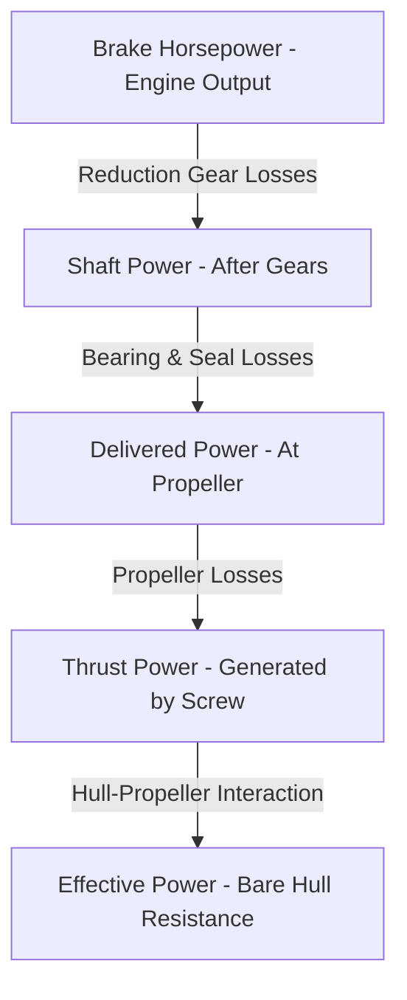
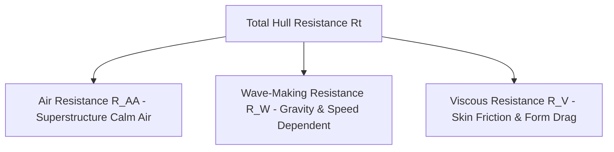

## 1. Ship Drive Train and Power Hierarchy

Power flows from the engine to the hull, experiencing losses at each stage. The relative magnitude follows:
\(BHP > SP > DP > TP > EP\)

### Definitions & Key Equations

* **Effective Power (EP):** Power required to tow/move the bare ship hull at speed \(V_s\) without propeller action.
\(EP = R_t \times V_s\)

* **Brake Horsepower (BHP):** Power output at the engine shaft before reduction gears.

* **Shaft Power (SP):** Power output coming out of the reduction gears.

* **Delivered Power (DP):** Power delivered directly to the propeller.
\(DP = SP - \text{losses in shafting, bearings, and seals}\)

* **Thrust Power (TP):** Power created by the propeller.
\(TP = DP - \text{propeller losses} = T \times V_a\)

---

## 2. Propulsion Efficiencies

Losses along the drive train are quantified using efficiencies (\(\eta\)):

* **Gear Efficiency:** \(\eta_{gear} = \frac{SP}{BHP}\) (Typical: \(\sim 98 - 99\%\))

* **Shaft Transmission Efficiency:** \(\eta_{shaft} = \frac{DP}{SP}\) (Typical: \(\sim 97 - 98\%\))

* **Propeller Efficiency:** \(\eta_{propeller} = \frac{TP}{DP}\) (Typical: \(\sim 70 - 75\%\))

* **Hull Efficiency:** \(\eta_{H} = \frac{EP}{TP}\) (Well-designed: \(\eta_H > 1\); Poorly-designed: \(\eta_H < 1\))

* **Propulsive Coefficient (PC):** Overall efficiency combining bearing, guide, and propeller losses.
\(\eta_{p} = PC = \frac{EP}{SP}\) (Typical range: \(55\% - 75\%\))

---

## 3. Total Hull Resistance and Components

Total hull resistance (\(R_t\) or \(R_T\)) is the force opposing ship motion, broken down into three principal components:
\(R_T = R_{AA} + R_W + R_V\)

### Resistance Components & Formulas

* **Air Resistance (\(R_{AA}\)):** Caused by airflow over the superstructure (typically \(4\% - 8\%\) of total resistance).

* **Wave-Making Resistance (\(R_W\)):** Caused by surface waves generated by the moving hull. Affected by beam-to-length ratio, displacement, hull shape, and Froude number.

* Theoretical wave length: \(L_{wave} = \frac{2\pi V^2}{g}\)

* Hull speed limit: \(V = 1.34 \sqrt{L_s}\) (resistance increases sharply when ship speed approaches hull speed).

* **Viscous Resistance (\(R_V\)):** Combines skin friction and viscous pressure drag.

* Total Resistance Coefficient: \(C_T = C_V + C_W + C_A = C_F(1 + K) + C_W + C_A\)

* Tangential skin friction coefficient (ITTC 1957 line): \(C_F = \frac{0.075}{(\log_{10} R_n - 2)^2}\)

* Reynolds Number: \(R_n = \frac{L V_s}{\nu}\), where kinematic viscosity \(\nu = 1.140 \times 10^{-6} \, m^2/s\) (fresh water) or \(1.190 \times 10^{-6} \, m^2/s\) (salt water).

* Form Factor (\(K\)) for normal component multiplier: \(K = 19 \left[ \frac{\nabla}{L B T} \frac{B}{L} \right]^2\)

* Total Resistance equation: \(R_t = 0.5 \rho S V_s^2 \cdot C_T\)

* **Correlation Allowance (\(C_A\)):** Accounts for full-scale hull surface roughness, paint texture, and corrosion.

---

## 4. Model Testing and Similitude (Froude's Law)

Because analytical modeling of 3D viscous and wave-making flow is complex, towing tanks use geometrically and dynamically similar models.

* **Scale Factor (\(\lambda\)):** \(\lambda = \frac{L_s}{L_m}\)

* Area scale: \(\lambda^2 = \frac{S_s}{S_m}\)

* Volume/Displacement scale: \(\lambda^3 = \frac{\nabla_s}{\nabla_m}\)

* **Law of Corresponding Speeds (Froude Similarity):** Dynamic similarity for wave-making requires equal Froude numbers.
\(\frac{V_s}{\sqrt{L_s}} = \frac{V_m}{\sqrt{L_m}} \implies V_m = V_s \lambda^{-1/2}\)

---

## 5. Screw Propellers and Performance Mechanics

### Terminology & Geometry

* **Diameter (\(D\)):** Tip-to-tip circle diameter.

* **Pitch (\(P\)):** Theoretical distance a propeller moves forward in one revolution through an unyielding fluid.

* **Pitch Angle (\(\phi\)):** Blade angle relative to incoming flow, calculated as \(\tan \phi = \frac{P}{2\pi r}\).

* **Speed of Advance (\(V_a\)):** Ship speed accounting for the wake velocity field (\(V_w\)):
\(V_a = V_s (1 - W_t)\), where \(W_t\) is Taylor's wake fraction (\(W_t \approx 0.5 C_b - 0.05\)).

* **Slip:**
* Apparent Slip Speed = \(V_t - V_s\), where theoretical speed \(V_t = P \times N\).

* Real Slip Speed = \(V_t - V_a\).

### Propeller Forces & Coefficients

* **Thrust Force (\(T\)):** Estimated by momentum change through the propeller disc:
\(T = \rho A P^2 N^2 s\) (where \(s\) is real slip, \(A\) is effective disc area, \(N\) is revs/sec).

* **Thrust Coefficient (\(K_T\)):** \(K_T = \frac{T}{\rho n^2 D^4}\)

* **Thrust Loading Coefficient (\(C_t\)):** \(C_t = \frac{T}{0.5 \rho V_a^2 A_o}\)

* **Ideal Propeller Efficiency:** \(\eta_{propeller} = \frac{2}{1 + \sqrt{1 + C_t}}\)

### Cavitation

* **Definition:** Formation and collapse of vapor bubbles when local blade pressure drops below the vapor pressure (\(P_v\) of water).

* **Consequences:** Loss of propeller efficiency, severe mechanical erosion, noise, and structural vibration.

* **Mitigation:** Smooth surfaces (free of fouling/nicks), gradual RPM adjustments, proper pitch control, and increased hydrostatic pressure (e.g., deeper submarine diving depth).
