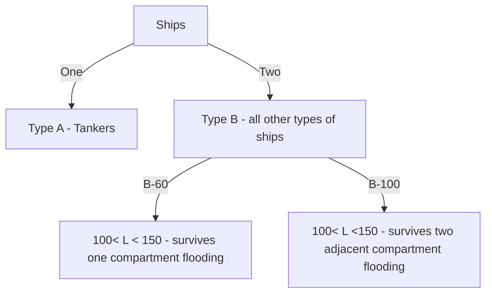
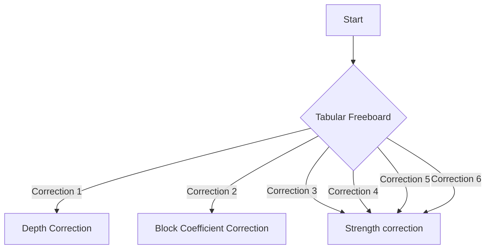

1. Type A ships - Tankers - ships carrying liquid bulk cargo.
2. Type B ships - All other type of ships.

**Oil tankers** are permitted to have more Summer freeboard than general cargo ships with
a similar LBP. They are considered to be **safer ships** for the following reasons:

1.They have much smaller deck openings in the main deck.
2.They have greater subdivision, by the additional longitudinal and transverse bulkheads.
3.Their cargo oil has greater buoyancy than grain cargo.
4.They have more pumps to quickly control ingress of water after a bilging incident.
5.Cargo oil has a permeability of about 5% whilst grain cargo has a permeability of 60e65%.
The lower permeability will instantly allow less ingress of water following a bilging incident.
6.Oil tankers will have greater GM values. This is particularly true for modern double-skin
tankers and wide shallow draft tankers.

