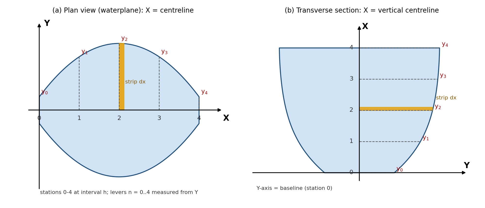

## I_x about the X axis and I_y about the Y axis, valid for any view: plan, transverse section or profile*

## 1. Convention: set this up first

Draw the view you are looking at. Then fix the axes as follows. The formulas depend only on this convention, so they hold for every view.

- **X axis:** the line along which the stations are equally spaced (interval *h*) and from which every ordinate is measured.
- **Y axis:** the line perpendicular to X at station 0. Levers are measured from it.
- **y:** ordinate (offset) from the X axis to the edge of the shape at each station.
- **n:** lever, the station number counted from the Y axis, so x = n·h.
- **SM:** Simpson multiplier.
- **k:** number of sides of the X axis on which the shape lies (k = 1 for one side only; k = 2 for a shape symmetrical about X when half ordinates are given).
- To look at the shape from another direction, rotate the drawing until the stations run along X, then reuse the same formulas.

---

## 2. Basic integrals (per strip of width dx)

### About X Axis

Strip area \(dA = y \times dx\). 
Its own inertia about its base is \(dI_x = \frac{y^3}{12} \times dx \), and moving it by \(\frac {y}{2}\) (parallel axis theorem) adds \( y \times dx \times \frac {y^2}{2^2} \).
Together:

\[ dI_x = (\frac {y^3}{12}+ \frac {y^3}{4})\times dx \]

### About Y Axis

About the Y axis the strip sits at distance x, so \(dI_y = x^2 \times y \times dx\).
The strip's own term \( y\times \frac {dx^3}{12}\) is negligible as dx → 0 and is dropped. Hence, for k sides:

 \[ A = k \int y dx \]
 \[ I_x = \frac{k}{3} \int y^3 dx \]
 \[ I_y = {k} \int x^2 y dx \]

---

## 3. Simpson's form

Let **\(c = \frac {h}{3}\)** for Simpson's 1st rule (SM = 1, 4, 2, 4, … 4, 1; needs an odd number of ordinates) or **\(c =  \frac {3h}{8}\)** for the 2nd rule (SM = 1, 3, 3, 2, 3, 3, … 3, 1; needs the number of intervals to be a multiple of 3). With levers in whole intervals (x = n·h):

| Quantity | Working formula |
|---|---|
| Area | `A = k·c·Σ(SM·y)` \( A = k \times c \times \Sigma (SM \times y)\) |
| Ix: about the X axis | `Ix = (k·c/3)·Σ(SM·y³)` \( I_x = ( k \times \frac {c}{3}) \times  \Sigma (SM \times y^3) \) |
| Iy: about the Y axis (station 0) | `Iy = k·c·h²·Σ(SM·y·n²)` \( I_y = k \times c \times h^2 \times \Sigma ( SM \times y \times n^2)\) |
| Centroid distance from Y axis | `x̄ = h·Σ(SM·y·n) / Σ(SM·y)` \(\bar x = h \times  \frac {\Sigma (SM \times y \times n)}{ \Sigma (SM \times y)}\) |
| Iy about the centroid | `Iy,cg = Iy − A·x̄²` \( I_{yCG} =  I_y - (A \times \bar x ^2) \)|
| Ix about the centroid (k = 1) | `Ix,cg = Ix − A·ȳ²`, with `ȳ = ½·Σ(SM·y²) / Σ(SM·y)` \(I_{xCG}= I_x - (A\times \bar y ^2)\) with \(\bar y = \frac {1}{2} \times \frac{\Sigma (SM \times y^2)}{\Sigma (SM \times y)} \)|
| Ix about the centroid (k = 2, symmetrical about X) | `ȳ = 0`, so Ix is already the centroidal value |

For Simpson's 1st rule these reduce to:

`Ix = (k·h/9)·Σ(SM·y³)` \[ I_x = (k \times \frac{h}{9}) \times \Sigma (SM \times y^3)\]
`Iy = (k·h³/3)·Σ(SM·y·n²)` \[ I_y = (k \times \frac {h^3}{9})\times \Sigma ( SM \times \times n ^2)\]

The levers n already include h, which is why the extra \(h^2\) ( \(h^3\)overall) appears.

---

## 4. Mapping to the view you are looking at

| View | X axis, stations, y | k | Ix means | Iy means |
|---|---|---|---|---|
| **Plan view (waterplane)** | X = centreline, stations from aft to forward, y = half-breadth | 2 | Transverse $$I_T$$  about the centreline. $$BM_T = \frac {I_T}{\nabla}$$ | About the transverse axis at station 0. Shift to the CoF: \(I_L = I_y − A·x_F^2\). \(BM_L = \frac {I_L}{\nabla}\)|
| **Transverse section (looking fore/aft)** | X = vertical centreline, stations = waterlines from the baseline, y = half-breadth | 2 | Section area about the vertical centreline | Section area about the baseline. Shift to the area centroid with x̄ |
| **Profile (side view)** | X = keel line, stations along the length, y = depth | 1 | Area about the keel line (shift with ȳ) | Area about the vertical axis at station 0 (shift with x̄) |

**Rule of thumb:** \(I_x\) always uses the cube of the ordinate \(y^3\). \(I_y\) always uses the ordinate times the square of the lever \(y \times n^2\).

---

## 5. Worked example (plan view, Y axis at the after end)

Waterplane with 5 stations, h = 5 m, half-breadths y = 1, 4, 5, 4, 1 m, k = 2, Simpson's 1st rule.

| Stn | n | y | SM | SM·y | SM·y·n | SM·y·n² | y³ | SM·y³ |
|:-:|:-:|:-:|:-:|:-:|:-:|:-:|:-:|:-:|
| 0 | 0 | 1 | 1 | 1 | 0 | 0 | 1 | 1 |
| 1 | 1 | 4 | 4 | 16 | 16 | 16 | 64 | 256 |
| 2 | 2 | 5 | 2 | 10 | 20 | 40 | 125 | 250 |
| 3 | 3 | 4 | 4 | 16 | 48 | 144 | 64 | 256 |
| 4 | 4 | 1 | 1 | 1 | 4 | 16 | 1 | 1 |
| **Σ** | | | | **44** | **88** | **216** | | **764** |

- A = 2·(5/3)·44 = **146.67 m²**
- Ix = (2·5/9)·764 = **848.89 m⁴** (centreline, already centroidal because the shape is symmetrical)
- x̄ = 5·88/44 = **10.0 m** from the Y axis
- Iy about station 0 = 2·(5³/3)·216 = **18 000 m⁴**
- Iy,cg = 18 000 − 146.67·10.0² = **3 333.33 m⁴**

**Self-check on a rectangle** of length 4h and full breadth 2y (Σ SM·y³ = 12y³): the formula gives Ix = (2h/9)·12y³ = 8hy³/3, which equals the exact (1/12)(2y)³(4h). About the end, Σ(SM·n²) = 64 gives Iy = 128·y·h³/3, also exact. Simpson's rules are exact here because the integrands are polynomials of degree 3 or lower.

---

## 6. Common errors

- Cubing after applying the multiplier: use SM·y³, not (SM·y)³.
- Forgetting k when half ordinates are used.
- Using y² in the Iy column. It is the ordinate to the first power times the lever squared.
- Dropping the h² (or h³) when the levers are written as station numbers.
- Quoting Iy about an arbitrary axis as if it were about the centroid or the centre of flotation. Always apply −A·x̄² (or −A·x_F²).
- Using Simpson's 1st rule with an even number of ordinates.
