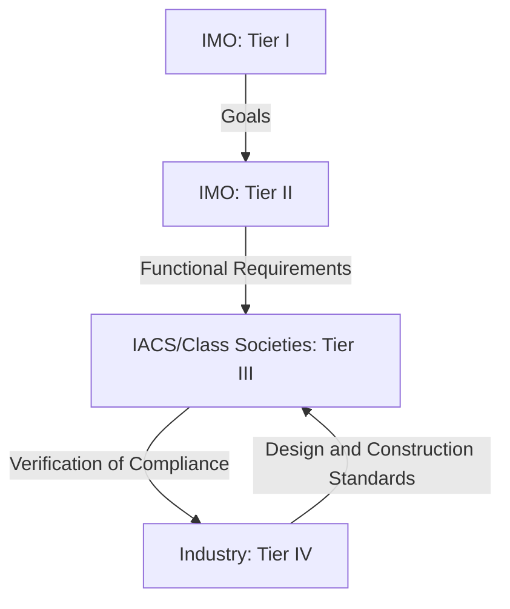

---

## **Q.1 Purpose of Common Structural Rules (CSR) and IACS Approaches**

### **A. Purpose of Introducing CSR**
The **Common Structural Rules (CSR)** were introduced by the **International Association of Classification Societies (IACS)** to address the following key objectives:

1. **Harmonization of Structural Standards**:
   - Eliminate **differences in structural rules** among classification societies (e.g., ABS, DNV, LR, NKK).
   - Ensure **consistent safety levels** across the global fleet.

2. **Improved Safety**:
   - Reduce **structural failures** (e.g., **bulk carrier sinkings, tanker breakups**) by adopting **uniform, science-based standards**.
   - Address **lessons learned** from incidents like **MV Derbyshire (1980)**, **Erika (1999)**, and **Prestige (2002)**.

3. **Efficiency in Design and Construction**:
   - Streamline **approval processes** for shipyards and owners.
   - Reduce **duplicative work** (e.g., multiple society approvals for the same design).

4. **Compliance with IMO’s Goal-Based Standards (GBS)**:
   - Align with **IMO’s GBS framework** (Tier I–IV) to ensure **performance-based** rather than purely prescriptive rules.

5. **Innovation and Flexibility**:
   - Allow for **new materials, designs, and technologies** while maintaining safety.

---

### **B. Fundamental Approaches of IACS in Developing CSR-OT + BC**
The **CSR for Oil Tankers (CSR-OT)** and **Bulk Carriers (CSR-BC)** were developed using the following **fundamental approaches**:

| **Approach** | **Description** | **Application in CSR** |
|--------------|----------------|------------------------|
| **Risk-Based Design** | Uses **probabilistic methods** to assess structural reliability. | **Load cases** (e.g., hogging, sagging, torsion) are analyzed for **probability of failure**. |
| **Performance-Based Standards** | Focuses on **what the structure must achieve** (e.g., strength, fatigue life) rather than **how to achieve it**. | **Functional requirements** (e.g., "The ship must survive a grounding event without catastrophic failure"). |
| **Harmonized Scantling Calculations** | Unified **formulas for plate thickness, stiffeners, and girder dimensions**. | **Common equations** for **longitudinal strength, buckling, and fatigue**. |
| **First-Principles Analysis** | Uses **fundamental engineering principles** (e.g., finite element analysis) to derive requirements. | **Direct strength analysis** for **hull girder, local strength, and fatigue**. |
| **Safety Margins** | Incorporates **safety factors** to account for uncertainties (e.g., material properties, loading conditions). | **Partial safety factors** for **yield strength, corrosion, and dynamic loads**. |
| **Validation Through Testing** | Uses **full-scale measurements, model tests, and FE analysis** to validate rules. | **IACS Joint Industry Projects** (e.g., **Tanker Structural Cooperative Forum, Bulk Carrier Safety Assessment**). |

---

---

## **Q.2 Class Notations for Bulk Carriers (ECR) vs. SOLAS Ch. XIII**

### **A. Class Notations for Bulk Carriers (ECR - Enhanced Common Rules)**
The **Enhanced Common Rules (ECR)** for bulk carriers introduce **class notations** based on **cargo density and structural strength requirements**. The primary notations are:

| **Notation** | **Description** | **Cargo Density Range** | **Structural Strength** |
|--------------|----------------|--------------------------|--------------------------|
| **BC-A** | **High-strength bulk carrier** | **> 1.75 t/m³** (e.g., iron ore, coal) | Designed for **high-density cargoes** with **increased scantlings**. |
| **BC-B** | **Standard bulk carrier** | **1.0–1.75 t/m³** (e.g., grain, bauxite) | **Moderate scantlings** for typical bulk cargoes. |
| **BC-C** | **Lightweight bulk carrier** | **< 1.0 t/m³** (e.g., light grain, wood chips) | **Reduced scantlings** (lighter cargoes require less structural strength). |

---

### **B. Comparison with SOLAS Ch. XIII Hull Strength Requirements**

| **Aspect** | **ECR (Class Notations)** | **SOLAS Ch. XIII** |
|------------|----------------------------|--------------------|
| **Basis** | **Performance-based** (cargo density, loading conditions). | **Prescriptive** (minimum scantlings, general requirements). |
| **Cargo Density Consideration** | **Explicitly accounts for cargo density** (BC-A, BC-B, BC-C). | **No direct classification by density** (general requirements for all bulk carriers). |
| **Structural Strength** | **Tailored scantlings** based on cargo type. | **Uniform minimum requirements** (e.g., plate thickness, stiffener spacing). |
| **Hull Girder Strength** | **Detailed calculations** for **hogging, sagging, and torsion**. | **Simplified formulas** (e.g., **longitudinal strength formula**). |
| **Fatigue Assessment** | **Mandatory fatigue analysis** for **high-stress areas**. | **No explicit fatigue requirements** (left to class societies). |
| **Corrosion Allowance** | **Differentiated corrosion margins** (e.g., **3 mm for BC-A, 2 mm for BC-C**). | **General corrosion allowance** (e.g., **2 mm for ballast tanks**). |
| **Loading Conditions** | **Considers dynamic loads** (e.g., **sloshing, impact loads**). | **Static load assumptions** (e.g., **homogeneous cargo distribution**). |

---

### **C. Why Cargo Density Matters in Strength Requirements**
The **density of cargo** directly influences the **structural loads** on a bulk carrier in the following ways:

1. **Hull Girder Bending Moments**:
   - **Higher-density cargoes** (e.g., iron ore at **~2.5 t/m³**) create **greater bending moments** on the hull girder.
   - **Example**: A **BC-A ship** (carrying iron ore) experiences **~50% higher bending moments** than a **BC-C ship** (carrying light grain).

2. **Local Strength (Plate and Stiffeners)**:
   - **High-density cargoes** require **thicker plates and stronger stiffeners** to prevent **buckling and yielding**.
   - **Example**: **BC-A ships** have **20–30% thicker bottom plates** than **BC-C ships**.

3. **Shear Forces**:
   - **Dense cargoes** increase **transverse shear forces** on the hull, requiring **stronger web frames and transverse bulkheads**.

4. **Dynamic Loads**:
   - **Heavy cargoes** (e.g., iron ore) can cause **impact loads** during loading/unloading, requiring **reinforced hopper tanks and side shells**.

5. **Stability and Trim**:
   - **Dense cargoes** lower the **center of gravity (KG)**, improving stability but increasing **hull stresses**.
   - **Light cargoes** (e.g., grain) raise **KG**, reducing stability but **reducing hull stresses**.

6. **Corrosion and Wear**:
   - **Abrasive cargoes** (e.g., iron ore, coal) accelerate **wear and corrosion** in cargo holds, requiring **additional corrosion margins**.

---

---

## **Q.3 Tiers of Goal-Based Standards (GBS) with Responsibilities**

### **A. Overview of GBS Tiers**
The **IMO’s Goal-Based Standards (GBS)** framework is structured into **four tiers**, each with **specific responsibilities** for developing and verifying standards.

---

### **B. GBS Tiers and Responsibilities**



| **Tier** | **Name** | **Responsibility** | **Example** | **Key Outputs** |
|----------|----------|--------------------|-------------|-----------------|
| **Tier I** | **Goals** | **IMO** defines the **high-level safety, environmental, and operational goals** for ships. | **Goal**: "The ship shall remain afloat and stable after damage." | **GBS Goals Document** (IMO Resolution A.1046(27)). |
| **Tier II** | **Functional Requirements** | **IMO** specifies **what the ship must achieve** to meet the goals. | **Requirement**: "The ship must survive flooding of any single compartment." | **GBS Functional Requirements** (IMO MSC.287(87)). |
| **Tier III** | **Verification of Compliance** | **IACS and Class Societies** develop **rules and guidelines** to verify compliance with Tier II. | **Rule**: "The ship must have a minimum metacentric height (GM) of 0.15 m." | **CSR, UR (Unified Requirements), Class Rules**. |
| **Tier IV** | **Design and Construction Standards** | **Industry (shipyards, designers, owners)** develops **detailed designs and construction standards** to meet Tier III. | **Standard**: "Plate thickness in cargo holds must be 20 mm." | **Ship Construction File (SCF), Coating Technical File (CTF)**. |

---

### **C. Illustration of GBS Tiers**

```
+-------------------------------------------------------------------+
|                            GOAL-BASED STANDARDS (GBS)             |
+-------------------------------------------------------------------+
|                                                                   |
|  +-------------------+     +---------------------+                 |
|  |     TIER I        |     |     TIER II         |                 |
|  |  (IMO: Goals)     |---->| (IMO: Functional    |                 |
|  |                   |     |  Requirements)      |                 |
|  +--------+----------+     +----------+----------+                 |
|           |                              |                            |
|           v                              v                            |
|  +--------+----------+     +----------+----------+                 |
|  |     TIER III      |     |     TIER IV         |                 |
|  | (IACS: Verification|<----| (Industry: Design & |                 |
|  |  of Compliance)    |     |  Construction)      |                 |
|  +-------------------+     +---------------------+                 |
|                                                                   |
+-------------------------------------------------------------------+
```

---

### **D. Responsibility Breakdown**

#### **Tier I: IMO (Goals)**
- **Role**: Set **high-level objectives** for ship safety and environmental protection.
- **Example Goals**:
  - "The ship shall be designed to minimize the risk of loss of life, pollution, and property."
  - "The ship shall have sufficient strength to withstand all expected loads."
- **Output**: **GBS Goals Document** (IMO Resolution A.1046(27)).

#### **Tier II: IMO (Functional Requirements)**
- **Role**: Define **what the ship must achieve** to meet the goals.
- **Example Requirements**:
  - "The ship must survive flooding of any single watertight compartment."
  - "The ship must have a positive metacentric height (GM) in all loading conditions."
- **Output**: **GBS Functional Requirements** (IMO MSC.287(87)).

#### **Tier III: IACS/Class Societies (Verification of Compliance)**
- **Role**: Develop **rules and guidelines** to verify compliance with Tier II.
- **Example Rules**:
  - **CSR for Bulk Carriers**: "The minimum plate thickness in cargo holds must be calculated using the following formula: t = C × L × √(σ / E)."
  - **UR (Unified Requirements)**: "The corrosion margin for ballast tanks must be at least 2 mm."
- **Output**: **CSR, UR, Class Rules** (e.g., ABS, DNV, LR rules).

#### **Tier IV: Industry (Design and Construction Standards)**
- **Role**: Develop **detailed designs and construction standards** to meet Tier III.
- **Example Standards**:
  - **Ship Construction File (SCF)**: "The midship section must include 20 mm bottom plates and 15 mm side plates."
  - **Coating Technical File (CTF)**: "The ballast tanks must be coated with epoxy-based paint with a minimum dry film thickness of 250 microns."
- **Output**: **Ship Construction File (SCF), Coating Technical File (CTF)**.

---

---

## **Q.4 Prescriptive Standards vs. Goal-Based Standards (GBS)**

### **A. Why Existing Construction Standards Are Called Prescriptive**
**Prescriptive standards** are rules that **explicitly specify** **how to achieve compliance** by providing **detailed, step-by-step requirements** for design, materials, and construction. They are **rigid and do not allow for alternative solutions**, even if they achieve the same safety level.

#### **Characteristics of Prescriptive Standards**
1. **Detailed Requirements**:
   - Specify **exact dimensions, materials, and methods** (e.g., "The minimum plate thickness in cargo holds must be 15 mm.").
2. **No Flexibility**:
   - **No room for innovation** or alternative designs that might achieve the same safety level.
3. **Based on Past Experience**:
   - Developed from **historical data and incidents** (e.g., **SOLAS rules after Titanic**).
4. **Uniform Application**:
   - **Same rules apply to all ships** of a given type, regardless of specific risks.

#### **Examples of Prescriptive Standards**
| **Standard** | **Prescriptive Requirement** | **Source** |
|--------------|--------------------------------|------------|
| **SOLAS II-1** | "The minimum freeboard for a bulk carrier must be calculated using the **ILLC 1966** formulas." | IMO |
| **ILLC 1966** | "The minimum plate thickness for a ship’s bottom shell must be **t = 0.02L + 5 mm**, where L is the ship’s length." | IMO |
| **Class Society Rules (Pre-CSR)** | "The spacing between transverse frames in cargo holds must not exceed **2.5 m**." | ABS, DNV, LR |
| **MARPOL Annex I (Pre-2010)** | "Oil tankers must have a **double bottom** with a height of at least **B/15 or 2 m**, whichever is less." | IMO |

---

### **B. Merits of GBS Over Prescriptive Standards**

| **Aspect** | **Prescriptive Standards** | **Goal-Based Standards (GBS)** |
|------------|-----------------------------|----------------------------------|
| **Flexibility** | **Rigid** (no alternatives allowed). | **Flexible** (allows innovative designs that meet functional requirements). |
| **Innovation** | **Discourages innovation** (must follow exact rules). | **Encourages innovation** (new materials, designs, and technologies can be used if they meet goals). |
| **Safety Focus** | **Compliance-based** (follow the rules = safe). | **Performance-based** (meet the safety goals = safe, regardless of method). |
| **Adaptability** | **Difficult to update** (requires rule changes for new technologies). | **Easily adaptable** (functional requirements can be met with new solutions). |
| **Risk Assessment** | **One-size-fits-all** (same rules for all ships). | **Risk-based** (rules tailored to specific risks and loading conditions). |
| **Global Harmonization** | **Differences between class societies** (e.g., ABS vs. DNV rules). | **Harmonized** (IACS CSR aligns with IMO GBS). |
| **Cost Efficiency** | **May lead to over-design** (rules may require more material than necessary). | **Optimized design** (only what is needed to meet goals). |

---

### **C. Lack of Innovation Due to Prescriptive Standards: Case Studies**

#### **(a) Typical Bulk Carrier (BC) Sinking Scenario**
**Incident**: **MV Derbyshire (1980)** – Largest British ship lost at sea (180,000 DWT bulk carrier).

- **Prescriptive Rules Followed**:
  - Met **ILLC 1966 freeboard requirements**.
  - Complied with **class society rules** for plate thickness and stiffener spacing.
- **Structural Failures**:
  1. **Hull Girder Failure**:
     - **Hogging stress** from **uneven cargo distribution** (heavy iron ore in center holds, light ballast in ends).
     - **Prescriptive rules** did not account for **dynamic loads** (e.g., sloshing in ballast tanks).
  2. **Buckling of Bottom Plates**:
     - **Thin plates** (15–18 mm) **buckled** under **high compressive stresses**.
     - **No fatigue analysis** was required under prescriptive rules.
  3. **Poor Watertight Integrity**:
     - **Hatch covers** were **not watertight** (prescriptive rules allowed this).
     - **Flooding** through **hatch covers** led to **loss of stability**.
- **Why Prescriptive Rules Failed**:
  - **No consideration of loading conditions** (e.g., **alternate hold loading**).
  - **No fatigue life assessment** (ship was **10 years old** but had **severe corrosion**).
  - **No redundancy** in structural design (single-skin hull).

**Lesson**: Prescriptive rules **did not account for real-world loading and fatigue**, leading to **catastrophic failure**.

---

#### **(b) Double Hull (DH) Tankers**
**Incidents**: **Erika (1999)**, **Prestige (2002)** – Single-hull tankers that **broke in half**, causing massive oil spills.

- **Prescriptive Rules Followed**:
  - Met **MARPOL Annex I (pre-2010)** requirements for **single-hull tankers**.
  - Complied with **class society rules** for **plate thickness and corrosion margins**.
- **Structural Failures**:
  1. **Corrosion in Cargo Tanks**:
     - **No mandatory coating standards** (PSPC was introduced later).
     - **Thickness reduced to 1–2 mm** in some areas (original: 12–15 mm).
  2. **Brittle Fracture**:
     - **Low-temperature corrosion** (cold seawater + sulfur in crude oil) → **embrittlement of steel**.
     - **No fracture toughness requirements** in prescriptive rules.
  3. **Poor Structural Redundancy**:
     - **Single hull** → **no secondary barrier** in case of grounding.
     - **No double bottom** → **direct contact with seawater** accelerated corrosion.
- **Why Prescriptive Rules Failed**:
  - **No corrosion monitoring** (only **visual inspections** were required).
  - **No fatigue analysis** (tankers were **20+ years old** with **no fatigue life assessment**).
  - **No requirement for double hulls** until **MARPOL Annex I, Reg. 13G (2010)**.

**Lesson**: Prescriptive rules **did not prevent corrosion or brittle fracture**, leading to **structural failures**.

---

---

## **Q.5 Industry Innovation Ahead of IMO**

### **A. Oil Tankers: Industry Led Safety Improvements**
The **shipping industry** introduced **safety innovations** for oil tankers **before IMO made them mandatory**:

| **Innovation** | **Industry Action** | **IMO Adoption** | **Impact** |
|----------------|---------------------|------------------|------------|
| **Double Hull Design** | **Exxon** and **Shell** voluntarily adopted **double hulls** for new tankers in the **1980s** (after **Exxon Valdez, 1989**). | **MARPOL Annex I, Reg. 13G (2010)** made double hulls **mandatory** for all tankers > 5,000 DWT. | Reduced **oil spill risk** by **90%** in grounding/collision. |
| **Cargo Tank Coatings** | **OCP (Oil Companies International Marine Forum)** developed **PSPC (Performance Standard for Protective Coatings)** in the **1990s**. | **IMO PSPC (MSC.215(82), 2006)** adopted as **mandatory**. | Extended **tank life** by **15–20 years**, reduced corrosion. |
| **Crude Oil Washing (COW)** | **Oil companies** introduced **COW** in the **1970s** to clean tanks without water (reducing sludge and corrosion). | **MARPOL Annex I, Reg. 34 (1983)** made COW **mandatory** for tankers > 70,000 DWT. | Reduced **oil pollution** from tank cleaning by **95%**. |
| **Inert Gas Systems (IGS)** | **Norwegian and Japanese shipowners** installed **IGS** in the **1960s** to prevent explosions. | **SOLAS II-2, Reg. 4.5.5 (1983)** made IGS **mandatory** for tankers > 20,000 DWT. | Reduced **tanker explosions** by **80%**. |
| **Midship Structural Reinforcement** | **Shipyards** (e.g., **Hyundai, Samsung**) added **extra stiffeners and thicker plates** in cargo tanks in the **1990s**. | **CSR for Tankers (2006)** incorporated these as **standard**. | Improved **fatigue life** and **damage resistance**. |

---

### **B. ROPAX Ships: Industry Led Safety Improvements**
The **ROPAX industry** introduced **safety innovations** before IMO updated SOLAS:

| **Innovation** | **Industry Action** | **IMO Adoption** | **Impact** |
|----------------|---------------------|------------------|------------|
| **Watertight Bulkheads on Car Decks** | **Stena Line** and **DFDS** added **additional watertight bulkheads** on car decks in the **1990s**. | **SOLAS-90 (1990)** made this **mandatory** for new ROPAX ships. | Reduced **flooding risk** in car decks. |
| **Automatic Fire Detection in Car Decks** | **Color Line** installed **heat/smoke detectors** in car decks in the **1980s**. | **SOLAS II-2, Reg. 7 (1992)** made **automatic fire detection** mandatory. | Reduced **fire spread** in car decks. |
| **Double-Skin Car Decks** | **P&O Ferries** introduced **double-skin car decks** in the **1990s** to improve damage stability. | **SOLAS-90+ (50) (1996)** required **enhanced subdivision** (e.g., double side shells). | Improved **survivability** after damage. |
| **Improved Evacuation Systems** | **Scandinavian ferry operators** added **lifeboats on both sides** and **low-location lighting** in the **1980s**. | **Stockholm Agreement (1996)** made these **mandatory** for all ROPAX ships. | Reduced **evacuation time** by **50%**. |
| **Fire-Resistant Materials** | **Shipyards** (e.g., **Meyer Werft**) used **A-60 class bulkheads** in ROPAX ships in the **1990s**. | **SOLAS II-2, Reg. 9 (1992)** made **A-60 divisions** mandatory. | Reduced **fire spread** in accommodation and car decks. |

---

---

## **Q.6 Short Notes**

---

### **① Ship Construction File (SCF)**
- **Definition**: A **comprehensive document** containing **all structural design, construction, and testing information** for a ship.
- **Purpose**:
  - Ensure **traceability** of materials, welding, and inspections.
  - Provide **evidence of compliance** with **CSR, GBS, and class rules**.
  - Facilitate **maintenance, repairs, and surveys** throughout the ship’s life.
- **Contents**:
  - **General Arrangement (GA) Plan**.
  - **Structural Drawings** (midship section, scantlings, welding details).
  - **Material Certificates** (steel grades, coatings, etc.).
  - **Welding Procedures** (WPS/PQR).
  - **Non-Destructive Testing (NDT) Reports** (ultrasonic, X-ray, MPI).
  - **Corrosion Protection Details** (coatings, cathodic protection).
  - **Fatigue Analysis Reports** (if applicable).
- **Regulatory Requirement**:
  - **Mandatory under CSR** (IACS UR Z10.1).
  - **Required for SOLAS compliance** (IMO MSC.287(87)).

---

### **② Functional Requirements (GBS) of "Design"**
- **Definition**: **Performance-based criteria** that a ship’s design must meet to **achieve safety, environmental, and operational goals** (IMO GBS Tier II).
- **Key Functional Requirements for Design**:
  1. **Structural Integrity**:
     - "The ship must **withstand all expected loads** (hogging, sagging, torsion, dynamic loads) **without failure**."
  2. **Damage Stability**:
     - "The ship must **remain afloat and stable** after **flooding of any single compartment**."
  3. **Fatigue Strength**:
     - "The ship must **survive 25 years of operation** without **fatigue failure** in critical areas."
  4. **Fire Safety**:
     - "The ship must **limit fire spread** and **provide safe evacuation** for passengers and crew."
  5. **Corrosion Protection**:
     - "The ship must **prevent structural degradation** due to corrosion over its **design life**."
- **Source**: **IMO GBS Functional Requirements (MSC.287(87))**.

---

### **③ Coating Technical File (CTF)**
- **Definition**: A **detailed document** specifying the **coating systems** used on a ship, including **application, inspection, and maintenance**.
- **Purpose**:
  - Ensure **compliance with PSPC** (Performance Standard for Protective Coatings).
  - Provide **traceability** for coating materials and application processes.
  - Facilitate **maintenance and surveys** (e.g., **IACS UR Z10.4**).
- **Contents**:
  - **Coating Specifications** (type, brand, dry film thickness).
  - **Surface Preparation** (blasting, cleaning standards).
  - **Application Procedures** (number of coats, curing time).
  - **Inspection Reports** (pre- and post-application).
  - **Maintenance Plan** (recoating intervals, touch-up procedures).
  - **Corrosion Monitoring** (ultrasonic thickness measurements).
- **Regulatory Requirement**:
  - **Mandatory under PSPC** (IMO MSC.215(82)).
  - **Required for SOLAS compliance** (IMO MSC.287(87)).

---

### **④ Useful Coating Life as per PSPC**
- **Definition**: The **minimum expected lifespan** of a coating system **before major maintenance or recoating is required**.
- **PSPC Requirement (IMO MSC.215(82))**:
  - **15 years** for **ballast tanks** (most critical area).
  - **10 years** for **cargo tanks** (oil tankers).
  - **5–10 years** for **other areas** (e.g., decks, superstructure).
- **Factors Affecting Coating Life**:
  1. **Coating Type**:
     - **Epoxy coatings** (15+ years).
     - **Zinc-rich coatings** (10–15 years).
  2. **Surface Preparation**:
     - **Sa 2.5 blast cleaning** (near-white metal) → **longer life**.
     - **Poor preparation** → **premature failure**.
  3. **Environmental Conditions**:
     - **Ballast tanks** (seawater, high humidity) → **shorter life**.
     - **Cargo tanks** (oil, chemicals) → **longer life**.
  4. **Application Quality**:
     - **Proper curing** → **better adhesion**.
     - **Incorrect application** → **peeling, cracking**.
  5. **Maintenance**:
     - **Regular inspections** → **extend life**.
     - **No maintenance** → **reduce life to 5–7 years**.
- **Verification**:
  - **IACS UR Z10.4** requires **annual inspections** to confirm coating performance.
  - **Ultrasonic Thickness Measurements (UTM)** to monitor corrosion.

---

### **⑤ Net Scantling (GBS)**
- **Definition**: The **minimum required dimensions** (e.g., plate thickness, stiffener size) of a ship’s **structural members** after accounting for **corrosion, wear, and fatigue**.
- **Purpose**:
  - Ensure **structural integrity** throughout the ship’s **design life** (typically **25 years** for bulk carriers and tankers).
  - Provide a **safety margin** against **yielding, buckling, and fatigue failure**.
- **Calculation**:
  ```
  Net Scantling = Gross Scantling – Corrosion Allowance – Wear Allowance
  ```
  - **Gross Scantling**: **Nominal thickness** (e.g., 20 mm plate).
  - **Corrosion Allowance**: **Extra thickness** to account for **corrosion** (e.g., **2–3 mm** for ballast tanks).
  - **Wear Allowance**: **Extra thickness** for **abrasive cargoes** (e.g., **1–2 mm** for iron ore carriers).
- **GBS Requirement (Tier III)**:
  - **Net scantlings must meet functional requirements** (e.g., **strength, fatigue life**).
  - **Verification through direct calculation or finite element analysis (FEA)**.
- **Example (Bulk Carrier)**:
  - **Gross Plate Thickness**: 20 mm.
  - **Corrosion Allowance**: 3 mm.
  - **Wear Allowance**: 1 mm (for iron ore).
  - **Net Scantling**: **20 – 3 – 1 = 16 mm** (minimum required after 25 years).

---

---

## **Q.7 CSR by IACS and Compliance with IMO’s GBS**

### **A. How CSR Development Complied with IMO’s GBS**
The **Common Structural Rules (CSR)** were developed by **IACS** to align with **IMO’s Goal-Based Standards (GBS)**. The compliance process involved:

1. **Alignment with GBS Goals (Tier I)**:
   - **CSR Objectives**:
     - **Safety**: "Prevent structural failure and loss of life."
     - **Environmental Protection**: "Prevent pollution from structural failure."
     - **Operational Efficiency**: "Ensure cost-effective, reliable designs."
   - **IMO GBS Goals (Tier I)**:
     - **Goal 1**: "The ship shall be designed to minimize the risk of loss of life, pollution, and property."
     - **Goal 2**: "The ship shall have sufficient strength to withstand all expected loads."
   - **Compliance**: CSR **directly addresses** IMO’s Tier I goals.

2. **Fulfilling Functional Requirements (Tier II)**:
   - **CSR Functional Requirements**:
     - **Structural Strength**: "The ship must withstand **hogging, sagging, torsion, and dynamic loads** without failure."
     - **Damage Stability**: "The ship must **remain afloat** after **flooding of any single compartment**."
     - **Fatigue Strength**: "The ship must **survive 25 years** without **fatigue failure** in critical areas."
   - **IMO GBS Functional Requirements (Tier II)**:
     - **Requirement 1**: "The ship must have **sufficient longitudinal strength** to resist **hogging and sagging**."
     - **Requirement 2**: "The ship must **limit the extent of flooding** in case of damage."
   - **Compliance**: CSR **incorporates and expands** on IMO’s Tier II requirements.

3. **Verification of Compliance (Tier III)**:
   - **CSR Rules**:
     - **Scantling Calculations**: Unified formulas for **plate thickness, stiffeners, and girders**.
     - **Load Cases**: **Hogging, sagging, torsion, and dynamic loads** (e.g., sloshing, impact).
     - **Fatigue Analysis**: **Mandatory for high-stress areas** (e.g., **side shells, deck plating**).
     - **Corrosion Margins**: **Differentiated by cargo type and location** (e.g., **3 mm for ballast tanks, 2 mm for cargo holds**).
   - **IMO GBS Tier III**:
     - **Verification Methods**: "Rules must **verify compliance** with functional requirements."
   - **Compliance**: CSR **provides the verification methods** for IMO’s Tier III.

4. **Design and Construction Standards (Tier IV)**:
   - **CSR Implementation**:
     - **Ship Construction File (SCF)**: **Mandatory** for all CSR-compliant ships.
     - **Class Society Approval**: **IACS members** (ABS, DNV, LR, etc.) **certify compliance** with CSR.
   - **IMO GBS Tier IV**:
     - **Industry Standards**: "Shipyards and designers must **develop designs** that meet Tier III rules."
   - **Compliance**: CSR **enables industry compliance** with IMO’s Tier IV.

---

### **B. Does IMO’s GBS (Tier IV & Tier III) Accept CSR as Fulfilling Tier Requirements?**

| **Tier** | **IMO GBS Requirement** | **CSR Compliance** | **Acceptance Status** |
|----------|------------------------|--------------------|-----------------------|
| **Tier III** | Verification of compliance with **functional requirements**. | CSR provides **rules and guidelines** to verify compliance (e.g., **scantling calculations, fatigue analysis**). | **✅ Fully Accepted** – IMO **recognizes CSR as fulfilling Tier III** (IMO MSC.287(87)). |
| **Tier IV** | Development of **design and construction standards** by industry. | CSR **enables shipyards/designers** to develop compliant designs (e.g., **SCF, CTF**). | **✅ Fully Accepted** – IMO **considers CSR as a valid path** to meet Tier IV. |

---

### **C. Key Points**
1. **CSR is a GBS-Compliant Rule Set**:
   - CSR was **developed in collaboration with IMO** to align with **GBS principles**.
   - **IACS UR Z10** (Unified Requirements) **incorporates GBS Tier III and IV requirements**.

2. **IMO’s Recognition of CSR**:
   - **IMO Resolution A.1046(27)** (GBS Goals) and **MSC.287(87)** (GBS Functional Requirements) **explicitly acknowledge CSR** as a **compliant rule set**.
   - **SOLAS II-1, Reg. 3-10** (Harmonized Structural Rules) **references CSR** for bulk carriers and tankers.

3. **Benefits of CSR-GBS Alignment**:
   - **Harmonization**: **Same rules apply globally** (no differences between class societies).
   - **Innovation**: **Allows new designs** (e.g., **alternative materials, optimized scantlings**) if they meet GBS goals.
   - **Safety**: **Reduces structural failures** by addressing **real-world risks** (e.g., **fatigue, corrosion, dynamic loads**).

4. **Challenges**:
   - **Complexity**: CSR requires **advanced analysis** (e.g., **FEA, fatigue assessments**).
   - **Cost**: **Higher initial design costs** (but **long-term savings** due to optimized structures).
   - **Training**: **Shipyards and designers** need **training in CSR/GBS compliance**.

---

---

## **Summary Table for Quick Revision**

| **Question** | **Key Points** |
|--------------|----------------|
| **Q.1 CSR Purpose & IACS Approaches** | Harmonize rules, improve safety, align with GBS, risk-based/performance-based design. |
| **Q.2 BC Notations vs. SOLAS Ch. XIII** | BC-A (high density), BC-B (medium), BC-C (low); SOLAS is prescriptive; cargo density affects hull girder strength, local strength, shear forces. |
| **Q.3 GBS Tiers** | Tier I (IMO Goals), Tier II (Functional Requirements), Tier III (IACS Verification), Tier IV (Industry Standards). |
| **Q.4 Prescriptive vs. GBS** | Prescriptive = rigid rules; GBS = flexible, performance-based; BC sinkings (Derbyshire) and DH tankers (Erika, Prestige) showed prescriptive rules’ limitations. |
| **Q.5 Industry Innovation** | Oil tankers: double hull, COW, IGS, coatings; ROPAX: watertight bulkheads, fire detection, double-skin decks, evacuation systems. |
| **Q.6 Short Notes** | SCF (structural docs), Functional Requirements (GBS Tier II), CTF (coating docs), PSPC Coating Life (15 years), Net Scantling (gross – corrosion – wear). |
| **Q.7 CSR & GBS Compliance** | CSR aligns with GBS Tiers I–IV; IMO accepts CSR for Tier III & IV; CSR enables harmonization, innovation, and safety. |
