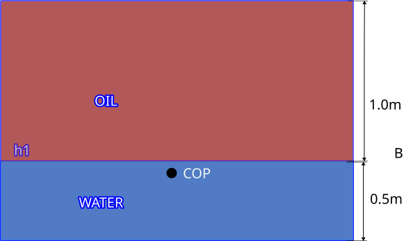
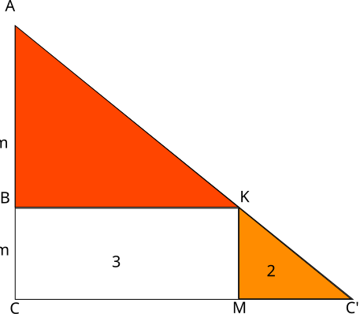

## Problem
Small rectangular tank full of Fresh water upto a height of 0.5m above base. Oil of relative density 0.8 is floating in settled condition above water, the height of Oil is 1.0m (Example: a small sludge tank in Engine Room) Calculate total pressure on one bulkhead of tank and find center of pressure from top of the tank.

## Answer

To understand the pressure diagram and its use here :
Pressure at Point 1 = \(h \times \rho \times g = 0 \)
Pressure at point 2 = \(h_1 \times \rho \times g =  h_1 \times 0.8 T/m^2 \)

Therefore triangle ABK represents a pressure diagram 
If we make one triangle for each vertical at \(P_1 and P_2\).
Volume of wedge formed by triangle ABK across BB that is 2m gives us the thrust.

**1.** Thrust due to Oil only \(= AB \times \frac {1}{2} \times 1 \times 0.8 \times 2 = 0.8 tons \)

**2.** Thrust on BBCC (due to water only)\(= 0.5 \times 1.0 \times 0.5 \times \frac{1}{2}\times 2= 0.25 tons\)

**3.**thrust on BKMC 
* (oil) = Pressure at BK is same as at CM . = \(h_1 \times 0.8 = 0.8 Tm^-2)
* (water) = \(0.8 tm^-2 \times 2 \times 0.5 = 0.8 tons \)

Therefore Final result \(= 1+2+3 = 0.8 + 0.25 +0.8 = 1.85  tons\)
