---
title: Question and Answers-1
type: docs

---
**Q1(a): Explain and illustrate the importance of Bonjean curves and with suitable diagrams and examples and state how they are applied in various calculations of naval architecture.** 

**Ans:** # Bonjean Curves in Naval Architecture 

*Introduction:* Bonjean curves, named after the French naval architect Jean-Baptiste Bonjean, are an essential tool in naval architecture for calculating various hydrostatic properties of a ship's hull. These curves provide a graphical representation of the underwater volume of a ship at different drafts and longitudinal positions. 

\## Importance of Bonjean Curves 

1. \*\*Quick Volume Calculations\*\*: Bonjean curves allow naval architects to quickly determine the volume of displacement for any given draft and trim condition. 
1. \*\*Stability Analysis\*\*: They are crucial in calculating the ship's stability characteristics, including the metacentric height and righting moments. 
1. \*\*Damage Stability\*\*: In case of hull damage, Bonjean curves help in assessing the impact on the ship's stability and buoyancy. 
1. \*\*Load Distribution\*\*: They aid in determining the effect of different loading conditions on the ship's trim and draft. 
1. \*\*Grounding Calculations\*\*: When a ship runs aground, Bonjean curves help in estimating the forces required to refloat the vessel. 

   ## Illustration of Bonjean Curves 

   Here's a simplified diagram illustrating Bonjean curves: 

   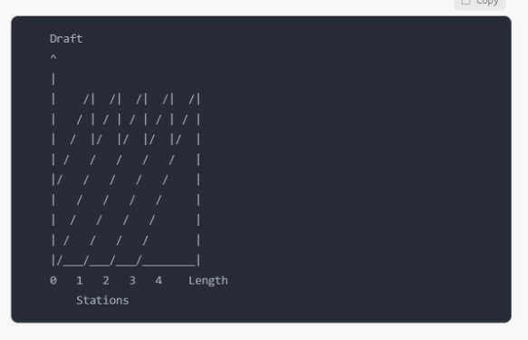Each vertical line represents a station along the ship's length. The curves show how the sectional area changes with draft at each station. 

   ## Application in Naval Architecture Calculations 

1. \*\*Displacement Calculation\*\*: 
- By integrating the area under the Bonjean curves, the volume of displacement can 

be calculated for any draft. 

- Example: If a ship's draft increases from 5m to 6m, the additional volume can be 

quickly determined using the curves. 

2. \*\*Trim Calculations\*\*: 
- Bonjean curves help in determining how the ship's trim changes with different 

loading conditions. 

- Example: When loading cargo in the forward hold, the curves show how much the 

bow will sink and the stern will rise. 

3. \*\*Stability Assessment\*\*: 
- The curves are used to calculate the ship's waterplane area and its centroid, which 

are crucial for stability calculations. 

- Example: In calculating the metacentric height (GM), the moment of inertia of the 

waterplane area is derived from Bonjean curves. 

4. \*\*Damage Stability\*\*: 
- If a compartment is breached, Bonjean curves help estimate the new equilibrium 

position. 

- Example: A hole in the side at a specific location can be analyzed to determine the 

new draft and trim. 

5. \*\*Grounding Calculations\*\*: 
- When a ship runs aground, the curves help determine the ground reaction force. 
- Example: If the ship is grounded at a specific point, the curves show how much 

buoyancy is lost and what force is needed to refloat. 

\## Conclusion 

Bonjean curves are a powerful tool in naval architecture, providing a visual and mathematical representation of a ship's underwater geometry. They simplify complex calculations and enable quick assessments of various hydrostatic properties, making them indispensable in ship design, operation, and emergency response planning. 

**Q1(b): Draw a sketch of a screw propeller and show the hub , blade tip, blade root, propeller diameter, pressure face, and suction back.**  

**Ans:** 

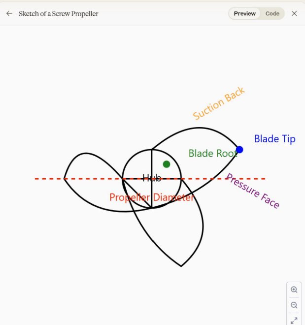

Here's a brief explanation of each part: 

Hub: The central part of the propeller where the blades are attached. 

Blade Tip: The outermost part of the propeller blade. 

Blade Root: Where the blade connects to the hub. 

Propeller Diameter: The diameter of the circle traced by the blade tips as the propeller rotates. 

Pressure Face: The side of the blade that pushes against the water (facing aft when the ship moves forward). 

Suction Back: The opposite side of the blade, which experiences lower pressure during operation. 

The sketch shows a three-bladed propeller viewed from the stern of the ship. The propeller diameter is indicated by the red dashed line across the entire width of the propeller. 

**Q2: Describe with appropriate diagrams the effect on curve of statical stability and determination of ship’s residual dynamic stability considering the effect of** 

**the following separately: (I) Grain cargo shift  (ii) Formation of ice** 

**Ans:**  
**
` `\*\*I) Grain Cargo Shift\*\*  

Grain cargo presents a significant risk to a vessel’s stability due to its shifting nature. When a ship carries grain, especially when not tightly packed or in partially filled holds, the cargo can shift during heavy rolling or listing. This movement of the cargo causes a change in the ship’s center of gravity (G), leading to stability problems. 

\#### \*\*Impact of Grain Cargo Shift on Stability\*\*: 

1. \*\*Change in Center of Gravity (G)\*\*: 
- When grain shifts from one side to another due to ship rolling, the center of 

gravity moves towards the shifted cargo. This movement causes a reduction in \*\*righting arm (GZ)\*\* and can increase the list. 

- The center of gravity moves off the centerline in the direction of the cargo shift, 

decreasing stability. 

2. \*\*Reduction in Initial Stability\*\*: 
- As the cargo shifts, the initial metacentric height (GM) reduces, leading to lower 

initial stability. The curve of statical stability (GZ curve) becomes narrower, and the maximum righting lever (GZmax) decreases. 

- In extreme cases, this can lead to capsizing if the righting moments are not 

sufficient to counter the heeling moments caused by the cargo shift. 

3. \*\*Angle of List\*\*: 
- Once the cargo shifts, the ship can assume a permanent list due to the shifted 

weight, which affects the ship’s overall equilibrium. This increases the heeling angle, and the GZ curve shifts accordingly. 

- The list reduces the area under the GZ curve, which represents the ship’s dynamic 

stability. This can reduce the vessel's ability to recover from rolling. 

\#### \*\*Effect on Statical Stability Curve (Diagram)\*\*: 

- The GZ curve shifts to reflect the new center of gravity. 
- The curve becomes more asymmetrical with reduced positive stability range. 

|  | 

\*II) Formation of Ice\*\* 

Ice accumulation, especially on the ship’s superstructure and decks, poses a serious stability risk. Ice adds weight high up on the ship, raising the center of gravity and reducing the metacentric height (GM). 

\#### \*\*Impact of Ice Formation on Stability\*\*: 

1\. \*\*Raising the Center of Gravity\*\*: 

- The added weight of ice accumulates high above the deck level, which raises the 

ship’s center of gravity (G), effectively reducing the metacentric height (GM). This decreases the vessel’s initial stability. 

1. With a higher G, the righting arm (GZ) decreases across all angles of heel. 
2. \*\*Reduction in Righting Arm (GZ)\*\*: 
   1. The formation of ice causes a marked reduction in the righting lever (GZ) across 

all angles of heel. This makes the ship more prone to capsizing. 

- The GZ curve flattens, with the peak righting arm occurring at a smaller angle of 

heel. Additionally, the range of positive stability reduces significantly. 

3. \*\*Increased Heeling Moment\*\*: 
- The weight of ice accumulation on one side or due to uneven distribution can 

cause a significant heeling moment. This can exacerbate the list, reducing the residual dynamic stability of the ship. 

4. \*\*Loss of Reserve Buoyancy\*\*: 
- Ice formation can also affect the ship’s freeboard by reducing reserve buoyancy, 

particularly in smaller vessels or vessels with low freeboard, which worsens the stability characteristics further. 

\#### \*\*Effect on Statical Stability Curve (Diagram)\*\*: 

- The curve becomes lower and shifts leftward. 
- The maximum righting arm occurs at a smaller angle of heel, and the overall range of positive stability decreases. 

|  | 

` `\*\*Residual Dynamic Stability\*\*: 

Residual dynamic stability refers to the remaining stability that a vessel has after accounting for external influences like grain shift or ice formation. It is the area under the GZ curve, representing the ship's ability to return to an upright position after being heeled over. 

1. \*\*For Grain Shift\*\*: 
- Residual dynamic stability decreases due to the permanent list and reduction in 

the GZ curve. The righting moment decreases, and the area under the curve diminishes. 

2. \*\*For Ice Formation\*\*: 
- Ice formation dramatically reduces the righting arm, and the GZ curve shifts 

downward. The vessel’s ability to recover from large angles of heel is significantly reduced, which is critical in rough sea conditions. 

\*\*Conclusion\*\*: 

Both grain cargo shift and ice formation lead to a detrimental effect on the vessel’s statical stability, reducing the maximum righting lever (GZmax), the range of positive stability, and the overall residual dynamic stability. Proper operational measures, such as securing grain cargo and de-icing protocols, are essential to maintain the ship's safety at sea. 

\*\*Key Considerations\*\*: 

- Regular inspections and adjustments to secure cargo and manage ice accumulation are crucial for ensuring ship stability. 
- Understanding how these external factors affect the GZ curve helps in making operational decisions, such as adjusting ballast or altering course in bad weather conditions. 

  **Q3. Using the classical simple harmonic motion equation , derive the expression for natural period of roll “Tr”, for a ship in still water conditions. Clearly state what is meant by radius of gyration.** 

  **Ans:** 

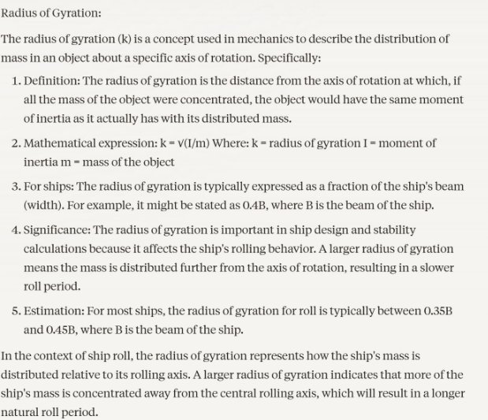

**Q4: Draw a diagram and a GZ with angle of heel graph to show and explain angle of loll of a ship. Using wall sided formula, how can we calculate GM at angle of loll?** 

**Ans:** 

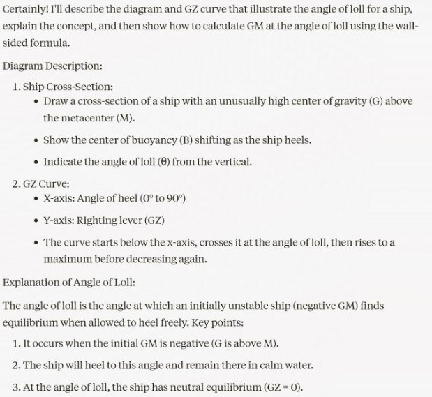

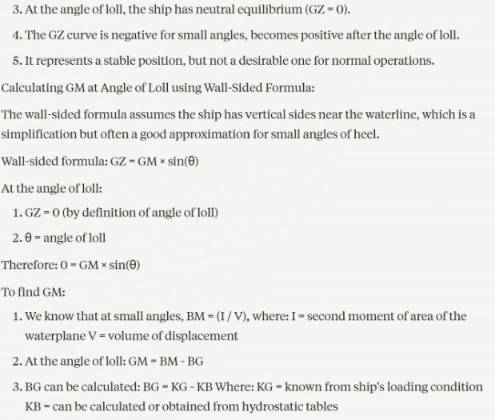

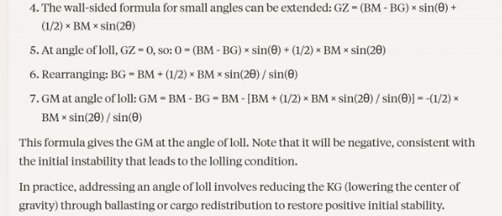

**Q5(a): How does a submarine surface and submerge with the help of the mail ballast tanks? Write in detail with proper sketches. How and why are hydroplanes used in the early part of surfacting?** 

**Ans:** Submarine Surfacing and Submerging: 

1. Main Ballast Tanks (MBTs): 

`   `Submarines use MBTs to control their buoyancy. These are large tanks located between the inner pressure hull and the outer hull. 

Sketch description:  

- Show a cross-section of a submarine with the pressure hull inside and the outer hull. 
- Indicate several large tanks between these hulls labeled as "Main Ballast Tanks" 
2. Submerging Process: 
1. To submerge, the submarine opens the flood valves at the top of the MBTs. 
1. This allows seawater to enter the tanks, replacing the air. 
1. As the tanks fill, the submarine's overall density increases. 
1. When the submarine's density becomes greater than that of the surrounding 

water, it begins to sink. 

Sketch description: 

- Show the submarine with arrows indicating water flowing into the MBTs from the top. 
- Illustrate the submarine angling downward as it begins to submerge. 
3. Surfacing Process: 
1. To surface, high-pressure air is blown into the MBTs. 
1. This air forces the water out through the bottom of the tanks. 
1. As the water is replaced by air, the submarine's overall density decreases. 
1. When the submarine becomes less dense than the surrounding water, it begins to 

rise. 

Sketch description: 

- Show the submarine with arrows indicating air being forced into the MBTs from the bottom. 
- Illustrate water being expelled from the bottom of the tanks. 
- Show the submarine angling upward as it begins to surface. 
4. Neutral Buoyancy: 

`   `Submarines can achieve neutral buoyancy by carefully controlling the amount of water in the MBTs. 

Sketch description: 

- Show the submarine level in the water with MBTs partially filled. 

Use of Hydroplanes: 

Hydroplanes are wing-like control surfaces on a submarine used to control its depth and attitude in the water. 

1. Location: 

`   `Submarines typically have two sets of hydroplanes: 

- Bow planes: Near the front of the submarine 
- Stern planes: Near the rear of the submarine 

Sketch description: 

- Show a side view of a submarine indicating the location of bow and stern planes. 
2. Function: 

`   `Hydroplanes work by creating hydrodynamic forces as water flows over them, similar to how airplane wings generate lift. 

3. Use in Early Stages of Surfacing: 
1. When a submarine begins to surface, it's still moving forward through the water. 
1. The hydroplanes are angled to create an upward force, helping to direct the 

submarine towards the surface. 

3. This allows for more precise control of the surfacing process, especially when the 

submarine is still at depth. 

Sketch description: 

- Show a submarine beginning to surface with hydroplanes angled upward. 
- Indicate water flow and upward force vectors on the hydroplanes. 
4. Why Hydroplanes are Important in Early Surfacing: 
1. Control: They provide fine control over the submarine's ascent rate and angle. 
1. Safety: Allow for a controlled ascent, preventing too rapid surfacing which could 

be dangerous. 

3. Stealth: Enable the submarine to approach the surface gradually, maintaining a 

degree of concealment. 

4. Energy Efficiency: Help in surfacing without relying solely on ballast changes, 

which require energy to pump air. 

5. Transition: 

`   `As the submarine nears the surface, it gradually reduces the angle of the hydroplanes and relies more on positive buoyancy from the MBTs to complete the surfacing process. 

Sketch description: 

- Show a series of images of the submarine at different depths, with hydroplanes gradually reducing their angle as the sub approaches the surface. 

  In conclusion, the main ballast tanks provide the primary means of controlling a submarine's buoyancy for surfacing and submerging, while hydroplanes offer precise control of depth and attitude, especially crucial in the early stages of surfacing for safety, control, and tactical reasons. 

  **Q5(b) : State the alternative intact stability criteria for a timber carrier as per the I.S. Code 2008. Enumerate reasons for the changed criteria. What are the pre-requisites to be eligible for this criteria?** 

  **Ans:** Alternative Intact Stability Criteria for Timber Carriers (I.S. Code 2008): 

  The International Maritime Organization (IMO) developed alternative intact stability criteria for timber carriers, outlined in the \*\*2008 International Code on Intact Stability (IS Code)\*\*. Timber carriers have unique stability considerations due to the high and often unsecured deck cargo, which affects their stability characteristics. The alternative criteria for timber carriers ensure their safety while accounting for the specific challenges they face. 

  ### \*\*Alternative Intact Stability Criteria for Timber Carriers\*\*: 

  The alternative intact stability criteria for timber carriers, as per the IS Code 2008, include the following: 

1. \*\*Initial Metacentric Height (GM)\*\*: 
- The \*\*initial GM\*\* after loading should be at least \*\*0.15 meters (15 cm)\*\*, 

considering the vessel's condition with the timber deck cargo. 

2. \*\*Righting Lever Curve (GZ Curve)\*\*: 
- \*\*GZmax\*\* (maximum righting arm) should not be less than \*\*0.25 meters (25 

cm)\*\* at an angle of heel not less than 30°. 

- The \*\*angle of maximum righting lever\*\* (GZmax) should occur at an angle not 

less than \*\*25°\*\*. 

3. \*\*Range of Positive Stability\*\*: 
- The range of positive stability should be at least \*\*15°\*\* beyond the angle of heel 

at which GZmax occurs. 

4. \*\*Heeling Moments\*\*: 
- The ship must have sufficient stability to counteract heeling moments from 

external factors like wind pressure, especially when timber is loaded on the deck. This ensures the vessel can resist heeling even with large deck cargo. 

5. \*\*Stability at 40° Heel\*\*: 
- The righting lever at a heel of \*\*40°\*\* or greater should not be negative, ensuring 

there is still positive stability beyond this angle. 

6. \*\*Wind Heeling Criteria\*\*: 
- The stability criteria must take into account the heeling moment due to wind 

acting on the exposed timber deck cargo. The vessel should have adequate righting levers to resist the heeling moment caused by wind. 

\--- 

\### \*\*Reasons for the Changed Criteria\*\*: 

1. \*\*Higher Deck Cargo\*\*: 
- Timber carriers transport large volumes of deck cargo, increasing the center of 

gravity, and reducing metacentric height (GM). Traditional stability criteria do not account for the elevated height and dynamic behavior of timber cargo. 

2. \*\*Wind Effect on Deck Cargo\*\*: 
- The large volume of timber carried on deck increases the ship's windage area, 

making it more susceptible to wind heeling moments. The alternative criteria take this 

into account by ensuring stability under the influence of wind pressure. 

3. \*\*Shift of Timber Cargo\*\*: 
- Timber deck cargo, if not secured properly, can shift during the voyage, affecting 

the ship's stability. The alternative criteria ensure that even if cargo shifts, there is sufficient residual stability. 

4. \*\*Increased Free Surface Effect\*\*: 
- Due to the deck load of timber, the free surface effect of ballast tanks and liquid 

cargo becomes more critical. The criteria ensure that the ship can maintain adequate stability despite this effect. 

5. \*\*Practical Challenges in Securing Cargo\*\*: 
- The difficulty of properly securing deck timber cargo, especially in rough seas, 

necessitates different stability criteria that accommodate the possibility of cargo movement or water saturation of timber, which increases weight and affects stability. 

\--- 

\### \*\*Pre-requisites to be Eligible for the Alternative Stability Criteria\*\*: 

To qualify for the alternative intact stability criteria, a timber carrier must meet specific conditions: 

1. \*\*Type of Cargo\*\*: 
- The vessel must be carrying \*\*timber deck cargo\*\*. The cargo must be stacked 

and secured in accordance with the \*\*International Convention on Load Lines (ICLL)\*\* requirements. 

2. \*\*Cargo Securing\*\*: 
- Timber must be properly secured using lashings and other securing arrangements 

as per international regulations. This ensures the cargo does not shift during the voyage. 

3. \*\*Freeboard and Deck Openings\*\*: 
- The ship must maintain an appropriate \*\*freeboard\*\* with deck cargo, and all 

deck openings must be properly secured to prevent water ingress. 

4. \*\*Adequate Ballast\*\*: 
- The vessel must carry sufficient ballast to enhance stability when carrying timber 

deck cargo. This ballast helps counteract the raised center of gravity due to the deck cargo. 

5. \*\*Compliance with Load Line Convention\*\*: 
- The ship must comply with the Load Line Convention requirements for timber 

deck carriers, which include structural modifications like bulwarks or uprights to secure the cargo. 

6. \*\*Stability Documentation\*\*: 
- The vessel's stability booklet must reflect the alternative criteria and provide clear 

guidance on stability management with timber deck cargo. 

\## \*\*Conclusion\*\*: 

The alternative intact stability criteria for timber carriers in the IS Code 2008 ensure that ships carrying timber deck cargo can maintain sufficient stability under challenging conditions. These criteria account for the unique risks posed by high deck cargo, including wind effects, cargo shift, and free surface effect, providing a tailored solution to safeguard the vessel’s stability during the voyage. 

**Q6: What are the hydrodynamic causes of and the remedies to avoid dangers of (I) Interaction of ship and river bank and (ii) interaction of ship with ship bottom.**  

**Ans:** ### Hydrodynamic Causes and Remedies to Avoid the Dangers of Ship Interaction: 

\#### (I) \*\*Interaction of Ship and River Bank (Bank Suction and Bank Cushion Effect):\*\* 

When a ship navigates close to a riverbank or canal wall, two significant hydrodynamic phenomena occur, referred to as \*\*bank suction\*\* and \*\*bank cushion\*\*. These effects can destabilize a ship, leading to dangerous situations, especially in narrow waterways. 

1. \*\*Bank Suction Effect\*\*: 
- \*\*Cause\*\*: 
  - As a ship moves near the bank, the water between the ship's hull and the 

riverbank is squeezed, creating higher water flow velocity along the bank side. 

- According to Bernoulli’s principle, the increased water velocity reduces pressure 

between the ship and the bank. This low-pressure area causes the ship to be pulled or sucked toward the bank. 

- \*\*Danger\*\*: 
  - \*\*Uncontrolled drift towards the bank\*\*: The ship can suddenly veer towards 

the bank, increasing the risk of grounding or collision. 

2. \*\*Bank Cushion Effect\*\*: 
- \*\*Cause\*\*: 
  - As the bow of the ship approaches the bank, the water ahead of it gets 

compressed. This compression increases the water pressure on the bow, which pushes the bow away from the bank. 

- \*\*Danger\*\*: 
  - \*\*Erratic course changes\*\*: While the stern is sucked towards the bank due to 

the suction effect, the bow is pushed away, creating a rotational moment that can lead to uncontrollable yawing. 

\*\*Remedies to Avoid Bank Interaction\*\*: 

- \*\*Maintain Adequate Distance\*\*: 
  - Avoid navigating too close to the bank. Keep a safe distance to reduce the effect of 

bank suction and cushion. 

- \*\*Slow Speed\*\*: 
  - Reduce the ship’s speed when approaching narrow waterways or riverbanks. 

Higher speed increases the magnitude of these hydrodynamic forces, making the ship more difficult to control. 

- \*\*Use of Rudder\*\*: 
  - Anticipate and compensate for bank suction and cushion by using appropriate 

rudder adjustments to counteract the pull or push forces. 

- \*\*Adequate Under Keel Clearance (UKC)\*\*: 
  - Ensure that the under keel clearance is sufficient to minimize the hydrodynamic 

forces acting on the ship when close to the bank. 

- \*\*Bow Thrusters\*\*: 
  - Use of bow thrusters, if available, can help maintain the ship's course and 

counteract bank cushion or suction. 

\--- 

\#### (II) \*\*Interaction of Ship with the Bottom (Squat Effect)\*\*: 

When a ship navigates in shallow waters, it experiences what is known as \*\*squat\*\*, where the ship's draft increases due to a decrease in pressure beneath the hull caused by the ship's forward motion. 

1. \*\*Squat Effect\*\*: 
- \*\*Cause\*\*: 
  - As the ship moves through shallow water, the water flow under the hull speeds 

up, reducing the pressure (Bernoulli’s principle). This pressure drop causes the ship to sink deeper into the water, increasing its draft. 

- In shallow water, the ship’s stern generally sinks more than the bow, leading to a 

\*\*stern squat\*\*. 

- \*\*Danger\*\*: 
  - \*\*Grounding risk\*\*: Squat can significantly reduce under keel clearance (UKC), 

leading to a higher risk of running aground, especially in confined or shallow waterways. 

2. \*\*Shallow Water Effect\*\*: 
- \*\*Cause\*\*: 
  - In very shallow waters, the flow of water under the hull becomes restricted, 

causing additional hydrodynamic resistance and slowing down the ship. The interaction between the ship and the sea bottom also amplifies the squat effect. 

- \*\*Danger\*\*: 
- \*\*Loss of maneuverability\*\*: The ship may become difficult to steer or 

maneuver as the hydrodynamic forces reduce rudder effectiveness and increase turning circle. 

\*\*Remedies to Avoid Bottom Interaction\*\*: 

- \*\*Reduce Speed\*\*: 
  - The squat effect increases with speed. By slowing down, the pressure reduction 

under the ship decreases, thereby reducing the squat effect. 

- \*\*Maintain Adequate Under Keel Clearance (UKC)\*\*: 
  - Ensure sufficient under keel clearance to avoid the ship sinking too deep into the 

water. Always assess UKC based on vessel speed and water depth. 

- \*\*Careful Passage Planning\*\*: 
  - Plan the passage considering shallow areas and narrow channels to ensure safe 

water depth for the ship’s draft and avoid excessive squat. 

- \*\*Use of Depth-Sensing Equipment\*\*: 
  - Regularly monitor the water depth with echo sounders or other depth-sensing 

equipment to ensure that the vessel stays clear of the bottom, especially in shallow waters. 

- \*\*Navigating Central in the Channel\*\*: 
  - Keeping the ship near the center of the channel ensures that the water depth is 

maximized and the risk of grounding due to squat is minimized. 

- \*\*Load Line Considerations\*\*: 
  - Ensure proper distribution of cargo and ballast to maintain an even keel and avoid 

excessive stern squat, especially when navigating in shallow waters. 

\--- 

\### Conclusion: 

- \*\*Bank Suction and Cushion Effects\*\* and \*\*Squat Effects\*\* are significant hydrodynamic phenomena that can adversely affect ship navigation in restricted waters. 
- The primary remedies involve maintaining appropriate speed, distance from the bank, adequate under keel clearance, and using the rudder or bow thrusters to counteract hydrodynamic forces. 
- Passage planning, continuous monitoring of water depth, and reducing speed are critical in avoiding the dangers associated with these interactions. 

  **Q7: A container ship of length 122m is observed to be steaming at high speed. The first trough of the bow wave system is seen to coincide with the stern trough. Estimate the speed of container ship assuming that the wave system distance is 0.9L.** 

  **Ans:** 

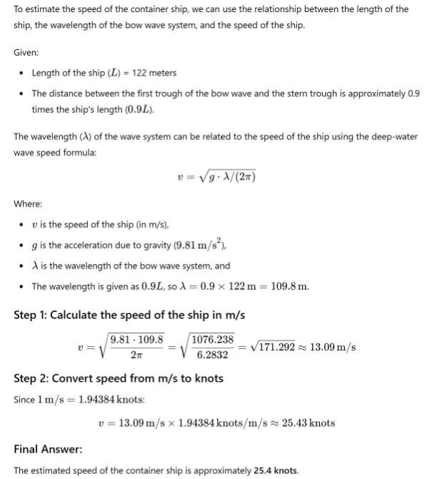

**Q8: Discuss the reasons for parametric rolling in ships with fine bow lines and full and broad sterns. What is the relationships of Tr with Te for parametric rolling to occur when vessel is heading into waves?** 

**Ans:** \*\*Parametric Rolling in Ships: Causes and Conditions\*\* 

Parametric rolling is a dangerous phenomenon where a ship experiences large rolling motions due to variations in wave-induced forces acting on the hull. Ships with \*\*fine bow lines\*\* and \*\*full, broad sterns\*\* are particularly susceptible to parametric rolling. This occurs mainly when the vessel is sailing in head or following seas, and the wave-induced motions resonate with the ship’s natural roll frequency. Below are the causes and key factors contributing to this phenomenon: 

\#### \*\*Causes of Parametric Rolling in Ships with Fine Bow and Broad Stern:\*\* 

1. \*\*Wave-Induced Changes in Buoyancy and Stability\*\*: 
- \*\*Fine bow lines\*\*: Ships with fine bows tend to have less buoyancy in the 

forward section when in calm water. However, when the ship encounters waves, especially head waves, the bow rises and falls significantly, leading to large periodic changes in the buoyancy distribution along the hull. 

- \*\*Broad sterns\*\*: Ships with a full and broad stern have large buoyancy in the aft 

section. When waves pass under the stern, the buoyancy in this section increases significantly, causing large fluctuations in the ship's transverse stability. 

- These variations in buoyancy between the bow and stern cause changes in the 

ship's \*\*metacentric height (GM)\*\*, which periodically alters the ship's stability as it pitches in waves. This periodic instability is a key trigger for parametric rolling. 

2. \*\*Changes in Transverse Stability\*\*: 
- As waves pass under the bow and stern, the ship experiences fluctuating stability 

due to the \*\*cyclic variation of wave crests and troughs\*\* acting on different sections of the hull. When the bow is in a wave crest, the ship gains buoyancy forward, temporarily increasing stability, and when the bow is in a wave trough, it loses buoyancy, reducing stability. 

- The \*\*loss of stability\*\* during the trough phases and the \*\*restoration of 

stability\*\* during the crest phases create a resonance effect, where the ship’s natural roll period aligns with the wave period, causing large rolling motions. 

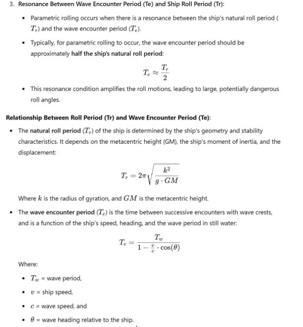

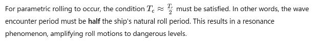

\#### \*\*Specific Factors Leading to Parametric Rolling in Ships with Fine Bows and Broad Sterns\*\*: 

1. \*\*Wave Pattern and Heading\*\*: 
- Parametric rolling is most likely to occur when the ship is \*\*heading into waves\*\* 

or \*\*following waves\*\*. These headings cause more significant variations in the wave-induced buoyancy changes along the hull length compared to beam seas. 

2. \*\*Large Fluctuations in Stability\*\*: 
- The fine bow and broad stern enhance the fluctuations in transverse stability 

because the forward and aft sections of the hull respond differently to wave crests and troughs. The fine bow can easily dip into the wave troughs, reducing stability, while the broad stern increases buoyancy in the wave crests, increasing stability temporarily. 

3. \*\*Ship’s Roll Period\*\*: 
- Ships with broad sterns generally have lower natural roll frequencies (larger 

\(T\_r\)), making them more likely to experience resonance with wave encounter periods. The fine bow makes them more sensitive to pitch and heave, which increases the likelihood of developing large rolling motions when the wave encounter period matches half the roll period. 

\*\*Summary of the Conditions for Parametric Rolling\*\*: 

1\. \*\*Primary Cause\*\*: The periodic changes in stability due to alternating buoyancy forces when waves pass under the ship's bow and stern, particularly in ships with fine bows and broad sterns. 

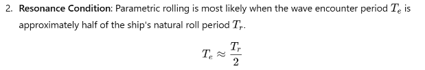

3. \*\*Ship and Wave Characteristics\*\*: 
- Ships with fine bows and full sterns experience greater fluctuations in stability, 

which can induce large roll angles when the wave encounter period matches the resonance condition. 

4. \*\*Remedies\*\*: 
- \*\*Speed reduction\*\*: Reducing speed can break the resonance condition by 

altering the wave encounter period. 

- \*\*Course alteration\*\*: Changing the ship’s heading relative to the waves can 

reduce the risk of encountering wave periods that trigger parametric rolling. 

- \*\*Active roll stabilization systems\*\*: Use of fin stabilizers or anti-rolling devices 

to dampen the rolling motions. 

\### \*\*Conclusion\*\*: 

Parametric rolling in ships with fine bows and broad sterns is a significant risk, especially in head seas or following seas. The phenomenon is driven by resonance between the ship’s natural roll period and the wave encounter period, with large rolling motions occurring when the wave encounter period is approximately half the natural roll period. Proper speed and course adjustments can help mitigate the risk of parametric rolling. 

**Q9: write notes in respect of the following about a submarine (1) trimming tanks and manoeuvring  (2) hull buoyancy variation after torpedo ejection (3) depth compensation tank.** 

**Ans:** ### Notes on Submarine Operations: #### 1. \*\*Trimming Tanks and Manoeuvring\*\* 

\*\*Trimming tanks\*\* on a submarine are used to adjust and control the vessel's longitudinal balance and overall buoyancy. These tanks play a crucial role in the submarine’s ability to maintain depth, dive, surface, and control its trim (the angle of the submarine’s hull relative to the horizontal plane). 

- \*\*Trimming Tanks Functionality\*\*: 
  - Submarines are equipped with \*\*fore and aft trimming tanks\*\*, which are located 

at opposite ends of the vessel. 

- Water can be transferred between these tanks to adjust the submarine’s trim, 

ensuring the vessel remains level during horizontal motion. 

- For \*\*longitudinal stability\*\*, water is moved from one tank to another, allowing 

the submarine to dive or surface at the correct angles without excessive pitch. 

- \*\*Manoeuvring\*\*: 
  - Trimming tanks are used in conjunction with \*\*ballast tanks\*\* and \*\*planes 

(hydroplanes)\*\* to control depth and buoyancy. 

- \*\*Ballast tanks\*\* are flooded or emptied with water to increase or decrease overall 

buoyancy, while trimming tanks allow for fine adjustments to trim for precise manoeuvring. 

- \*\*Hydroplanes (dive planes)\*\* located at the bow and stern are used to control the 

angle of the submarine during forward motion, aiding in depth control. 

In manoeuvring, trimming tanks allow for small, precise changes in buoyancy to ensure stable navigation and prevent uncontrolled dives or surfaces. 

\--- 

\#### 2. \*\*Hull Buoyancy Variation After Torpedo Ejection\*\* 

After a submarine ejects a \*\*torpedo\*\*, there is a \*\*loss of mass\*\*, leading to an increase in the submarine's overall buoyancy. This is a critical situation because if not properly managed, it could cause the submarine to ascend unintentionally. 

- \*\*Impact of Torpedo Ejection\*\*: 
  - \*\*Torpedos\*\* are stored within the submarine’s hull and occupy a significant 

volume and mass. When they are fired, the sudden reduction in mass can cause an imbalance in buoyancy. 

- The \*\*buoyancy variation\*\* depends on the mass of the torpedo and the number 

of torpedoes fired. Each torpedo adds positive buoyancy, which may lead to an upward motion. 

- \*\*Buoyancy Correction\*\*: 
  - To maintain depth after torpedo ejection, \*\*compensating ballast tanks\*\* are used 

to offset the loss of weight. Water is taken into these tanks to balance the buoyancy. 

- In some designs, submarines may have \*\*torpedo compensating tanks\*\*, 

specifically designed to counter the buoyancy changes associated with torpedo launches. 

Proper compensation is crucial to prevent the submarine from surfacing, which could jeopardize the mission or lead to detection. 

\--- 

\#### 3. \*\*Depth Compensation Tank\*\* 

The \*\*depth compensation tank\*\* is used to maintain neutral buoyancy at different depths by compensating for changes in water density. As submarines dive deeper, water pressure increases, compressing the air inside the submarine’s ballast tanks and slightly reducing the overall volume of the submarine, thereby affecting its buoyancy. 

- \*\*Function\*\*: 
  - The \*\*depth compensation tank\*\* allows the submarine to adjust its internal 

ballast to maintain \*\*neutral buoyancy\*\* despite the increasing external pressure. 

- As a submarine dives deeper, the water density increases, and the \*\*effective 

buoyancy decreases\*\*. The depth compensation tank compensates for this by either adding or removing water to ensure that the submarine remains neutrally buoyant at all depths. 

- \*\*Control of Neutral Buoyancy\*\*: 
  - This tank is crucial when a submarine wants to remain at a certain depth without 

ascending or descending. It fine-tunes the balance between the weight of the submarine and the buoyancy forces. 

- Without such compensation, submarines might experience \*\*“negative 

buoyancy”\*\* at greater depths, forcing them to sink uncontrollably, or \*\*“positive buoyancy”\*\* at shallow depths, leading to an unintentional ascent. 

The depth compensation tank is integral to precise depth control and helps submarines avoid vertical motion caused by external pressure variations as they dive or surface. 

\--- 

\### \*\*Summary\*\*: 

1. \*\*Trimming Tanks and Manoeuvring\*\*: Trimming tanks allow for the fine-tuning of buoyancy and trim, critical for stable and precise submarine navigation. 
1. \*\*Hull Buoyancy Variation After Torpedo Ejection\*\*: The loss of mass after firing torpedoes leads to positive buoyancy, requiring ballast adjustments to maintain depth. 
1. \*\*Depth Compensation Tank\*\*: This tank helps manage the effects of increased water pressure and density at greater depths, ensuring the submarine remains neutrally buoyant. 

   **Q10: write on the hydrodynamic lift features of a planning hull boat with a hard** 

   **chine shape. Why does such a boat have poor seakeeping ability and poor reputation for passenger comfort ?**  

   **Ans:** ### Hydrodynamic Lift Features of a Planing Hull Boat with a Hard Chine Shape 

   A \*\*planing hull\*\* is designed to \*\*ride on top of the water\*\* at high speeds, as opposed to displacing water like a displacement hull. The key to the operation of planing hulls is the generation of \*\*hydrodynamic lift\*\*, which reduces the amount of hull in contact with the water, thereby minimizing drag and allowing the boat to achieve greater speeds. 

   #### 1. \*\*Hydrodynamic Lift in a Planing Hull\*\* 

- \*\*Lift Generation\*\*: As the boat gains speed, water pressure beneath the hull increases, creating \*\*lift\*\*. This lift raises the hull out of the water, reducing drag by decreasing the wetted surface area. 
- \*\*Angle of Attack\*\*: The hull is designed with a particular \*\*angle of attack\*\*, typically determined by the hull's deadrise angle (the angle between the horizontal plane and the bottom of the boat at the keel). This allows the boat to ride higher in the water as speed increases. 
- \*\*Hard Chine\*\*: A \*\*hard chine hull\*\* has a distinct, sharp angle where the side of the boat meets the bottom. This sharp angle helps in creating a well-defined planing surface, which assists in generating lift efficiently and provides a quicker transition from displacement to planing mode. 
  - Hard chines produce more lift by creating a large flat surface for the water to act 

on, allowing the boat to quickly rise on top of the water. 

- \*\*Flat Bottom\*\*: Many planing hulls with hard chines are designed with relatively \*\*flat or shallow-V bottoms\*\*, which provide more lift at high speeds. 

  #### 2. \*\*Why a Hard Chine Planing Hull Boat Has Poor Seakeeping Ability\*\* 

  While planing hulls with hard chines excel at speed and efficiency, they are known for poor \*\*seakeeping\*\* ability in rough waters due to the following reasons: 

- \*\*Reduced Stability in Waves\*\*: Hard chine boats tend to slam and pound into waves when encountering rough seas. The flat or shallow-V hull, which works well for lift in calm waters, is more likely to slam down hard into waves, creating a jarring and uncomfortable ride. 
- \*\*High Impact with Waves\*\*: In heavy seas, the sharp chine and relatively flat bottom do not cut through the water efficiently. This leads to \*\*high-impact shocks\*\* every time the boat encounters a wave, causing excessive vertical motion (heaving). 
- \*\*Planing Mode Sensitivity\*\*: The transition from displacement to planing mode is critical. If the boat is at intermediate speeds, the hull may not generate enough lift, leading to excessive bow rise and making the boat less stable. If speeds are too low, the boat may ride rough and feel unstable. 

  #### 3. \*\*Poor Reputation for Passenger Comfort\*\* 

  The hard chine planing hull has a \*\*poor reputation for passenger comfort\*\*, especially in rough conditions, due to: 

- \*\*Pounding and Slamming\*\*: When the boat encounters waves at high speeds, the flat bottom slaps down** on the water surface after leaving the crest of the wave, leading to \*\*pounding\*\*. This repeated impact results in uncomfortable, jarring movements. 
- \*\*Vibrations and Noise\*\*: The impact of slamming into waves causes vibrations to be transmitted through the hull, leading to \*\*noise and discomfort\*\* for passengers. 
- \*\*Limited Dampening of Vertical Motion\*\*: The relatively flat bottom and hard chine design offer little in terms of cushioning or dampening the vertical accelerations caused by waves. This lack of cushioning exacerbates the discomfort for those onboard, especially at higher speeds in rough waters. 
- \*\*Increased Rolling\*\*: At slower speeds, hard chine boats are prone to \*\*rolling\*\* from side to side in beam seas due to the sharp chine edges digging into the water unevenly, making it difficult to stabilize the vessel and adding to passenger discomfort. 

  #### 4. \*\*Summary\*\* 

- \*\*Advantages\*\*: 
  - Excellent lift at high speeds due to the hard chine and flat surfaces. 
  - Low drag and efficient planing, making it suitable for high-speed boating in calm 

conditions. 

- \*\*Disadvantages\*\*: 
  - Poor seakeeping ability in rough water due to pounding and slamming into waves. 
  - Uncomfortable ride for passengers, especially in adverse weather or rough seas. 
  - Prone to excessive bow rise at intermediate speeds, reducing stability. 

Planing hulls with hard chines are ideal for speed in calm conditions but suffer from poor comfort and stability in rough seas, making them less suitable for passenger vessels that require smooth and stable rides. 

**Q11: Derive Attwood’s formula for calculating moment of statical stability at a large angle of heel.**  

**Ans:** 

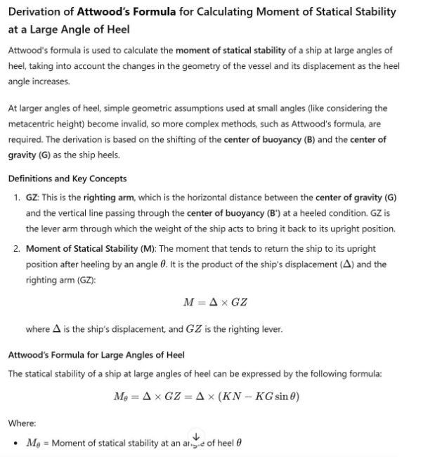

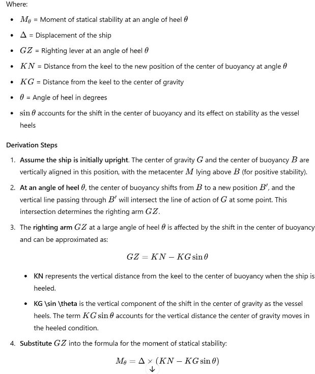

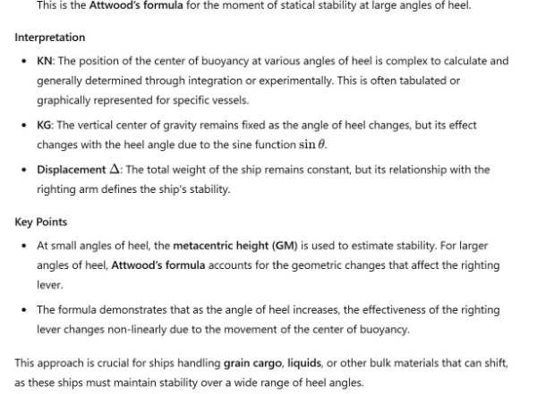

**Q12: What are the limitations of the wall -sides formula? Explain the relevance to “wall” sides as the ship heels to a large angle. Further give reasons why do we need to use these formulae for finding GZ at large angles of heel when for small angles the simple relationship of GZ=GM . Sinϴ can produce acceptable results.** 

**Ans:** 

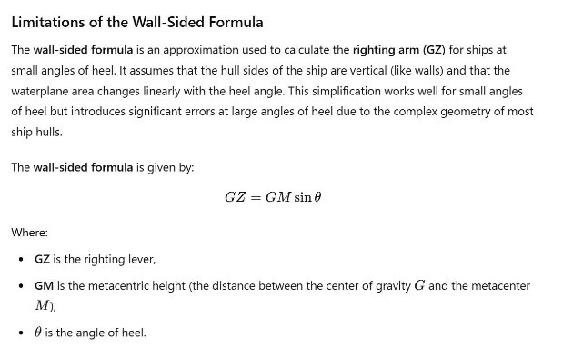

\#### Limitations of the Wall-Sided Formula: 

1. \*\*Accuracy at Large Angles\*\*: The formula assumes that the shape of the hull is essentially vertical along the waterline. At small angles of heel, this assumption holds, but at large angles, the underwater geometry of the ship changes significantly, invalidating the linear relationship between heel angle and the righting arm. 
1. \*\*Neglects Shifting Center of Buoyancy\*\*: As the ship heels to a larger angle, the \*\*center of buoyancy (B)\*\* shifts laterally and vertically. The wall-sided formula does not account for this, resulting in inaccurate righting lever (GZ) values at large angles. 
1. \*\*Non-linearity at Large Angles\*\*: The change in the waterplane area and the submerged volume becomes non-linear as the ship heels. At large angles of heel, the simple trigonometric relationship used in the wall-sided formula is no longer valid. 
1. \*\*Hull Form Complexity\*\*: Ships often have \*\*curved hull forms\*\*, especially around the bilges and sheer. The wall-sided formula does not account for this curvature, making it unreliable for broader sections of the ship, particularly when significant portions of the hull are submerged at large heel angles. 

   ### Relevance to "Wall" Sides as the Ship Heels to Large Angles 

   At small angles of heel, a ship's sides might effectively behave like "walls" — meaning that the ship's waterline area doesn't change dramatically with small increases in heel. The waterplane is mostly flat, and the volume displaced by the ship is relatively consistent with small changes in heel angle. 

   However, as the angle of heel increases, the submerged portion of the hull changes significantly. Instead of behaving like a wall, the hull’s shape begins to curve into the water, which impacts the \*\*center of buoyancy (B)\*\*, the \*\*righting arm (GZ)\*\*, and the overall stability. The ship’s geometry becomes more complex, and using a simple "wall-sided" assumption no longer provides accurate results. At large heel angles, the displacement and the stability characteristics of the ship must be calculated using more complex methods that account for the hull’s true geometry. 

   ### Reasons for Using More Complex Formulas for Large Angles of Heel 

   For small angles of heel, the \*\*GZ = GM \sin \theta\*\* formula is generally acceptable because: 

- The metacentric height (GM) is a good indicator of the initial stability of the ship, and the \*\*center of buoyancy\*\* does not shift significantly. 
- The heel angle is small enough that the hull shape does not greatly affect the righting arm, making the approximation fairly accurate. 
- Changes in the waterplane area are minimal, so the metacentric height remains relatively constant. 

  However, at larger angles of heel, the following factors come into play, making the simple formula insufficient: 

1. \*\*Shifting Center of Buoyancy (B)\*\*: As the ship heels further, the center of buoyancy shifts both horizontally and vertically. This shift impacts the righting moment, and the simple trigonometric relationship in the wall-sided formula fails to capture this shift accurately. 
1. \*\*Non-linear Stability\*\*: At larger angles, the relationship between the angle of heel and the righting arm (GZ) becomes non-linear. The metacentric height (GM) is only valid for small angles, but at larger angles, \*\*Attwood’s formula\*\* or other complex methods are needed to determine the actual GZ. 
1. \*\*Free Surface Effect\*\*: For ships with liquid cargo, free surfaces of liquids can affect stability dramatically at large heel angles, further complicating the calculation of the righting arm. 
1. \*\*Critical Heel Angle\*\*: At large angles of heel, other stability concerns come into play, such as \*\*angle of vanishing stability\*\*, where the ship's stability becomes neutral or even negative. Simple formulas cannot account for these phenomena. 

   ### Summary of the Need for Complex Formulas for Large Angles 

- At small angles of heel, \*\*GZ = GM \sin \theta\*\* provides acceptable results because the ship’s geometry and stability characteristics remain relatively simple. 
- At large angles of heel, the complexity of the hull form, the shifting of the center of buoyancy, and non-linear changes in the waterplane area require more sophisticated methods like \*\*Attwood’s formula\*\* or \*\*numerical integration\*\* of the ship's geometry. 
- These more complex formulas accurately account for the changes in the ship’s stability as the heel angle increases, ensuring safe and reliable calculations of the righting moment and residual stability at large angles of heel. 

  **Q13: Explain briefly hoe non-displacement hydrofoils having surface-piercing foil or submerged foil produce righting moment to maintain transverse stability.** 

  **Ans:** Non-displacement hydrofoils, whether they have \*\*surface-piercing foils\*\* or \*\*fully submerged foils\*\*, create lift to support the vessel above the water, reducing drag and allowing for greater speeds. These hydrofoils also contribute to \*\*transverse stability\*\* by generating a \*\*righting moment\*\*, which helps to maintain balance and prevent excessive heel or roll. Here's how these foils contribute to the righting moment: 

  ### 1. \*\*Surface-Piercing Hydrofoils\*\* 

  Surface-piercing hydrofoils are designed in such a way that part of the foil remains above the water’s surface, while the lower part is submerged. These foils naturally adjust the amount of lift they generate depending on their depth in the water, providing stability through self-regulation. 

- \*\*Mechanism for Righting Moment\*\*:  
  - As the boat begins to heel or tilt sideways, the surface-piercing foil on the lowered 

side of the boat becomes more deeply submerged. This increased submersion increases the lift generated on that side. 

- On the opposite side (the higher side), the foil becomes less submerged, 

generating less lift. 

- This differential in lift between the two sides creates a \*\*righting moment\*\* that 

works to restore the vessel to an upright position, thus maintaining transverse stability. 

- \*\*Advantages\*\*: 
  - Self-regulating: The foils automatically adjust the lift based on submersion, 

requiring no active control. 

- Effective at low to moderate speeds, as the change in lift happens passively with 

changes in heel. 

- \*\*Limitations\*\*: 
  - Less efficient at very high speeds compared to fully submerged foils. 
  - Can be affected by wave action, leading to variability in lift as the foil interacts 

with the water surface. 

\### 2. \*\*Fully Submerged Hydrofoils\*\* 

Fully submerged hydrofoils are located entirely below the water’s surface and are less affected by waves. These foils are typically paired with active control systems that help maintain balance and stability. 

- \*\*Mechanism for Righting Moment\*\*: 
  - Fully submerged foils rely on \*\*control systems\*\* to maintain a constant depth 

and lift. Sensors and actuators adjust the angle of the foils in real-time to respond to changes in the vessel’s heel or roll. 

- When the vessel tilts to one side, the control system changes the angle of attack of 

the foils on that side, increasing the lift and creating a righting moment. 

- On the opposite side, the foil’s angle of attack is reduced, lowering the lift and 

further helping to bring the vessel back to an upright position. 

- \*\*Advantages\*\*: 
  - More stable in rough sea conditions since the foils remain submerged and are not 

affected by waves. 

- Provides smoother and more consistent performance at high speeds. 
- \*\*Limitations\*\*: 
  - Requires complex control systems to maintain balance and stability. 
  - Higher cost and maintenance compared to surface-piercing foils. 

\### Summary 

Both types of hydrofoils create \*\*righting moments\*\* to maintain transverse stability by generating differential lift when the vessel heels. Surface-piercing foils achieve this passively through changes in submersion, while fully submerged foils rely on active control systems to adjust the lift. Each type has its strengths, with surface- piercing foils being simpler and self-regulating, while submerged foils offer better 

stability and performance in more challenging conditions. 

**Q14: State atleast 3 limitation cases of using only GM in assessing stability adequacy of a ship.** 

**Ans;** Using only \*\*GM (metacentric height)\*\* to assess the stability of a ship has several limitations. While GM provides insight into the ship’s initial stability or its ability to resist small angles of heel, it does not fully capture the ship's overall stability at larger angles or under different conditions. Here are three key limitation cases: 

\### 1. \*\*Inability to Assess Stability at Large Angles of Heel\*\* 

- \*\*Limitation\*\*: GM is a measure of a ship's initial stability and is only valid for 

small angles of heel (typically up to around 10 degrees). Beyond this range, GM does not accurately reflect the ship's stability characteristics. 

- \*\*Explanation\*\*: At large angles, the shape of the ship's hull and the distribution 

of buoyancy change significantly, affecting the \*\*GZ curve\*\* (righting arm). A ship with a good GM might still experience reduced stability at larger angles of heel, and could potentially capsize, despite having adequate initial stability. 

- \*\*Example\*\*: In heavy weather, a ship may heel significantly, and GM alone will 

not provide sufficient information about whether the vessel can safely recover from larger heel angles. 

\### 2. \*\*Neglect of Dynamic Stability (Energy Consideration)\*\* 

- \*\*Limitation\*\*: GM does not provide information on the \*\*dynamic stability\*\* 

of the vessel, which is the ship’s ability to resist capsizing over time or recover from a large heel. 

- \*\*Explanation\*\*: Dynamic stability is determined by the area under the GZ 

curve, which represents the energy required to heel the ship and the energy available to bring the ship back to its upright position. A vessel with a high GM might have poor dynamic stability if the area under the curve is insufficient, leading to a risk of capsize under sustained forces like wind or waves. 

- \*\*Example\*\*: A ship with a high GM but a short, narrow GZ curve might react 

quickly to heeling forces but could capsize under continued force, since there is insufficient righting moment at larger heel angles. 

\### 3. \*\*Failure to Account for Free Surface Effects and Cargo Shifts\*\* 

- \*\*Limitation\*\*: GM does not consider the effects of \*\*free surfaces\*\* of liquids 

in tanks or \*\*shifting cargo\*\*, both of which can significantly reduce the ship's stability. 

- \*\*Explanation\*\*: When liquid in tanks moves as the ship rolls, it lowers the 

effective GM, reducing stability. Similarly, when cargo shifts, it can lead to a reduction in the righting moment, causing dangerous heeling or capsizing. 

- \*\*Example\*\*: A ship carrying grain or liquids might initially have an adequate 

GM, but as the cargo shifts or liquids slosh within partially filled tanks, the actual GM is reduced, and the ship's stability can be compromised. 

In summary, while GM is useful for assessing initial stability, it does not provide a 

complete picture of a ship's stability, particularly at large angles of heel, under dynamic conditions, or when free surface effects and cargo shifts are involved. 

**Q15: Discuss the causes of the hull failure of the bulk carrier M.V. “Flare” ( as per investigation available in the public domain) resulting  in lossof crew with very few survivors in a stormy sea in Northern Atlantic of New Foundland. Refer to (1) Bending moment in ballast condition (2) Upkeep and maintenance of topside tanks (3) possibility of resonance rolling and (4) Brittle fracture.**   

**Ans:** The hull failure of the bulk carrier \*\*M.V. Flare\*\* on January 16, 1998, off the coast of Newfoundland in the North Atlantic, resulting in the tragic loss of most of the crew, provides crucial lessons in ship structural integrity, stability, and maintenance. Several key factors contributed to the failure, which can be analyzed as follows: 

\### 1. \*\*Bending Moment in Ballast Condition\*\* 

- \*\*Cause\*\*: Bulk carriers like M.V. Flare experience extreme stress in the hull due 

to \*\*hogging\*\* and \*\*sagging\*\* in heavy seas, especially when in ballast condition. In ballast, the vessel is more vulnerable to wave-induced bending moments because there is little cargo to counterbalance the wave forces. 

- \*\*Explanation\*\*:  
  - In ballast, the ship's center is supported by water while the bow and stern are 

unsupported during hogging conditions. Conversely, during sagging, the weight of the ship’s structure bears down on the middle, while wave crests support the ends. 

- The \*\*high bending moments\*\* generated by these forces, particularly in rough 

seas, can cause significant stress concentration on structural weak points, such as hatch coamings, tank tops, and deck plating. 

- \*\*In M.V. Flare’s Case\*\*: The investigation suggested that high bending moments 

in ballast contributed to a progressive failure of the vessel's structure. The stresses were exacerbated by the stormy conditions, with large waves placing enormous strain on the hull. 

\### 2. \*\*Upkeep and Maintenance of Topside Tanks\*\* 

- \*\*Cause\*\*: Poor maintenance of the \*\*topside ballast tanks\*\* likely contributed 

to structural weaknesses in M.V. Flare. 

- \*\*Explanation\*\*: 
  - Topside tanks are crucial for the ship's stability and stress distribution. Corrosion 

or damage to these tanks can reduce their effectiveness in maintaining the ship's structural integrity and buoyancy. If these tanks are not adequately maintained, they may become a point of weakness in the ship's overall structure. 

- Poor maintenance practices, especially the accumulation of \*\*corrosion\*\* in 

critical structural components like bulkheads, side shells, and deck plating, can lead to rapid deterioration of the ship’s hull strength. 

- \*\*In M.V. Flare’s Case\*\*: The \*\*topside tanks\*\* and \*\*ballast spaces\*\* were 

found to be in poor condition, with rust and corrosion weakening the hull structure. This degradation may have reduced the ability of the hull to withstand the stresses imposed by the rough seas. 

\### 3. \*\*Possibility of Resonance Rolling\*\* 

- \*\*Cause\*\*: \*\*Resonant rolling\*\* could have aggravated the structural stresses on 

the vessel, especially in a stormy sea. 

- \*\*Explanation\*\*: 
  - Resonance rolling occurs when the natural rolling period of the vessel matches 

the period of the waves, leading to significant rolling and instability. This can result in excessive heeling and a magnified stress on the hull. 

- Ships like bulk carriers, especially in ballast condition, are susceptible to 

\*\*parametric rolling\*\* or resonance rolling when facing head or beam seas. This leads to rapid, uncontrolled rolling that exacerbates the ship’s bending moments. 

- \*\*In M.V. Flare’s Case\*\*: The rough sea conditions might have induced 

resonance rolling, increasing the rolling angles beyond normal limits. This repeated motion could have placed additional \*\*cyclic stresses\*\* on the hull, particularly around structurally weak areas, accelerating the failure. 

\### 4. \*\*Brittle Fracture\*\* 

- \*\*Cause\*\*: \*\*Brittle fracture\*\* of the steel used in the construction of M.V. 

Flare's hull could have played a significant role in its catastrophic failure. 

- \*\*Explanation\*\*: 
  - \*\*Brittle fracture\*\* is the sudden and catastrophic failure of a material without 

significant prior deformation, usually occurring at low temperatures. It typically occurs when the material has microscopic defects that propagate under stress, leading to cracking. 

- Bulk carriers built in earlier decades may not have used modern \*\*ductile 

steel\*\* or lacked appropriate stress-relief treatments in their construction, making them more vulnerable to brittle fracture in cold environments. 

- \*\*In M.V. Flare’s Case\*\*: The \*\*cold waters\*\* of the North Atlantic, coupled 

with the high stress on the hull, likely contributed to \*\*brittle fracture\*\*. Investigators noted that the \*\*structural steel of the ship’s hull\*\* was likely to have experienced embrittlement, leading to a sudden and rapid propagation of cracks that caused the hull to fail catastrophically. 

\--- 

\### Summary of Contributing Factors 

The sinking of M.V. Flare was the result of a \*\*combination of factors\*\*: 

1. \*\*Bending moments\*\* in ballast, leading to high stresses on the hull in rough seas. 
1. \*\*Poor maintenance\*\* and corrosion in critical structural components like topside tanks, weakening the ship’s overall integrity. 
1. \*\*Resonant rolling\*\* in storm conditions, which amplified the forces acting on the vessel. 
1. \*\*Brittle fracture\*\* due to the cold environment and high-stress concentrations in already weakened areas of the hull. 

\### Conclusion 

M.V. Flare’s failure highlights the importance of \*\*adequate maintenance\*\*, \*\*structural monitoring\*\*, and awareness of \*\*environmental effects\*\* (such as cold temperatures and storm conditions) in ensuring the safety of bulk carriers. This tragedy serves as a reminder of the critical need for proper structural design, regular inspections, and maintenance in high-risk areas of a ship. 

**Q16: After detailed studies and deliberations the second generation intact stability criteria is near finalization. Comment on the following in respect to the same:** 

1) **The stability failure modes being considered in the criteria and formalised procedures for vulnerability checks.** 
1) **Impact of second generation intact stability criteria on coastal shipping in particular small coastal vessels.**  

   **Ans:** The development of the second generation intact stability criteria represents a significant advancement in ensuring maritime safety, especially for coastal and small vessels. Below is a detailed commentary on the specified aspects: 

   ### (A) Stability Failure Modes and Formalized Procedures for Vulnerability Checks 

   #### Stability Failure Modes Considered 

1. \*\*Parametric Rolling\*\*:  
- \*\*Description\*\*: This phenomenon occurs when the wave pattern interacts with 

the ship's natural rolling frequency, leading to extreme rolling angles that can compromise stability. 

- \*\*Considerations\*\*: The criteria will include assessment methodologies to 

quantify the risk of parametric rolling and establish threshold limits for various vessel designs. 

2. \*\*Broaching\*\*: 
- \*\*Description\*\*: Broaching is when a vessel is turned beam-on to the waves, 

causing it to be at risk of capsizing due to excessive rolling and loss of control. 

- \*\*Considerations\*\*: The criteria will involve measures to assess the likelihood of 

broaching based on vessel speed, heading, and wave conditions. 

3. \*\*Dynamic Stability Loss\*\*: 
- \*\*Description\*\*: This refers to the gradual decrease in stability due to shifting 

loads, weather conditions, or hull deformation. 

- \*\*Considerations\*\*: The criteria will include methods to model the effects of 

dynamic loading and changes in stability due to operations like ballasting or cargo loading. 

4. \*\*Downflooding\*\*: 
- \*\*Description\*\*: This occurs when water enters the vessel through openings at or 

below the waterline, leading to loss of buoyancy and stability. 

- \*\*Considerations\*\*: Enhanced vulnerability checks will assess the adequacy of 

freeboard and the effectiveness of watertight compartments. 

\#### Formalized Procedures for Vulnerability Checks 

- \*\*Risk Assessment Framework\*\*: The second generation criteria will establish a structured approach to identify vulnerabilities through simulations and real-world scenario testing. This may include computer modeling and validation against historical data. 
- \*\*Stability Calculation Protocols\*\*: Standardized procedures for calculating the ship's stability characteristics, including \*\*righting levers\*\* and \*\*metacentric height (GM)\*\*, will be formalized to ensure consistency across assessments. 
- \*\*Operational Guidelines\*\*: Guidelines will be provided for assessing operational scenarios, such as cargo operations in adverse weather, ensuring that vessels maintain stability under various conditions. 
- \*\*Data Collection and Analysis\*\*: Emphasis will be placed on the collection of operational data to continually update stability models, making it possible to adapt to new designs and operational practices. 

  ### (B) Impact of Second Generation Intact Stability Criteria on Coastal Shipping and Small Coastal Vessels 

  #### Implications for Coastal Shipping 

1. \*\*Enhanced Safety Standards\*\*: 
- The new criteria will contribute to improved safety for coastal shipping operations 

by establishing more rigorous stability checks, thus potentially reducing the risk of accidents and capsizing. 

2. \*\*Design Modifications\*\*: 
- Coastal vessels may need to undergo design revisions to comply with the new 

stability criteria, affecting the shape, size, and overall stability characteristics of these vessels. 

- Shipbuilders will need to adapt their designs to ensure compliance, possibly 

leading to changes in hull shapes or increased weight in certain areas to improve stability. 

3. \*\*Operational Limitations\*\*: 
- The implementation of the second generation criteria may necessitate operational 

changes, such as restrictions on cargo operations in certain conditions, which could impact operational efficiency and profitability. 

- Small coastal vessels may face stricter operational limits, particularly regarding 

allowable loading conditions and weather restrictions. 

4. \*\*Increased Compliance Costs\*\*: 
- Smaller operators may incur additional costs for retrofitting existing vessels or 

investing in new designs that comply with the updated criteria. This could create financial strain on smaller operators and potentially affect market dynamics. 

- Regular inspections and updates to safety protocols may also incur additional 

costs, particularly for small operators with limited resources. 

5. \*\*Training and Education\*\*: 
- Increased emphasis will be placed on crew training and education regarding 

stability management and emergency procedures, which will enhance overall safety culture within coastal shipping. 

6. \*\*Focus on Research and Development\*\*: 
- The updated criteria may encourage increased research and development within 

the industry, leading to innovative designs and technologies that improve vessel stability and performance. 

\### Conclusion 

The second generation intact stability criteria represents a proactive approach to addressing stability issues in maritime operations. By focusing on potential failure modes and instituting formalized procedures for vulnerability checks, these criteria are likely to enhance the safety and reliability of coastal shipping, particularly for small vessels. While the implications may pose challenges in terms of compliance and operational adjustments, the long-term benefits to safety and environmental protection are likely to outweigh these initial hurdles. 

**Q17: Impetus is being laid behind domestic cruise industry. As a budding cruise vessel owner, evaluate Safe Return to port (SRTP) in terms of its applicability and affect on coasting and operations, including on passenger capacity.**  

**Ans:** The "Safe Return to Port" (SRTP) concept is a critical safety measure for cruise vessels that emphasizes the importance of ensuring that a ship can return to port safely even in the event of an emergency. As a budding cruise vessel owner, evaluating SRTP in terms of its applicability and impact on coasting, operations, and passenger capacity is essential for navigating the evolving domestic cruise industry landscape. Here’s a detailed evaluation: 

\### Applicability of SRTP 

1. \*\*Regulatory Framework\*\*: 
- \*\*International Standards\*\*: SRTP is based on SOLAS (Safety of Life at Sea) 

regulations and is particularly applicable to passenger ships. Compliance with these regulations is vital to ensure the safety of passengers and crew. 

- \*\*National Regulations\*\*: In addition to international standards, domestic 

regulations may also dictate specific SRTP requirements. Understanding these frameworks is crucial for compliance and operational planning. 

2. \*\*Safety Features\*\*: 
- \*\*Redundancy Systems\*\*: SRTP necessitates the incorporation of redundancy in 

critical systems (e.g., power, propulsion, steering), ensuring that if one system fails, others can take over to maintain control and return to port. 

- \*\*Damage Control\*\*: The design and operational protocols must allow for 

effective damage control measures, including watertight compartments and emergency response systems, to minimize the impact of incidents. 

3. \*\*Design Considerations\*\*: 
- \*\*Ship Design\*\*: The SRTP philosophy influences the design of the vessel, 

necessitating features that enhance stability, maneuverability, and safety. This may impact hull shape and materials used. 

- \*\*Passenger Safety\*\*: Passenger areas must be designed with safety in mind, 

ensuring that emergency exits are easily accessible and evacuation routes are clearly marked. 

\### Impact on Coasting and Operations 

1. \*\*Operational Readiness\*\*: 
- \*\*Crew Training\*\*: Implementing SRTP requires comprehensive crew training on 

emergency procedures, damage control, and passenger evacuation. This ensures that the crew is well-prepared to manage emergencies effectively. 

- \*\*Emergency Drills\*\*: Regular drills will be necessary to familiarize the crew 

and passengers with emergency protocols, contributing to overall safety and operational efficiency. 

2. \*\*Insurance and Liability\*\*: 
- \*\*Insurance Premiums\*\*: Compliance with SRTP may affect insurance 

premiums. Insurers may offer reduced rates for vessels that meet SRTP requirements due to the reduced risk profile. 

- \*\*Liability Management\*\*: Demonstrating compliance with SRTP can help 

mitigate liability in the event of an incident, as it shows a commitment to safety. 

3. \*\*Cost Implications\*\*: 
- \*\*Initial Investment\*\*: Implementing SRTP may require significant upfront 

investment in technology and design modifications, including redundancy systems and safety features. 

- \*\*Operational Costs\*\*: Ongoing costs associated with crew training, maintenance 

of safety systems, and emergency drills should be considered in the overall operational budget. 

\### Impact on Passenger Capacity 

1. \*\*Space Utilization\*\*: 
- \*\*Design Constraints\*\*: SRTP requirements may impose constraints on the 

design and layout of passenger areas. Additional safety features may take up valuable space, potentially reducing passenger capacity. 

- \*\*Compartmentalization\*\*: Increased compartmentalization for safety may lead 

to reduced overall capacity, as certain areas must be designated for safety equipment and emergency systems. 

2. \*\*Passenger Experience\*\*: 
- \*\*Safety Awareness\*\*: While some passengers may view safety measures as a 

positive aspect, others may feel constrained by safety protocols. Effective communication about SRTP and safety features can enhance passenger confidence. 

- \*\*Impact on Amenities\*\*: The need to accommodate safety features may affect 

the range of amenities available on board, impacting the overall passenger experience. A balance between safety and passenger comfort must be maintained. 

3. \*\*Market Positioning\*\*: 
- \*\*Appeal to Safety-Conscious Travelers\*\*: Emphasizing SRTP compliance can 

attract safety-conscious travelers who prioritize safety in their travel choices, potentially increasing overall passenger demand. 

- \*\*Differentiation in a Competitive Market\*\*: In a growing domestic cruise 

industry, having SRTP certification can differentiate your cruise line from competitors, potentially allowing for premium pricing strategies. 

\### Conclusion 

The "Safe Return to Port" concept is crucial for ensuring the safety of passengers and crew on cruise vessels. While it presents challenges in terms of design, operational costs, and potential impacts on passenger capacity, it ultimately contributes to a safer and more reliable cruising experience. By effectively integrating SRTP principles into the operational strategy, you can position your cruise line as a leader in safety within the burgeoning domestic cruise market, fostering passenger confidence and loyalty. Balancing safety, operational efficiency, and passenger experience will be key to successfully navigating the evolving landscape of the cruise industry. 

**Q18: SDC at IMO is working upon drafting a new code on ‘carriage of more than 12 Industrial personnel (IP) on board vessels engaged on international voyages’. As a shipowner engaged in offshore activities what shall be your submissions in regard to the same.** 

**Ans:** As a shipowner engaged in offshore activities, providing submissions to the SDC (Ship Design and Construction) at the IMO regarding the carriage of more than 12 Industrial Personnel (IP) on board vessels engaged in international voyages is crucial. Here’s a structured submission addressing key considerations: 

\### Submissions on the Draft Code for Carriage of More than 12 Industrial Personnel (IP) 

\#### 1. \*\*Safety Standards and Regulations\*\* 

- \*\*Enhanced Safety Protocols\*\*: The code should incorporate robust safety 

protocols specifically tailored for vessels carrying more than 12 industrial personnel. This includes ensuring that life-saving appliances, fire safety measures, and evacuation routes are adequate and comply with the latest international safety standards. 

- \*\*Safety Management System (SMS)\*\*: Encourage the inclusion of a 

requirement for a comprehensive Safety Management System that adheres to the ISM Code, ensuring all operational aspects are conducted safely and effectively. 

\#### 2. \*\*Vessel Design and Construction\*\* 

- \*\*Vessel Stability and Design Criteria\*\*: Propose that the code stipulates specific 

design criteria focusing on vessel stability, structural integrity, and accommodation standards for carrying larger numbers of personnel. This includes ensuring stability under different loading conditions and sea states. 

- \*\*Accommodations and Facilities\*\*: Suggest minimum accommodation 

standards for industrial personnel to ensure comfort and welfare. This should include adequate living quarters, sanitation facilities, and common areas to support mental well-being during offshore activities. 

\#### 3. \*\*Training and Competency Requirements\*\* 

- \*\*Training Standards\*\*: Advocate for stringent training requirements for both 

crew and industrial personnel. This includes emergency response training, safety drills, and familiarization with the vessel’s layout and emergency procedures. 

- \*\*Competency Verification\*\*: Support a framework for verifying the competency 

of personnel embarking on such vessels, ensuring they possess the necessary skills and knowledge to operate safely in offshore environments. 

\#### 4. \*\*Operational Considerations\*\* 

- \*\*Risk Assessment and Management\*\*: Emphasize the necessity for detailed risk 

assessments specific to offshore operations involving industrial personnel. The code should require continuous risk management processes, adapting to changing operational conditions. 

- \*\*Emergency Response Plans\*\*: Propose that the code mandates comprehensive 

emergency response plans that cater to the specific challenges posed by carrying a large number of industrial personnel, including potential medical emergencies, evacuations, and firefighting. 

\#### 5. \*\*Health and Well-being\*\* 

- \*\*Health Monitoring\*\*: Suggest the inclusion of health monitoring protocols for 

personnel on board, addressing both physical health and psychological well-being, especially during long offshore assignments. 

- \*\*Medical Facilities\*\*: Recommend minimum standards for onboard medical 

facilities, including the availability of trained medical personnel, first aid supplies, and equipment for emergencies. 

\#### 6. \*\*Environmental Considerations\*\* 

- \*\*Pollution Prevention Measures\*\*: Advocate for stringent pollution prevention 

measures to minimize the environmental impact of offshore activities. The code should specify requirements for waste management, emissions control, and emergency spill response plans. 

\#### 7. \*\*Consultation and Stakeholder Engagement\*\* 

- \*\*Inclusion of Industry Stakeholders\*\*: Urge the SDC to engage with relevant 

industry stakeholders, including shipowners, maritime unions, and environmental organizations, during the drafting process to ensure the code reflects practical realities and stakeholder concerns. 

\### Conclusion 

The proposed code on the carriage of more than 12 Industrial Personnel on vessels engaged in international voyages should prioritize safety, operational efficiency, and the welfare of all personnel on board. By emphasizing the need for enhanced safety protocols, vessel design standards, training requirements, and health monitoring, we 

can contribute to a safer and more efficient offshore industry. Engaging with stakeholders will ensure the code is both practical and beneficial for the maritime community, enhancing the overall safety and efficiency of offshore operations. 

**Q19: List the features of design related to fire-growth potential and smoke generation in passenger accomodation on the Scandinavian Star which contributed to a severe loss of life with particular reference to (1) bulkheads, ceilings and corridors (2) Lamination material (3) Escape routes and visibility of “exit” signs. Briefly state the SOLAS regulations meant to prevent such losses.** 

**Ans:** The tragic fire incident on the \*Scandinavian Star\* in 1990 highlighted several design features related to fire growth potential and smoke generation in passenger accommodation that contributed to the loss of life. Here are the key factors concerning design elements and relevant SOLAS regulations: 

\### Design Features Contributing to Fire-Growth Potential and Smoke Generation 

\#### 1. \*\*Bulkheads, Ceilings, and Corridors\*\* 

- \*\*Inadequate Fire Resistance\*\*: The bulkheads and ceilings in the 

accommodation areas may not have had sufficient fire-resistance ratings. This allowed flames and smoke to spread quickly between cabins and through corridors, compromising compartmentalization. 

- \*\*Continuous Corridors\*\*: Long, uninterrupted corridors allowed smoke and heat 

to travel easily throughout the vessel, leading to rapid deterioration of conditions in escape routes. 

- \*\*Vertical Spaces\*\*: Poor design of vertical spaces (e.g., stairwells) connected the 

different decks, facilitating the rapid spread of smoke and flames, which hampered evacuation efforts. 

\#### 2. \*\*Lamination Material\*\* 

- \*\*Flammable Materials\*\*: The use of combustible materials for furnishings, wall 

panels, and ceilings increased the fire growth potential. For example, laminated wood and other synthetic materials can contribute to rapid fire spread and intense smoke generation. 

- \*\*Smoke Toxicity\*\*: Many of the materials used in the passenger accommodation 

emitted toxic smoke when burned, significantly impacting the survivability of passengers and crew during a fire. 

\#### 3. \*\*Escape Routes and Visibility of “Exit” Signs\*\* 

- \*\*Poorly Marked Exits\*\*: Inadequate or poorly positioned exit signs made it 

difficult for passengers to locate escape routes during the emergency. Visibility was likely compromised due to smoke, further hindering evacuation efforts. 

- \*\*Blocked or Confusing Escape Routes\*\*: The design may have included 

obstacles or lack of clear directional signage along escape routes, which would have confused passengers trying to evacuate. 

- \*\*Insufficient Escape Capacity\*\*: The number of escape routes available may not 

have been adequate for the number of passengers on board, leading to overcrowding and delays during the evacuation process. 

\### Relevant SOLAS Regulations to Prevent Such Losses 

The International Convention for the Safety of Life at Sea (SOLAS) includes several regulations aimed at improving fire safety in passenger vessels, particularly in accommodation areas: 

1. \*\*SOLAS Chapter II-2 (Fire Safety)\*\*: 
- \*\*Part A - General\*\*: Establishes general principles for fire safety, including the 

need for a fire safety plan and adequate training for crew members. 

- \*\*Part B - Fire Safety Measures\*\*: Requires the use of fire-retardant materials for 

bulkheads, ceilings, and furnishings to minimize fire growth and smoke generation. 

- \*\*Part C - Fire Protection\*\*: Mandates compartmentalization of spaces to prevent 

the spread of fire and smoke, ensuring that bulkheads and decks have specific fire- resistance ratings. 

2. \*\*Escape Route Regulations\*\*: 
- \*\*Escape Routes and Exits\*\*: SOLAS requires clearly marked escape routes and 

exits that are easily accessible and visible, including adequate signage that remains illuminated in smoke conditions. 

- \*\*Passenger Capacity and Means of Escape\*\*: The regulations ensure that the 

number of escape routes corresponds to the passenger capacity, minimizing congestion during an evacuation. 

3. \*\*Smoke Detection and Alarm Systems\*\*: 
- \*\*Fire Detection and Alarm Systems\*\*: SOLAS mandates installation of smoke 

detectors and alarm systems in accommodation areas to provide early warning of a fire, enabling timely evacuation. 

\### Conclusion 

The \*Scandinavian Star\* incident underscored the importance of incorporating fire- safe design principles and materials in passenger accommodation areas. Adherence to SOLAS regulations regarding fire safety, escape routes, and the use of non- combustible materials is crucial for preventing similar tragedies in the future. 

**Q20: Length of ship is 300m. Ship is passing through a regular train of waves at an angle of 30 degrees to the line of the crests. The wave crest passes from stern to bow of the ship in 12 seconds in the following sea. Calculate the speed of the ship.** 

**Ans:** 

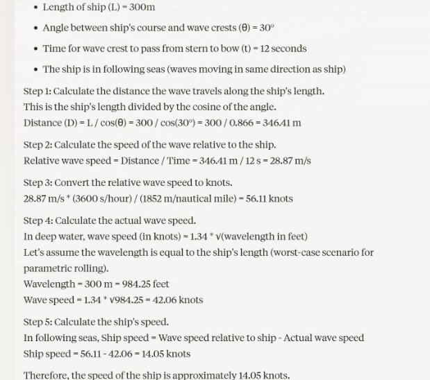

**Q21: Describe Murray’s method of calculating longitudinal bending moment. What is a standard wave? Why is WBM necessary to be considered in addition to SWBM?**  

**Ans:** ### Murray's Method of Calculating Longitudinal Bending Moment 

Murray's method is a systematic approach used to calculate the longitudinal bending moment (LBM) in ships, particularly useful in assessing the structural integrity of a vessel under various loading conditions. The method involves the following steps: 

1. \*\*Division into Segments\*\*: The hull is divided into segments along its length. Each segment is treated as an individual beam subjected to bending moments due to various forces, such as weight, buoyancy, and external loads. 
1. \*\*Calculation of Forces\*\*: The method calculates the various forces acting on each segment, including: 
- \*\*Weight (W)\*\*: This includes the weight of the ship’s structure, cargo, fuel, and 

other components. 

- \*\*Buoyancy (B)\*\*: This is the upward force exerted by the water displaced by the 

submerged volume of the ship. 

3. \*\*Static Equilibrium\*\*: By applying the principles of static equilibrium, the method ensures that the sum of vertical forces and moments around any point along the length of the vessel is zero. This helps determine the internal forces and moments at various sections. 

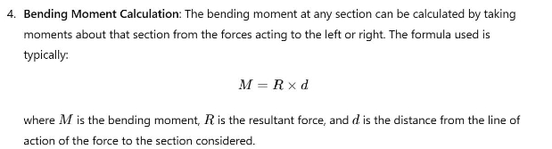

5\. \*\*Plotting the Bending Moment Curve\*\*: Finally, the calculated moments at different sections are plotted to obtain the longitudinal bending moment curve for the entire length of the ship. This curve is essential for assessing the ship's structural adequacy and for design purposes. 

\### Standard Wave 

A \*\*standard wave\*\* refers to a theoretical wave profile that is often used in naval architecture and marine engineering to simplify the analysis of wave-induced loads on a vessel. It typically represents sinusoidal wave patterns with specific characteristics, such as wave height, period, and length. Standard waves are utilized for modeling purposes to predict how ships interact with wave conditions, making it easier to analyze forces acting on the ship due to wave action. 

\### Necessity of Considering WBM in Addition to SWBM 

\*\*WBM (Wave Bending Moment)\*\* and \*\*SWBM (Static Wave Bending Moment)\*\* are both important considerations in ship design and stability assessments. Here’s why it is crucial to consider WBM in addition to SWBM: 

1. \*\*Dynamic Effects\*\*: WBM accounts for the dynamic loads and bending moments induced by wave action, which can vary significantly depending on the wave conditions and the ship's motion. SWBM only considers static forces, which may not accurately reflect the conditions a vessel experiences in real-world scenarios. 
1. \*\*Fatigue Analysis\*\*: Continuous exposure to dynamic loads can lead to fatigue in the ship's structure over time. Considering WBM helps in assessing the cumulative effects of repeated wave actions, which is critical for evaluating the ship's long-term integrity. 
1. \*\*Safety Margins\*\*: Including both WBM and SWBM provides a more comprehensive view of the forces acting on the vessel, ensuring that safety margins are adequate to prevent structural failure under extreme conditions. 
4. \*\*Regulatory Compliance\*\*: Many classification societies and regulations require the consideration of dynamic effects in the design and assessment of ship structures, making the inclusion of WBM necessary for compliance. 

   In summary, while SWBM provides a baseline for assessing static conditions, WBM is essential for understanding the full range of forces experienced by a ship in motion and ensuring structural safety and longevity. 

   **Q22: Draw diagrams to depict the forces involved when vessel is heeled at an angle due to vessel turning at speed using its rudder. Explain why does the ship heel to one side when starting the turn and then to the other side when turning at steady rate of turn.** 

   **Ans:** When a vessel turns using its rudder at speed, several forces and moments come into play that cause the ship to heel. The heel experienced by the vessel is due to a combination of centrifugal forces, hydrodynamic forces on the hull, and the moment created by the rudder action. Below is an explanation along with diagrams depicting these forces. 

   ### Forces Acting on a Vessel When Turning 

1. \*\*Centrifugal Force (Fₐ)\*\*: This force acts outward from the center of the turn and tends to push the vessel away from the direction of the turn. It acts at the center of mass of the ship and is proportional to the vessel's speed and the sharpness of the turn (radius of the turn). 
1. \*\*Hydrodynamic Force (Fₕ)\*\*: This force acts on the hull of the vessel due to the pressure differences caused by water flow around the hull as the vessel turns. The rudder action creates a flow imbalance, pushing the stern sideways. 
1. \*\*Rudder Force (Fᵣ)\*\*: When the rudder is angled, it creates a force perpendicular to the flow of water, turning the vessel in the desired direction. 
1. \*\*Weight (W)\*\*: The vessel’s weight acts vertically downward at its center of gravity (G). 
1. \*\*Buoyancy (B)\*\*: The buoyant force acts vertically upward through the vessel’s center of buoyancy (CB). As the vessel heels, the position of CB shifts. 

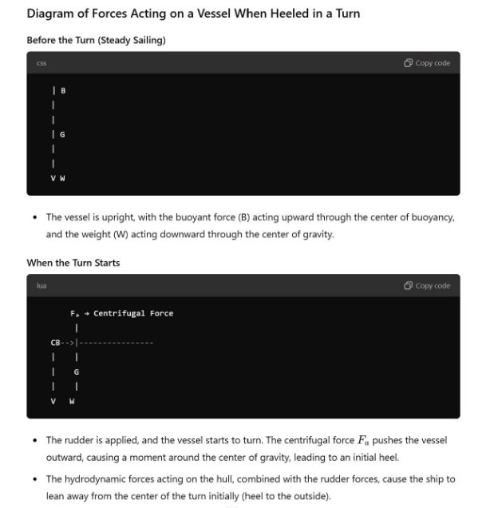

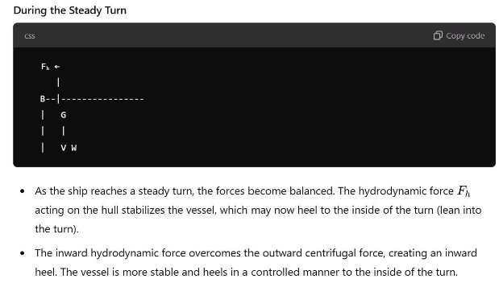

Explanation of the Heeling Behavior 

1. \*\*Initial Heel (Outward)\*\*:  

`   `When the ship starts to turn, the centrifugal force \( Fₐ \) acts outward, away from the center of the turn. This causes the ship to heel outward initially (away from the direction of the turn). This happens because the rudder force and hydrodynamic forces have not yet fully developed to balance the centrifugal force. 

2. \*\*Steady Turn (Inward Heel)\*\*:  

`   `As the ship establishes a steady rate of turn, the hydrodynamic forces acting on the hull and rudder become stronger. These forces create a moment that opposes the centrifugal force, and the vessel heels inward into the turn. The shift in the center of buoyancy also contributes to this inward heel. 

`   `The inward heel during a steady turn helps the vessel maintain stability and makes it easier to handle. 

\### Key Points to Note 

- The vessel’s initial outward heel is caused by the dominant centrifugal force when the turn begins. 
- The inward heel during a steady turn is due to the balancing of hydrodynamic forces on the hull and rudder, which counteract the centrifugal force. 
- The degree of heel in both cases depends on factors like ship speed, turn radius, hull shape, and rudder angle. 

  ### Diagrams Summary 

1. Before the turn: Ship is upright with balanced forces. 
1. At the start of the turn: Outward centrifugal force causes the ship to heel outward. 
1. During a steady turn: Hydrodynamic forces stabilize the ship, and it heels inward for balance. 
