---
title: Question and Answers-2
type: docs

---
**Q14(a): Describe the simplest form of an underwater glider (AUV) especially**

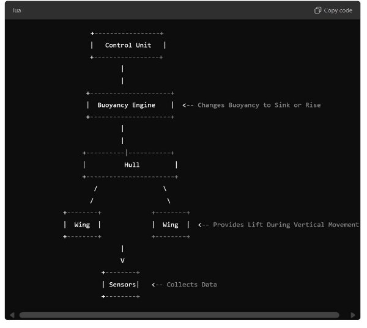

**referring to its unique propulsion system. Make a simple sketch to illustrate.**

Ans: ### \*\*Underwater Glider (AUV): Simplest Form and Unique Propulsion System\*\*

An \*\*Underwater Glider\*\* is a type of Autonomous Underwater Vehicle (AUV) that moves through the water without traditional propellers. Instead of using mechanical propulsion like conventional AUVs, it relies on buoyancy changes and wings for propulsion. This results in a very energy-efficient system, allowing the glider to operate for long periods, sometimes for months.

\#### \*\*Simplest Form of an Underwater Glider\*\*

The simplest form of an underwater glider consists of the following components:

1. \*\*Hull/Body\*\*:
   1. Streamlined and hydrodynamic to reduce drag in water.
   1. Typically shaped like a torpedo for smooth movement through the water.
1. \*\*Buoyancy Engine\*\*:
- The glider has a \*\*buoyancy engine\*\*, which changes its buoyancy by either taking in or expelling water. By

altering its density, the glider either sinks or rises in the water column.

1. \*\*Ballast tanks\*\* or \*\*oil bladders\*\* are often used to adjust the buoyancy.
3. \*\*Wings/Fins\*\*:
   1. The glider has fixed wings on the sides of its body. As it sinks or rises, the wings generate lift, converting

vertical motion into forward horizontal movement.

- The combination of buoyancy change and the lift from the wings provides propulsion without the need for a

mechanical propeller.

4. \*\*Control Surfaces\*\*:
   1. Some gliders have rudders or fins to help with directional control and stability as they glide through the water.
4. \*\*Internal Sensors and Control System\*\*:
- An internal control system adjusts buoyancy and control surfaces to direct the glider's path.
- Equipped with sensors to collect oceanographic data such as temperature, salinity, and currents.

\---

\### \*\*Unique Propulsion System: Buoyancy-Driven Propulsion\*\*

The key to an underwater glider’s unique propulsion system is its \*\*buoyancy-driven propulsion\*\*. Here's how it works:

1. \*\*Buoyancy Changes\*\*:
- The glider takes in water to increase its density, making it heavier than the surrounding water, so it starts to sink.
- To ascend, it expels water (or inflates oil-filled bladders) to reduce its density, making it buoyant and causing it

to rise.

2. \*\*Gliding Motion\*\*:
- As the glider sinks or rises, its wings generate lift. This allows the glider to move forward in a gliding motion,

much like an airplane glides through the air.

1. This method of propulsion requires very little energy, making gliders highly efficient.
3. \*\*No Propeller\*\*:
   1. Unlike other AUVs that use propellers or jet propulsion, the glider doesn’t have any moving mechanical parts for

propulsion. This results in low power consumption, allowing the glider to operate for extended durations (up to months) on a single battery charge.

\---

\### \*\*Simple Sketch of an Underwater Glider\*\*

Below is a simple illustration showing the layout of an underwater glider and how it achieves propulsion through buoyancy changes.

`

\### \*\*Advantages of Underwater Gliders\*\*:

1. \*\*Energy Efficiency\*\*:
- Gliders use minimal energy for propulsion, allowing them to operate for long periods without the need for

frequent battery changes.

2. \*\*Long-Duration Missions\*\*:
- Due to their energy efficiency, they are well-suited for long-term missions like oceanographic surveys, which can

last several months.

3. \*\*Quiet Operation\*\*:

- The lack of mechanical propulsion (like propellers) makes gliders extremely quiet, which is beneficial for

underwater research and reducing disturbance to marine life.

4. \*\*Versatile Depth Range\*\*:
- Can operate at various depths, making them ideal for both shallow and deep-sea missions.

\---

\### \*\*Disadvantages of Underwater Gliders\*\*:

1. \*\*Slow Speed\*\*:
- The gliding motion is relatively slow compared to conventional AUVs that use propellers, limiting the glider’s

ability to cover large areas quickly.

2. \*\*Limited Maneuverability\*\*:
- The glider’s movement is more passive, relying on buoyancy and wings for propulsion, making it less

maneuverable than traditional AUVs with active propulsion systems.

3. \*\*Dependency on Buoyancy Control\*\*:
- Any malfunction in the buoyancy system can result in the glider being unable to control its ascent or descent,

potentially limiting its mission capabilities.

\---

\### \*\*Conclusion\*\*

The simplest form of an underwater glider utilizes buoyancy changes and wings for efficient, long-duration propulsion. Its energy-efficient design makes it ideal for extended missions, but its speed and maneuverability are limited compared to other AUVs. This unique method of propulsion is a game-changer for oceanographic research, offering quiet, sustainable, and long-term data collection capabilities.

**Q14(b) : Write what you know about recent advances in wind power utilization in “sail assisted” ships and comment on the feasibility of the existing technology in adverse weather and in horse latitudes.**

Ans: ### \*\*Recent Advances in Wind Power Utilization in "Sail-Assisted" Ships\*\*

In recent years, the shipping industry has been exploring \*\*wind-assisted propulsion\*\* as a means to reduce fuel consumption and carbon emissions. Modern sail-assisted technologies leverage wind energy to complement conventional propulsion systems, offering the potential for significant environmental and economic benefits. Below are some of the key technologies and recent advances in wind power utilization for sail-assisted ships:

\---

\#### \*\*1. Rotor Sails (Flettner Rotors)\*\*

- \*\*Technology Overview\*\*: Rotor sails use the \*\*Magnus effect\*\* to generate lift. These are tall, rotating cylinders installed on a ship's deck. When wind passes over the spinning rotors, a pressure differential is created, which produces a forward thrust.
- \*\*Recent Advances\*\*:
  - Rotor sails have been installed on several commercial vessels (e.g., Maersk’s tanker "Maersk Pelican") with

reported fuel savings of up to 8-10%.

- They can function even when the wind is not directly behind the ship, making them versatile.
- \*\*Feasibility in Adverse Conditions\*\*:
  - Rotor sails are relatively unaffected by adverse weather because they are mechanical systems. However, in storms

with strong headwinds, their effectiveness can be reduced.

- They are not dependent on large sail areas, so high winds and weather extremes have less impact compared to

traditional sails.

\---

\#### \*\*2. Rigid Wing Sails\*\*

- \*\*Technology Overview\*\*: Rigid wing sails resemble the airfoil shape of airplane wings and are made of solid materials. They generate lift similarly to conventional sails but with more efficiency due to their rigid structure.
- \*\*Recent Advances\*\*:
  - Some ships, such as the \*\*"Oceanbird" concept\*\* developed by Wallenius Marine, feature large, retractable rigid

wing sails, designed to reduce fuel consumption by up to 90%.

- These rigid sails are adjustable and can rotate to capture optimal wind angles.
- \*\*Feasibility in Adverse Conditions\*\*:
  - Rigid sails can be stowed or retracted during storms or heavy winds, reducing the risk of damage. However, in

horse latitudes (regions with little wind), their effectiveness is minimal.

- The retractable design makes them more versatile, but their reliance on favorable wind conditions limits their

performance in calm regions.

\---

\#### \*\*3. Kite Sails (SkySails)\*\*

- \*\*Technology Overview\*\*: A kite sail is deployed from the bow of the ship, flying at a high altitude where wind speeds are typically stronger. The kite captures wind energy and transfers it to the ship, generating propulsion.
- \*\*Recent Advances\*\*:
  - The \*\*SkySails\*\* system has been tested on several commercial vessels, with fuel savings reported between 10-

20%.

- Kites can fly up to 300 meters above the ship, where winds are generally stronger and more stable than at sea

level.

- \*\*Feasibility in Adverse Conditions\*\*:
  - Kite systems can be retracted during storms, making them less vulnerable to high winds. However, their

deployment in adverse weather can be difficult, and strong winds may pose challenges in controlling the kite.

- In regions of weak or no wind, such as the horse latitudes, kite sails become ineffective.

\---

\#### \*\*4. DynaRig (Automated Sail System)\*\*

- \*\*Technology Overview\*\*: The \*\*DynaRig\*\* system is a fully automated, square-rigged sail system with freestanding masts. The sails are furlable and can be deployed or adjusted automatically depending on wind conditions.
- \*\*Recent Advances\*\*:
  - DynaRig systems have been tested on luxury yachts like the \*\*Maltese Falcon\*\* and are being adapted for larger

commercial vessels.

- This system offers significant fuel savings by reducing engine load when sailing in favorable wind conditions.
- \*\*Feasibility in Adverse Conditions\*\*:
  - The automated nature of the system allows for rapid adjustments to sail position in adverse weather. However,

strong winds and storms can still necessitate sail retraction to prevent damage.

- In areas like the horse latitudes, where wind is minimal, the DynaRig system would not provide significant

propulsion.

\---

\#### \*\*5. Traditional Soft Sails (Modern Versions)\*\*

- \*\*Technology Overview\*\*: Modern soft sail systems are updated versions of traditional sails used on commercial vessels. These can be fully automated and optimized for modern ships with better materials and designs.
- \*\*Recent Advances\*\*:
  - The development of stronger and more durable sail fabrics, such as \*\*carbon fiber-reinforced materials\*\*, has

improved the efficiency and durability of soft sails.

- Advanced control systems allow for automatic trimming and adjustment based on real-time weather data.

- \*\*Feasibility in Adverse Conditions\*\*:
  - Like all sails, soft sails are highly dependent on wind conditions. In adverse weather, they are vulnerable to

damage and must be furled to prevent tearing or capsizing.

- In calm conditions, such as the horse latitudes, soft sails would be ineffective, requiring reliance on conventional

propulsion.

\---

\### \*\*Feasibility of Existing Technologies in Adverse Weather and Horse Latitudes\*\*

1. \*\*Adverse Weather\*\*:
- \*\*Rotor sails\*\* and \*\*kite sails\*\* offer the best performance in adverse weather due to their ability to be

retracted or controlled in extreme conditions. \*\*Rigid wing sails\*\* and \*\*DynaRig systems\*\* can also be retracted or adjusted, but they are still vulnerable to damage from high winds and storms.

- Traditional \*\*soft sails\*\* are the least feasible in adverse conditions because they are more susceptible to

damage from strong winds and rough seas.

2. \*\*Horse Latitudes\*\*:
- In areas like the \*\*horse latitudes\*\*, where wind is minimal or nonexistent, \*\*wind-assisted propulsion\*\*

becomes largely ineffective. Technologies like \*\*kite sails\*\*, \*\*rigid wing sails\*\*, and \*\*rotor sails\*\* rely on the availability of wind, and without it, the ship must revert to conventional engine power.

- This limits the applicability of these systems in regions with weak or inconsistent winds, necessitating careful

voyage planning to maximize the use of wind power.

\---

\### \*\*Conclusion\*\*

Recent advances in wind power utilization for sail-assisted ships offer significant potential for reducing fuel consumption and CO2 emissions. Technologies such as rotor sails, rigid wing sails, kite sails, and DynaRig systems provide innovative solutions that can complement conventional propulsion systems. However, their feasibility in adverse weather and low-wind regions like the horse latitudes is limited, requiring a hybrid approach that combines wind-assisted and conventional propulsion to ensure reliability in all sea conditions.

**Q15(a) : which engine components require cooling and how is this achieved? Why is selection of the correct media important? What are the problems encountered with using sea water as a cooling media? Are there any alternatives to using sea water for cooling.**

**Ans:** ### \*\*Cooling of Engine Components\*\*

In large marine diesel engines, various components require cooling to maintain optimal operating temperatures and prevent overheating. The cooling system must ensure that the engine operates efficiently while avoiding damage due to excessive heat. Here's an overview of the engine components that require cooling, the methods used, and the considerations for the cooling media.

\---

\### \*\*1. Engine Components That Require Cooling\*\*

- \*\*Cylinder Liners\*\*:
  - The cylinder liners are subject to high combustion temperatures. Cooling helps maintain the thermal balance,

preventing overheating and ensuring proper lubrication of piston rings.

- \*\*Cylinder Heads\*\*:
  - Cylinder heads are exposed to intense heat due to combustion. Cooling prevents thermal stress, cracking, and

warping.

- \*\*Pistons\*\*:
  - Pistons are cooled either through \*\*oil cooling\*\* (via oil galleries inside the piston crown) or by cooling water

jets directed at the underside of the piston. This is essential to avoid piston seizure due to excessive expansion.

- \*\*Exhaust Valves\*\*:
  - Exhaust valves are exposed to high temperatures from exhaust gases. Cooling prevents valve burn-out and

maintains the integrity of valve seats.

- \*\*Turbochargers\*\*:
  - The bearings and casing of turbochargers require cooling to handle the heat from exhaust gases and to protect the

lubrication system.

- \*\*Fuel Injectors\*\*:
  - Fuel injectors are cooled to maintain the correct fuel spray pattern and ensure efficient combustion. Overheating

can cause carbon deposits to form, reducing injector efficiency.

- \*\*Engine Block\*\*:
  - The engine block (housing all internal components) must be cooled to ensure proper temperature distribution and

reduce the risk of thermal stress.

\---

\### \*\*2. Cooling Methods\*\*

- \*\*Water Cooling\*\*:
  - Most marine engines use a water-based cooling system. This typically involves circulating cooling water through

\*\*water jackets\*\* in the cylinder block, cylinder heads, and other engine components.

- \*\*Freshwater cooling\*\* systems are common, with heat exchangers transferring the engine heat to sea water in a

secondary circuit.

- \*\*Oil Cooling\*\*:
  - Some components, like pistons and turbocharger bearings, are cooled with \*\*lubricating oil\*\*. This is done via

oil spray jets or oil galleries that carry heat away and prevent overheating.

- \*\*Air Cooling\*\*:
  - In some auxiliary engines and smaller components, \*\*air cooling\*\* may be used. However, this is less common

in large marine engines due to insufficient heat dissipation capabilities.

\---

\### \*\*3. Importance of Selecting the Correct Cooling Media\*\* Selecting the right cooling media is crucial for the following reasons:

- \*\*Corrosion Prevention\*\*:
  - Improper cooling media (such as untreated sea water) can lead to \*\*corrosion\*\* of engine components, especially

if they are made of ferrous metals or alloys that are sensitive to saltwater.

- \*\*Thermal Efficiency\*\*:
  - The cooling media must have good heat transfer properties to efficiently carry heat away from the engine

components. Freshwater with additives (antifreeze or corrosion inhibitors) is often preferred for its controlled properties.

- \*\*Scale Formation\*\*:
  - Incorrect media can lead to \*\*scale deposits\*\* inside cooling channels, reducing heat transfer efficiency and

leading to hot spots in the engine.

- \*\*Erosion\*\*:
  - If the cooling media is too abrasive (such as untreated sea water with particulates), it can cause \*\*erosion\*\* of

internal components like cylinder liners and water jackets.

\---

\### \*\*4. Problems Encountered with Using Sea Water as a Cooling Media\*\*

- \*\*Corrosion\*\*:
  - Sea water contains high concentrations of salts (primarily sodium chloride) and other minerals, which can cause

\*\*severe corrosion\*\* in engine components made of metals like steel, cast iron, and aluminum.

- Chloride ions in sea water are particularly corrosive, causing rapid degradation of materials and components

unless protected by coatings or sacrificial anodes.

- \*\*Fouling\*\*:
  - Sea water can contain marine organisms (algae, barnacles, etc.) and debris, which can lead to \*\*biofouling\*\* and

blockages in heat exchangers and cooling channels. This reduces the cooling system's efficiency and can lead to overheating.

- \*\*Scale Formation\*\*:
  - The minerals present in sea water, especially calcium and magnesium salts, can precipitate as \*\*scale\*\* when

heated. This scale can clog heat exchangers and cooling channels, reducing heat transfer efficiency and causing overheating of engine components.

- \*\*Erosion\*\*:
  - The \*\*abrasive particles\*\* present in sea water, such as sand and silt, can cause \*\*erosion\*\* of cooling system

components, especially in high-velocity areas like pumps and heat exchangers.

\---

\### \*\*5. Alternatives to Using Sea Water for Cooling\*\*

- \*\*Freshwater Cooling with Heat Exchanger (Closed Circuit)\*\*:
  - In most modern marine engines, \*\*freshwater\*\* is used as the primary cooling medium in a closed-loop system.

This freshwater circuit cools the engine components, while a secondary circuit (typically sea water) is used to dissipate the heat in a heat exchanger.

- Freshwater is treated with \*\*corrosion inhibitors\*\* and \*\*antifreeze\*\* to prevent corrosion and scaling. This

system minimizes the risk of corrosion and fouling associated with direct sea water cooling.

- \*\*Air Cooling\*\*:
  - Air cooling is used in some smaller auxiliary engines. In this system, the engine components are cooled by air

flowing over cooling fins. However, air cooling is not suitable for large marine engines due to the enormous amount of heat that needs to be dissipated.

- \*\*Hybrid Systems\*\*:
  - Some hybrid cooling systems use a combination of \*\*freshwater and air cooling\*\*. For example, freshwater

could cool the main engine components, and additional fans or air systems could dissipate excess heat in low-load conditions.

- \*\*Central Cooling Systems\*\*:
  - Ships can have a \*\*central cooling system\*\* where sea water cools a central cooler, and the central cooler

distributes chilled water or freshwater to various engine and machinery systems. This reduces the direct exposure of engine components to sea water and helps mitigate the risk of corrosion and fouling.

\---

\### \*\*Conclusion\*\*

Proper cooling is vital to the performance and longevity of marine engines. Critical components like cylinder liners, pistons, and cylinder heads must be cooled to prevent overheating and ensure efficient operation. The selection of the correct cooling media is important to prevent issues such as corrosion, fouling, and scale formation, all of which are common with sea water cooling. Freshwater with heat exchangers is the preferred method for most modern ships. Alternatives like air cooling or hybrid systems may be used in specific applications, but they are generally less effective for large engines.

**Q15(b): “budget is not a financial activity”- discuss this statement with ship related examples.**

**Ans:** The statement “budget is not a financial activity” can be interpreted to mean that budgeting goes beyond mere financial calculations and projections. In the maritime industry, budgeting encompasses strategic planning, resource allocation, operational efficiency, and decision-making, reflecting a holistic approach to managing ship operations rather than simply focusing on financial figures. Here’s a discussion of this concept with ship-related examples:

\### \*\*1. Strategic Planning and Operational Goals\*\*

- \*\*Example: Voyage Planning\*\*:
  - When planning a voyage, a ship's budget includes not only fuel costs but also factors such as crew wages, port

fees, maintenance, and provisioning.

- This strategic approach ensures that all operational aspects are aligned with the company’s goals, such as

minimizing environmental impact or maximizing operational efficiency.

- \*\*Importance\*\*: A budget that considers operational goals ensures that the ship’s activities are financially sustainable and aligned with the overall mission of the shipping company. For example, a company may prioritize investments in green technologies or safety training, which may not yield immediate financial returns but enhance long-term viability and competitiveness.

  ### \*\*2. Resource Allocation and Efficiency\*\*

- \*\*Example: Maintenance Budgeting\*\*:
  - A shipping company allocates budget for regular maintenance and repairs, which are crucial for vessel

performance and safety.

- By allocating resources for preventive maintenance, a company can avoid costly dry-docking and unexpected

repairs, thus enhancing the operational lifespan of the ship.

- \*\*Importance\*\*: This demonstrates that budgeting is about effectively managing resources to ensure operational readiness and safety, rather than simply a financial exercise. Investing in maintenance can lead to significant savings in the long run, as it prevents more extensive repairs and downtime.

  ### \*\*3. Performance Measurement and Accountability\*\*

- \*\*Example: KPIs and Budget Variance Analysis\*\*:
  - A ship’s management may establish Key Performance Indicators (KPIs) that relate to fuel efficiency, cargo

handling, and crew performance. The budget then serves as a benchmark for measuring these KPIs.

- For instance, if a vessel exceeds its fuel budget, this could indicate inefficiencies in operations that need to be

addressed, such as navigation routes or engine performance.

- \*\*Importance\*\*: Budgeting in this context becomes a tool for accountability and performance improvement rather than merely tracking financial expenditures. This allows ship managers to make data-driven decisions that optimize operations and reduce costs.

  ### \*\*4. Risk Management\*\*

- \*\*Example: Contingency Planning\*\*:
  - Ship operators often include contingency funds in their budgets to address unforeseen circumstances such as

changes in fuel prices, regulatory changes, or emergency repairs.

- For example, during a global crisis like the COVID-19 pandemic, budgets had to be adjusted to account for

increased health and safety protocols.

- \*\*Importance\*\*: This approach highlights budgeting as a proactive management tool that prepares organizations for uncertainties and risks, which goes beyond just financial planning. By anticipating potential challenges, ship operators can safeguard their operations and ensure stability.

  ### \*\*5. Stakeholder Communication and Alignment\*\*

- \*\*Example: Investor Relations\*\*:
  - In presenting a budget, shipping companies must communicate their strategic goals to investors and stakeholders,

showing how budget allocations support broader business objectives, such as market expansion or technological advancements.

- For example, a budget may allocate significant resources to retrofitting vessels with emissions-reducing

technologies, which could appeal to environmentally conscious investors.

- \*\*Importance\*\*: This illustrates that budgeting is not merely a financial statement but a means of aligning stakeholder interests with the company’s strategic vision. Engaging stakeholders through budgeting fosters a collaborative approach to achieving shared goals.

  ### \*\*Conclusion\*\*

  In conclusion, the statement “budget is not a financial activity” emphasizes that budgeting in the maritime industry encompasses strategic planning, resource allocation, operational efficiency, risk management, and stakeholder engagement. While financial calculations are essential, the broader context of budgeting is about enhancing ship operations, ensuring safety, and achieving organizational goals. By viewing budgeting as a holistic management tool, shipping companies can navigate the complexities of their operations more effectively, ultimately leading to improved performance and sustainability in the industry.

  **Q16(a): A 20HP, 440V 3phase 4pole motor works on 50Hz supply. Determine (a) synchronous speed (b) rotor speed at 4%slip © frequency of rotor current when the slip is 7.5% (d) current drawn by the motor it the efficiency of the motor is 90% and P.F. Of motor is 0.8.**

  **Ans:**

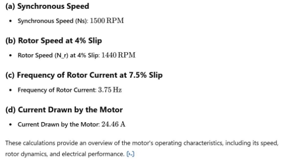

**Q16(b): what is the most common cause of induction motor failure? How do you check the insulation resistance between phases on an induction motor?**

**Ans:** ### \*\*Common Causes of Induction Motor Failure\*\* The most common causes of induction motor failure include:

1. \*\*Insulation Breakdown\*\*:
- Over time, the insulation of motor windings can deteriorate due to heat, moisture, or contaminants, leading to

short circuits between turns or phases.

2. \*\*Overheating\*\*:
- Excessive heat can result from prolonged overload conditions, inadequate ventilation, or failure of cooling

systems. Overheating can damage the motor windings and bearings.

3. \*\*Bearing Failures\*\*:
- Bearing wear or lubrication failure can lead to mechanical damage and misalignment, which increases friction

and heat, ultimately causing motor failure.

4. \*\*Electrical Imbalances\*\*:
- Unbalanced voltages can cause overheating and vibration, leading to premature motor failure. This imbalance

can be caused by issues in the power supply or faulty connections.

5. \*\*Vibration\*\*:
- Excessive vibration due to misalignment, unbalanced loads, or mechanical wear can cause damage to the motor

components and lead to failure.

6. \*\*Contamination\*\*:
- Dust, dirt, moisture, and chemical exposure can compromise the integrity of the motor windings and bearings,

leading to failures.

7. \*\*Power Supply Issues\*\*:
- Voltage spikes, transients, or interruptions can cause stress on the motor windings and control circuitry, leading

to failure.

\---

\### \*\*Checking Insulation Resistance Between Phases on an Induction Motor\*\*

To check the insulation resistance between phases on an induction motor, follow these steps:

\#### \*\*Tools Needed\*\*

- Insulation Resistance Tester (Megohmmeter)
- Safety gear (gloves, goggles)

\#### \*\*Procedure\*\*

1. \*\*Ensure Safety\*\*:
- Disconnect the motor from the power supply. Ensure that it is completely isolated and locked out to prevent

accidental energization.

2. \*\*Discharge Capacitors\*\*:
   1. If the motor has capacitors, discharge them to avoid electric shock or damage to the tester.
2. \*\*Access Motor Terminals\*\*:
- Remove the terminal cover or access panel to expose the motor’s phase terminals (U, V, W for a three-phase

motor).

4. \*\*Select the Tester Voltage\*\*:
- Set the insulation resistance tester to an appropriate test voltage (usually between 250V to 1000V, depending on

motor rating and manufacturer specifications).

5. \*\*Connect the Tester\*\*:
- Connect one lead of the tester to one phase terminal (e.g., U) and the other lead to another phase terminal (e.g.,

V).

1. Repeat this process for all combinations of phase pairs: U-V, V-W, and W-U.
6. \*\*Record Readings\*\*:
   1. Observe and record the insulation resistance values displayed on the tester. A healthy insulation resistance value

is typically greater than 1 MΩ, although the exact acceptable value can vary based on the motor's specifications.

7. \*\*Perform a Ground Test\*\*:
- To check for insulation breakdown to ground, connect one lead to the phase terminal (e.g., U) and the other to

the motor frame or ground. Repeat for all phases.

8. \*\*Interpret Results\*\*:
- Compare the measured values against acceptable standards. Values below the recommended levels may indicate

insulation deterioration, and further investigation or repairs may be necessary.

9. \*\*Reassemble the Motor\*\*:
- Once testing is complete, ensure all connections are secure, replace covers, and re-energize the motor following

safety protocols.

\#### \*\*Conclusion\*\*

Regular insulation resistance testing is crucial for the maintenance and reliability of induction motors. By identifying potential insulation failures early, operators can take corrective actions to prevent motor failures and ensure continuous operation.

**Q17 (a): what is orthomorphism ? Show how a conical projection with one standard parallel is made orthomorphic.**

**Ans:** Certainly! Let's break this down into two parts: first, we'll define orthomorphism, and then we'll demonstrate how a conical projection with one standard parallel can be made orthomorphic.

1. What is orthomorphism?

Orthomorphism, also known as conformality, is a property of map projections where the shape of small features on the Earth's surface is preserved when projected onto a map. In an orthomorphic projection:

- Angles are preserved locally
- The scale factor is the same in all directions at any given point
- Shapes of small areas are maintained, though their size may change

This property is particularly useful for navigation and for preserving the shape of landmasses on maps, although it often comes at the cost of distorting area relationships.

2. Making a conical projection with one standard parallel orthomorphic:

To make a conical projection with one standard parallel orthomorphic, we need to adjust the spacing of the parallels. Here's how it's done:

Step 1: Start with a basic conical projection

In a simple conical projection, the Earth's surface is projected onto a cone that touches or intersects the globe along a chosen parallel (the standard parallel).

Step 2: Introduce a scale factor

Let's define:

φ = latitude

φ1 = latitude of the standard parallel

n = cone constant (determines how "pointy" the cone is)

The scale factor along meridians (h) in a regular conical projection is: h = n / cos φ

Step 3: Adjust the spacing of parallels

To make the projection orthomorphic, we need to ensure that the scale factor is the same in all directions. We do this by adjusting the spacing of the parallels.

The radius (r) of a parallel in the orthomorphic conical projection is given by: r = k (tan(π/4 + φ/2))^n

Where:

k is a constant that determines the overall scale of the map n is the cone constant, which can be calculated as:

n = cos φ1

Step 4: Calculate the positions of parallels

Using the formula for r, we can calculate the position of each parallel on the map. This will result in parallels that are spaced increasingly further apart as we move away from the standard parallel.

Step 5: Verify orthomorphism

At any point on this adjusted conical projection:

- The scale factor along parallels (k) equals the scale factor along meridians (h)
- The product of these scale factors (kh) equals the square of the scale factor in any direction

This ensures that the projection is orthomorphic.

By following these steps, we've transformed a regular conical projection with one standard parallel into an orthomorphic projection. This type of projection is known as a Lambert Conformal Conic projection, which is widely used for aeronautical charts and topographic mapping of regions that are predominantly east-west in extent.

The key to achieving orthomorphism in this case is the adjustment of the parallel spacing using the (tan(π/4 + φ/2))^n factor, which ensures that the scale factor is the same in all directions at any given point, thus preserving local angles and shapes.

**Q17(b): describe the method of constructing the graticule for conical projection with one standard parallel is made orthomorphic.**

**Ans:** Certainly. I'll describe the method of constructing the graticule for a conical projection with one standard parallel that has been made orthomorphic (also known as a Lambert Conformal Conic projection). This process involves several steps:

1. Choose the standard parallel and central meridian:
   1. Select the latitude of the standard parallel (φ1)
   1. Choose a central meridian
1. Calculate the cone constant (n):    n = sin φ1
1. Determine the scale factor (k):

`   `This is usually chosen to minimize overall scale distortion in the area of interest.

4. Construct the central meridian:
   1. Draw a straight line to represent the central meridian
   1. Mark the latitude intersections along this line
4. Calculate and plot the parallels:

`   `For each parallel of latitude (φ), calculate its radius (r) from the apex of the cone:    r = k (tan(π/4 + φ1/2) / tan(π/4 + φ/2))^n

- The parallel for latitude φ1 (standard parallel) will be a circular arc centered on the apex of the cone
- Other parallels will be concentric circular arcs
6. Plot the meridians:
- Meridians are straight lines radiating from the apex of the cone
- The angle (θ) between the central meridian and any other meridian with longitude difference λ is:

`     `θ = n λ

Where λ is in radians

7. Construct the graticule:
   1. Draw the calculated parallels as circular arcs
   1. Draw the meridians as straight lines radiating from the apex
   1. Ensure proper intersection of parallels and meridians
7. Label the graticule:
   1. Mark latitudes along the central meridian
   1. Mark longitudes along the standard parallel or the bottom edge of the map
7. Add map elements:
- Include a scale bar (noting that scale varies across the map)
- Add a north arrow
- Include information about the projection, standard parallel, and central meridian

Practical considerations:

- Use a large drawing surface or digital mapping software for accuracy
- For hand drawing, use a compass for the circular arcs (parallels) and a protractor for the angles between meridians
- The spacing between parallels will increase as you move away from the standard parallel
- The convergence of meridians will be uniform, unlike in non-orthomorphic conical projections

Remember, this orthomorphic conical projection preserves angles locally but distorts areas, especially far from the standard parallel. The distortion increases with distance from the standard parallel, so choose it wisely based on your area of interest.

This method of construction results in a map where small shapes are preserved, making it useful for navigation and topographic mapping, especially for regions that span east-west rather than north-south.

**Q18(a) : what is cyber security? Discuss the advice as given by MSC of IMO to governments and companies in respect of cyber security risks and the SMS as per the ISM code.**

**Ans:** Cybersecurity in the maritime context refers to the practice of protecting ships, ports, and maritime organizations from digital threats and vulnerabilities. It encompasses the technologies, processes, and practices designed to defend maritime systems, networks, programs, and data from attack, damage, or unauthorized access.

The Maritime Safety Committee (MSC) of the International Maritime Organization (IMO) has provided advice to governments and companies regarding cybersecurity risks and their integration into Safety Management Systems (SMS) as per the International Safety Management (ISM) Code. Here's a discussion of the key points:

1. Advice to Governments:
1) Risk Assessment:
   1. Encourage national risk assessments to identify critical maritime systems
   1. Develop strategies to mitigate identified risks
1) Legal Framework:
   1. Develop or update national legislation to address maritime cybersecurity
   1. Ensure compliance with international maritime cybersecurity standards
1) Incident Reporting:
   1. Establish national mechanisms for cybersecurity incident reporting
   1. Share information on threats and vulnerabilities with the maritime community
1) Capacity Building:
   1. Invest in cybersecurity training and education for maritime personnel
   1. Develop national expertise in maritime cybersecurity
1) International Cooperation:
- Engage in international efforts to enhance maritime cybersecurity
- Share best practices and lessons learned with other nations
2. Advice to Companies:
1) Cybersecurity Risk Management:
- Integrate cybersecurity into existing risk management processes
- Conduct regular cybersecurity risk assessments
2) Defense-in-Depth Strategy:
   1. Implement multiple layers of security controls
   1. Use a combination of technical and procedural measures
2) System Design and Configuration:
   1. Apply "security by design" principles in maritime systems
   1. Ensure proper configuration and regular updates of all systems
2) Network Segmentation:
   1. Separate critical systems from non-critical networks
   1. Implement access controls between network segments
2) Incident Response Plan:
   1. Develop and regularly test cybersecurity incident response plans
   1. Ensure coordination with relevant authorities and stakeholders
2) Supply Chain Security:
- Assess and manage cybersecurity risks in the maritime supply chain
- Ensure vendors and contractors adhere to cybersecurity standards
3. Integration into SMS as per ISM Code:

The MSC has advised that cybersecurity risk management should be incorporated into existing Safety Management Systems. Key aspects include:

1) Policy:
   1. Develop a clear company policy on cybersecurity
   1. Ensure top management commitment to cybersecurity
1) Responsibility and Authority:
   1. Clearly define roles and responsibilities for cybersecurity
   1. Designate a company cybersecurity officer or team
1) Resources and Personnel:
   1. Allocate necessary resources for cybersecurity measures
   1. Ensure personnel are trained in cybersecurity awareness and procedures
1) Procedures:
   1. Develop and implement cybersecurity procedures as part of the SMS
   1. Include procedures for system maintenance, access control, and incident response
1) Contingency Planning:
   1. Integrate cybersecurity scenarios into shipboard and shore-based contingency plans
   1. Regularly drill and exercise these plans
1) Documentation:
   1. Maintain documentation of cybersecurity measures and incidents
   1. Ensure cybersecurity documentation is part of the ship's critical documentation
1) Company Verification, Review, and Evaluation:
   1. Include cybersecurity in internal audits and management reviews
   1. Continuously improve cybersecurity measures based on assessments and incidents
1) Certification and External Verification:
- Be prepared for cybersecurity elements to be assessed during ISM Code audits
- Maintain evidence of cybersecurity compliance

The MSC emphasizes that cybersecurity should be approached as an ongoing process rather than a one-time solution. Companies are advised to stay informed about evolving cyber threats and continuously update their security measures.

By integrating cybersecurity into the SMS and following these guidelines, maritime companies can enhance their resilience against cyber threats, comply with international standards, and contribute to the overall safety and security of maritime operations.

**Q18(b) : Expand on “Identify, protect, detect, respond and recover” philosophy of functional elements of cyber security with shipboard examples.**

**Ans:** The "Identify, Protect, Detect, Respond, and Recover" philosophy is a framework for cybersecurity risk management, often referred to as the NIST Cybersecurity Framework. In the context of shipboard cybersecurity, this approach provides a comprehensive strategy for managing cyber risks. Let's expand on each element with shipboard examples:

1. Identify:

This stage involves understanding the cybersecurity landscape and potential risks specific to the ship.

Shipboard examples:

- Conduct an inventory of all onboard systems, including navigation systems, cargo management systems, and communication equipment.
- Identify critical systems such as ECDIS (Electronic Chart Display and Information System), AIS (Automatic Identification System), and engine control systems.
- Map data flows between systems and to/from shore-based networks.
- Assess potential vulnerabilities in each system, considering factors like age, update status, and connectivity.
2. Protect:

This phase focuses on implementing safeguards to ensure the delivery of critical infrastructure services.

Shipboard examples:

- Install and regularly update antivirus software on all shipboard computers.
- Implement strong password policies for all systems, including bridge equipment.
- Use firewalls to segregate critical navigation and propulsion systems from other networks.
- Provide cybersecurity awareness training for all crew members, including topics like phishing and safe USB usage.
- Implement access control measures, ensuring crew members only have access to systems necessary for their roles.
- Regularly back up critical data and store backups securely.
3. Detect:

This stage involves implementing appropriate activities to identify the occurrence of a cybersecurity event.

Shipboard examples:

- Install intrusion detection systems to monitor network traffic for suspicious activities.
- Implement log monitoring for critical systems like ECDIS and engine control systems.
- Use anomaly detection software to identify unusual patterns in system behavior or data traffic.
- Conduct regular vulnerability scans of shipboard networks and systems.
- Train crew to recognize and report potential cybersecurity incidents, such as unusual system behavior or suspicious emails.
4. Respond:

This phase focuses on taking action regarding a detected cybersecurity incident.

Shipboard examples:

- Develop and maintain a ship-specific cyber incident response plan.
- Establish clear procedures for isolating affected systems to prevent spread of an attack.
- Define roles and responsibilities for cyber incident response, including communication with shore-based support and authorities.
- Conduct regular drills to practice response procedures, such as switching to backup systems if primary navigation systems are compromised.
- Maintain offline, up-to-date copies of all critical software and data to aid in recovery.
- Establish secure communication channels for reporting incidents to company IT support and relevant maritime authorities.
5. Recover:

This stage involves maintaining plans for resilience and restoring any capabilities or services that were impaired due to a cybersecurity incident.

Shipboard examples:

- Develop and maintain detailed recovery procedures for each critical system.
- Regularly test the restoration process from backups to ensure data integrity and system functionality.
- Establish procedures for cleaning and restoring potentially infected systems, including re-imaging computers if necessary.
- Conduct post-incident reviews to identify lessons learned and improve future response and recovery efforts.
- Maintain relationships with vendors and support services that can assist in recovery efforts if needed.
- Ensure redundancy in critical systems, such as having backup GPS systems or alternative means of navigation.

Additional Considerations:

- Integration: These elements should be integrated into the ship's Safety Management System (SMS) as per ISM Code requirements.
- Continuous Improvement: Regularly review and update all procedures based on new threats, incidents, and technological changes.
- Supply Chain: Consider cybersecurity risks from third-party vendors and service providers, such as software updates or technician visits.
- Remote Access: Implement strict controls and monitoring for any remote access to ship systems, including by shore-based personnel or vendors.

  By applying this "Identify, Protect, Detect, Respond, and Recover" philosophy, ships can develop a comprehensive approach to cybersecurity that aligns with international best practices and enhances their overall security posture. This structured approach helps ensure that all aspects of cybersecurity are addressed, from prevention through to recovery, creating a more resilient maritime cyber environment.

  **Q19: Both the Ring Laser Gyro and Fibre Optic Gyro use the principle of Sagnac Effect yet their construction differs considerably, Elaborate on thedifferences in the constructional features, accuracy and applications in the marine field.**

  **Ans:** Both Ring Laser Gyros (RLG) and Fiber Optic Gyros (FOG) are based on the Sagnac effect, which describes the phase shift between two counter-propagating light beams in a rotating frame. However, their construction, accuracy, and applications differ significantly. Let's elaborate on these differences:

1. Constructional Features:

Ring Laser Gyro (RLG):

- Construction: Consists of a sealed cavity with mirrors at the corners, forming a closed path.
- Light Source: Uses a helium-neon gas laser.
- Path: Light travels in a polygonal (usually triangular or square) path.
- Size: Typically larger, with path lengths of 10-30 cm.
- Moving Parts: No moving parts in modern designs (older designs used mechanical dithering).

Fiber Optic Gyro (FOG):

- Construction: Uses a coil of optical fiber, often several kilometers long.
- Light Source: Uses a semiconductor laser or LED.
- Path: Light travels through the fiber coil.
- Size: Can be made more compact due to the coiled fiber.
- Moving Parts: No moving parts.
2. Accuracy:

Ring Laser Gyro (RLG):

- Generally more accurate, especially for high-performance applications.
- Typical drift rates: 0.001 to 0.01 degrees per hour.
- Better scale factor stability.
- Less affected by temperature changes.

Fiber Optic Gyro (FOG):

- Accuracy has improved significantly over the years.
- Typical drift rates: 0.1 to 10 degrees per hour (high-end FOGs can achieve better).
- More susceptible to temperature effects, requiring compensation.
- Accuracy can be improved by using longer fiber coils, but at the cost of increased size.
3. Applications in the Marine Field:

Ring Laser Gyro (RLG):

- High-end marine navigation systems, especially for large vessels and naval ships.
- Inertial Navigation Systems (INS) for submarines.
- Attitude and Heading Reference Systems (AHRS) for dynamic positioning systems.
- Used in high-precision survey vessels.

Fiber Optic Gyro (FOG):

- Medium to high-performance marine navigation systems.
- Gyrocompasses for commercial vessels.
- Motion reference units for offshore platforms.
- Stabilization systems for smaller vessels.
- ROV (Remotely Operated Vehicle) navigation.
4. Other Considerations:

Cost:

- RLGs are generally more expensive due to their complex construction and precision requirements.
- FOGs can be more cost-effective, especially for medium-performance applications.

Reliability:

- RLGs have a longer track record of reliability in harsh environments.
- FOGs are catching up in reliability and are improving rapidly.

Power Consumption:

- FOGs typically have lower power consumption.
- RLGs require more power to maintain the laser.

Warm-up Time:

- RLGs usually require longer warm-up times.
- FOGs can often be operational more quickly.

Vibration Sensitivity:

- RLGs can be sensitive to certain vibration frequencies (lock-in effect).
- FOGs are generally less sensitive to vibration.

Longevity:

- RLGs may have issues with gas leakage over very long periods.
- FOGs don't have this issue, potentially offering longer operational life.
5. Recent Trends:
- Integration: Both types are increasingly integrated into multi-sensor systems, combined with GPS and other sensors for enhanced performance.
- Miniaturization: Efforts to reduce size, especially for RLGs, to compete with the compact nature of FOGs.
- Improved FOG Performance: Ongoing research to enhance FOG accuracy to match or exceed RLG performance in more applications.

  In conclusion, while both RLGs and FOGs use the Sagnac effect, their different constructions lead to varying characteristics. RLGs generally offer higher accuracy and are preferred for high-end applications, while FOGs offer a good balance of performance, size, and cost for many marine applications. The choice between them depends on the specific requirements of the application, including accuracy needs, environmental conditions, size constraints, and budget considerations. Both technologies continue to evolve, with FOGs increasingly challenging RLGs in performance while often offering advantages in size, power consumption, and cost.

  **Q20: What velocities must balance to cause the maximum altitude of a heavenly body near an upper meridian passage?**

  **Ans:** To understand what velocities must balance to cause the maximum altitude of a heavenly body near an upper meridian passage, we need to consider the apparent motion of celestial objects across the sky. Let's break this down step by step:

1. Apparent Motion of Celestial Objects:

`   `Celestial objects appear to move across the sky due to two primary factors:

1) The Earth's rotation on its axis (diurnal motion)
1) The object's own motion relative to Earth (if any)
2. Upper Meridian Passage:

`   `This occurs when a celestial object crosses the observer's meridian (an imaginary line running from north to south through the zenith).

3. Maximum Altitude:

`   `The altitude of a celestial object is its angular distance above the horizon. For objects that don't cross the zenith, the maximum altitude occurs at the moment of upper meridian passage.

4. Velocities Involved:

`   `To understand what velocities must balance, we need to consider the vertical component of the object's apparent motion.

1) Upward Velocity:

`      `As the object approaches the meridian, it appears to move upward in the sky due to Earth's rotation.

2) Downward Velocity:

`      `The object's own motion relative to Earth may have a component that moves it away from the celestial equator (changing its declination).

5. Balancing Point:

`   `The maximum altitude occurs when these two vertical velocity components are equal and opposite, effectively canceling each other out momentarily.

6. Mathematical Expression:

`   `If we denote the upward velocity due to Earth's rotation as Vr and the downward velocity due to the object's motion as Vo, then at the moment of maximum altitude:

Vr = Vo

7. Practical Considerations:
- For most stars, Vo is negligible over short periods, so the maximum altitude coincides almost exactly with the

meridian passage.

- For solar system objects like the Sun, Moon, and planets, Vo can be significant enough to cause the maximum

altitude to occur slightly before or after the exact moment of meridian passage.

8. Examples:
- Sun: Its changing declination throughout the year means its maximum altitude might not coincide exactly with

its meridian passage.

- Moon: Due to its rapid motion relative to Earth, its maximum altitude can occur noticeably before or after

meridian passage.

- Planets: Depending on their position in orbit, they may have significant Vo, affecting the timing of maximum

altitude.

In conclusion, the maximum altitude of a heavenly body near an upper meridian passage occurs when the upward velocity component due to Earth's rotation exactly balances the downward velocity component due to the object's own motion relative to Earth. This balance point may occur slightly before or after the exact moment of meridian passage, depending on the specific motion of the celestial object in question.

**Q21 As a part of activity at a Hydrographic Organization;**

1) **Illustrate with diagram, conical orthomorphic projection with two standard parallels.**

**Ans:** Certainly! I'll describe the conical orthomorphic projection with two standard parallels, also known as the Lambert Conformal Conic projection with two standard parallels, and provide a verbal description of how the diagram would look.

Conical Orthomorphic Projection with Two Standard Parallels:

This projection is used to map areas that span east-west rather than north-south, and it's particularly useful for mapping mid-latitude regions. It preserves angles locally (hence "conformal" or "orthomorphic") but distorts areas, especially far from the standard parallels.

Diagram Description:

1. Cone Shape:
- The projection is based on a cone that intersects the globe along two parallels of latitude, called the standard

parallels.

- These standard parallels are where the cone touches or intersects the globe, resulting in no distortion along these

lines.

2. Parallels:
   1. Appear as concentric circular arcs centered on the apex of the cone.
   1. The two standard parallels are emphasized, often drawn with a thicker line.
   1. Spacing between parallels increases as you move away from the standard parallels.
2. Meridians:
- Appear as straight lines radiating from the apex of the cone.
- Evenly spaced around the map, converging at the apex.
4. Scale:
   1. True along the two standard parallels.
   1. Compressed between the standard parallels.
   1. Stretched beyond the standard parallels.
4. Shape:
   1. The overall shape of the mapped area is a fan-like sector of a circle.
   1. The top of the map (towards the pole) is curved, while the bottom is straighter.
4. Distortion:
   1. Minimal near and between the standard parallels.
   1. Increases as you move away from the standard parallels, especially towards the poles and equator.
4. Pole:
- Not shown as a point, but as an arc at the top of the map.

Key Features to Note:

1. The choice of standard parallels depends on the region being mapped. They are often chosen to minimize distortion in the area of interest.
1. The area between the standard parallels is slightly compressed, while areas outside are stretched.
1. All parallels are concentric arcs, and all meridians are straight lines intersecting at the apex of the cone.
1. Angles are preserved locally, making this projection useful for navigation.
1. Area distortion increases with distance from the standard parallels.

   This projection is widely used for aeronautical charts, topographic maps of countries or regions that are wider than they are tall, and for meteorological maps. It provides a good compromise between shape and area preservation for mid-latitude regions.

2) **: Deduce Meridional part formula for a sphere. Explain how it differs from meridional parts formula of the spheroidal earth?**

   **Ans: Meridional Part Formula for a Sphere**

   The **meridional part** is a value that represents the length of a meridian (in minutes of latitude) between the equator and a given parallel of latitude. It is crucial in *Mercator projection*, where the meridional parts are used to correct for the distortion of scale with increasing latitude.

   For a spherical Earth, the meridional part formula is derived by integrating the differential length along a meridian on the sphere. Here's how we can deduce it:

   **1. Formula Derivation for a Sphere**

   

   **Meridional Part Formula for the Spheroidal Earth**

   For a more accurate representation of Earth as an *oblate spheroid*, the formula for meridional parts is more complex due to the varying radius along different latitudes. The Earth's shape causes the meridian lengths to differ because Earth is flattened at the poles and bulging at the equator.

   The formula for the meridional parts of a spheroidal Earth takes into account the varying curvature and is given by:

   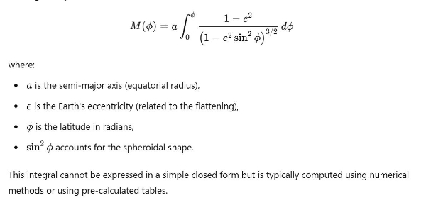

   **Key Differences Between the Sphere and Spheroid Meridional Part Formulas**

   **Complexity**:

- The formula for a **sphere** is straightforward, involving a simple proportional relationship between the latitude and the radius.
- The formula for a **spheroid** includes the Earth's eccentricity and requires an elliptic integral, making it much more complex to compute.

**Accuracy**:

- The **sphere model** assumes the Earth has a constant radius at all latitudes, which leads to inaccuracies, especially at higher latitudes.
- The **spheroid model** accounts for the Earth's oblateness, resulting in more precise values of meridional parts, especially when considering larger latitudes.

**Variation of Radius**:

- In the **sphere**, the radius is constant, so the meridional parts grow linearly with latitude.
- In the **spheroid**, the radius varies with latitude, and the rate of change of meridional parts slows down as latitude increases due to the flattening at the poles.

**Use in Navigation**:

- In early navigation, the **spherical model** was often used for simplicity, but as more accurate maps and charts were needed, the **spheroidal model** became standard for marine and air navigation.

In conclusion, while the spherical model offers simplicity in calculating meridional parts, the spheroidal model provides a much more accurate representation of Earth's shape, which is crucial for precise navigation and charting applications.

(**C ): Derive expression of parametric latitude in terms of geodetic latitude. Ans:**

**Deriving the Parametric Latitude Expression in Terms of Geodetic Latitude**

In geodetic and hydrographic computations, different types of latitudes are used based on different aspects of the Earth's shape. The **parametric latitude** (or **reduced latitude**, denoted as β\betaβ) is commonly used in connection with ellipsoidal Earth models, especially in geodetic surveys and map projections. It is related to the **geodetic latitude** (denoted as ϕ\phiϕ), which is the angle between the normal to the reference ellipsoid and the equatorial plane.

Let’s derive the expression for the parametric latitude in terms of the geodetic latitude.

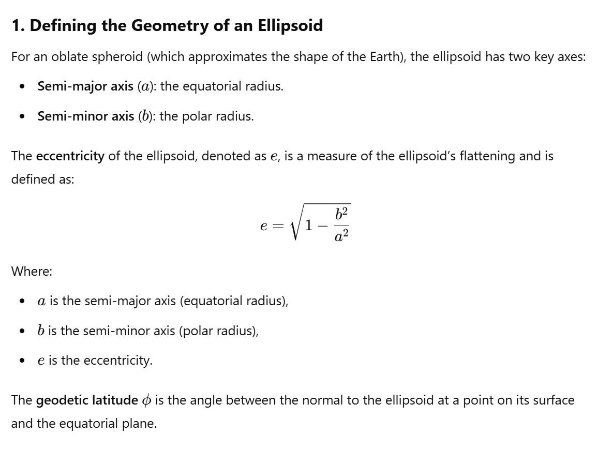

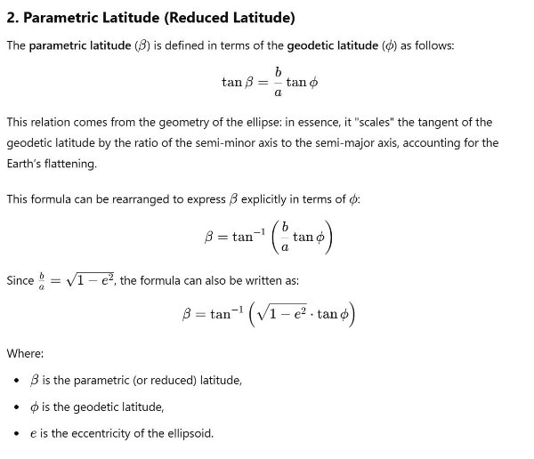

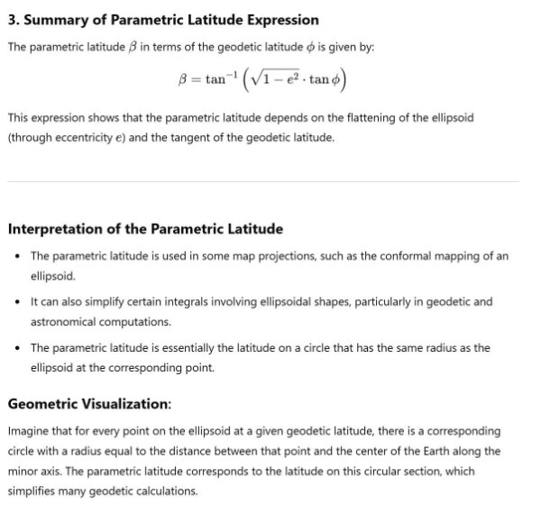

**Q23 (a) : Explain the following cyber threats and the measures for prevention against them (I) Brute Force Attack (II) MITM (III) DDOS and (IV) XSS**

**Ans:** ### \*\*Cyber Threats and Their Prevention Measures\*\*

In the context of maritime operations, especially with increased digitalization, understanding cyber threats is crucial for maintaining the safety and security of onboard and onshore systems. Here is an explanation of four common cyber threats and measures to prevent them:

\---

\### \*\*1. Brute Force Attack\*\*

\#### \*\*Explanation\*\*:

- \*\*Brute Force Attack\*\* is a method of attempting to crack passwords, encryption keys, or other security credentials by systematically trying all possible combinations until the correct one is found. The attacker uses automation to try numerous combinations in rapid succession.
- This is a simple yet effective method for breaking into accounts or systems if they rely on weak passwords or encryption mechanisms.

  #### \*\*Prevention Measures\*\*:

- \*\*Strong Password Policies\*\*: Enforce the use of complex passwords (e.g., a mix of upper/lower case letters, numbers, and special characters) that are difficult to guess.
- \*\*Limit Login Attempts\*\*: Implement account lockout mechanisms after a certain number of failed login attempts.
- \*\*Multi-Factor Authentication (MFA)\*\*: Adding a second layer of authentication (such as a one-time code sent to a mobile device) can significantly reduce the risk of brute force attacks.
- \*\*Captcha\*\*: Use CAPTCHA or similar mechanisms to prevent automated systems from trying passwords repeatedly.

  ---

  ### \*\*2. Man-in-the-Middle (MITM) Attack\*\*

  #### \*\*Explanation\*\*:

- In a \*\*Man-in-the-Middle (MITM)\*\* attack, the attacker secretly intercepts and possibly alters the communication between two parties (e.g., between a ship’s system and an onshore server). The attacker can eavesdrop, manipulate data, or steal sensitive information without either party knowing.
- This type of attack often happens in unsecured networks, where the attacker can position themselves between the communicating entities.

  #### \*\*Prevention Measures\*\*:

- \*\*Encryption\*\*: Ensure that all communications use strong encryption protocols like TLS (Transport Layer Security) or SSL (Secure Sockets Layer) to prevent attackers from reading the data.
- \*\*Secure Networks\*\*: Avoid using unsecured or public networks for sensitive communications. Use VPNs (Virtual Private Networks) to create a secure communication tunnel.
- \*\*Authentication and Certificates\*\*: Use digital certificates and authentication mechanisms to verify the identity of communicating parties, ensuring that data is exchanged only with trusted entities.
- \*\*Network Monitoring\*\*: Regularly monitor network traffic for unusual patterns that could indicate a MITM attack is occurring.

  ---

  ### \*\*3. Distributed Denial of Service (DDoS)\*\*

  #### \*\*Explanation\*\*:

- \*\*DDoS (Distributed Denial of Service)\*\* is an attack where multiple compromised systems (often botnets) flood a target server or network with traffic, overwhelming its resources and rendering it unavailable to legitimate users. In the maritime industry, such attacks could cripple communication and navigation systems.
- DDoS attacks can cause significant disruptions to services, leading to downtime and financial loss.

  #### \*\*Prevention Measures\*\*:

- \*\*Traffic Filtering\*\*: Implement firewalls and Intrusion Prevention Systems (IPS) to filter out abnormal traffic before it reaches the target system.
- \*\*Load Balancing\*\*: Distribute traffic across multiple servers to prevent any single server from being overwhelmed.
- \*\*DDoS Protection Services\*\*: Use cloud-based or third-party DDoS protection services that can absorb and mitigate large-scale attacks.
- \*\*Rate Limiting\*\*: Apply rate limiting on networks to control the flow of incoming requests and prevent overwhelming amounts of traffic from entering the system.

  ---

  ### \*\*4. Cross-Site Scripting (XSS)\*\*

  #### \*\*Explanation\*\*:

- \*\*Cross-Site Scripting (XSS)\*\* is a web vulnerability that allows attackers to inject malicious scripts into webpages viewed by other users. These scripts can steal user data, such as session cookies, or perform malicious actions on behalf of the user without their knowledge.
- XSS is a common attack on websites with poor input validation and can affect applications used in fleet management or onboard systems.

  #### \*\*Prevention Measures\*\*:

- \*\*Input Validation and Sanitization\*\*: Ensure that all input fields, especially in web applications, validate user input to prevent the injection of malicious scripts. Use libraries and frameworks that sanitize input data.
- \*\*Escaping User Input\*\*: Properly escape user input to ensure it cannot be executed as code. This is especially important in web applications.
- \*\*Use Content Security Policy (CSP)\*\*: Implement CSP headers to restrict the execution of scripts on the website from unauthorized or untrusted sources.
- \*\*Web Application Firewalls (WAF)\*\*: Deploy a WAF that can detect and block XSS attacks by inspecting HTTP requests and responses.

  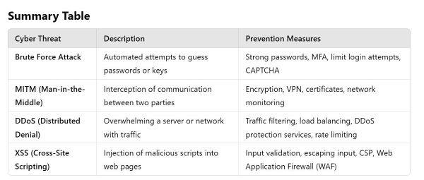

  Each of these cyber threats can disrupt operations and compromise safety, especially in the context of increasingly connected and digitalized maritime systems. Prevention relies heavily on strong security practices, regular updates, and monitoring systems.

  **Q23(b) : Enumerate advantages of TLS over SSL? Ans:** \*\*Advantages of TLS over SSL\*\*

  Transport Layer Security (TLS) is the successor to Secure Sockets Layer (SSL), and it offers several improvements in terms of security and performance. Here are the key advantages of \*\*TLS over SSL\*\*:

  ### 1. \*\*Enhanced Security Protocols\*\*

- \*\*Stronger Encryption Algorithms\*\*: TLS supports more modern encryption algorithms (e.g., AES, ECC) that

are more secure compared to those used in SSL (e.g., RC4, 3DES). This makes TLS less vulnerable to attacks on encryption algorithms.

- \*\*HMAC for Integrity\*\*: TLS uses the Hash-based Message Authentication Code (HMAC) for message

integrity, which is more secure than the MAC (Message Authentication Code) used in SSL. HMAC provides stronger protection against message tampering.

- \*\*Protection Against Known Vulnerabilities\*\*: SSL, especially versions prior to SSL 3.0, are susceptible to

several vulnerabilities like POODLE, BEAST, and DROWN attacks. TLS was designed to mitigate these vulnerabilities, offering better security from known exploits.

\### 2. \*\*Stronger Authentication\*\*

- \*\*Improved Handshake Process\*\*: TLS introduces additional checks in the handshake process, improving the

security of the session establishment between the client and server. For example, TLS includes measures like \*\*explicit message verification\*\*, ensuring the integrity of the handshake messages.

- \*\*Forward Secrecy\*\*: TLS supports perfect forward secrecy (PFS) through key exchange mechanisms such as

Diffie-Hellman Ephemeral (DHE) and Elliptic Curve Diffie-Hellman Ephemeral (ECDHE). This means that even if long-term keys are compromised, past communication cannot be decrypted.

\### 3. \*\*Session Resumption\*\*

- \*\*Efficient Session Resumption\*\*: TLS allows for \*\*session resumption\*\* using \*\*Session IDs\*\* or \*\*Session

Tickets\*\*, reducing the overhead of re-establishing secure sessions for subsequent connections. This improves performance, especially for frequently connecting clients.

\### 4. \*\*Improved Message Authentication\*\*

- \*\*Record Protocol Enhancements\*\*: TLS improves the message authentication and encryption mechanism

compared to SSL. This is achieved through \*\*separate encryption and authentication\*\* for each message, making it harder for attackers to tamper with or intercept the data.

\### 5. \*\*Better Flexibility and Extensibility\*\*

- \*\*Extensible Cipher Suites\*\*: TLS is designed to be more flexible and extensible with support for a wide range

of \*\*cipher suites\*\*, which can easily be updated as new, more secure algorithms become available. This allows for smoother transitions to stronger encryption without needing to overhaul the entire protocol.

- \*\*Backward Compatibility\*\*: TLS provides backward compatibility with SSL to ensure interoperability with

legacy systems, but still prioritizes modern security enhancements when available.

\### 6. \*\*Mitigation of Downgrade Attacks\*\*

- \*\*Prevention of Downgrade Attacks\*\*: SSL is vulnerable to downgrade attacks, where an attacker forces the

communication to fall back to an older, less secure version of SSL (e.g., SSL 2.0). TLS incorporates mechanisms (like the \*\*TLS\_FALLBACK\_SCSV\*\* signal) that prevent such downgrade attacks, ensuring that the strongest possible protocol version is used for the connection.

\### 7. \*\*Support for Modern Cryptographic Practices\*\*

- \*\*Elliptic Curve Cryptography (ECC)\*\*: TLS supports modern cryptographic methods such as ECC, which

provides strong security with smaller keys compared to traditional algorithms. This improves performance and security.

- \*\*Stronger Key Exchange Mechanisms\*\*: TLS uses more secure key exchange mechanisms, like \*\*RSA-

PSS\*\*, \*\*DHE\*\*, and \*\*ECDHE\*\*, making key exchanges more secure compared to SSL.

\### 8. \*\*De Facto Standard for Security\*\*

- \*\*Wider Adoption and Support\*\*: TLS has become the standard protocol for securing internet communications,

with ongoing development and updates to address new threats. SSL, especially versions 2.0 and 3.0, has been deprecated and is no longer considered secure by modern browsers and systems.

In conclusion, TLS is the modern, more secure, and efficient replacement for SSL. With its ability to handle stronger cryptographic algorithms, session resumption, and protection against various vulnerabilities, it is the preferred choice for secure communication in today's cyber landscape.

**Q23( c) : As head of a company providing post - fixture commercial management to container ships, what factores would you envisage to be included in your contingency plan (including recovery) in case of cyber attack?**

**Ans:**  As the head of a company providing post-fixture commercial management to container ships, ensuring the company's resilience to cyber threats is critical to maintaining the continuity of operations and safeguarding sensitive commercial, financial, and operational data. Developing a \*\*contingency plan\*\* that includes both preventive and recovery measures in case of a cyber attack is essential. Below are the factors to consider in this contingency plan:

\---

\### \*\*1. Risk Assessment and Identification\*\*

- \*\*Critical Asset Identification\*\*: Identify key systems and data critical to the commercial management

operations (e.g., cargo tracking systems, communication with ports and authorities, payment systems, and ship management software).

- \*\*Vulnerability Assessment\*\*: Regularly assess vulnerabilities in the IT infrastructure, including software,

hardware, and operational processes, to identify potential cyber threats.

- \*\*Cyber Attack Scenarios\*\*: Develop specific scenarios for potential cyber attacks (e.g., ransomware, phishing,

system hijacking) that could impact the post-fixture management systems.

\---

\### \*\*2. Incident Detection and Response\*\*

- \*\*Monitoring and Detection Systems\*\*: Implement continuous monitoring tools to detect unusual activities or

unauthorized access to the network. Intrusion detection systems (IDS) and endpoint detection and response (EDR) tools can help monitor network activity.

- \*\*Incident Response Plan\*\*: Define a clear incident response procedure that includes roles and responsibilities

for the IT team, management, and external security consultants to address the immediate impact of a cyber attack.

- \*\*Threat Isolation\*\*: In case of an attack, have a protocol in place to isolate affected systems or networks to

prevent the spread of the attack to other parts of the organization or ships.

\---

\### \*\*3. Data Backup and Recovery\*\*

- \*\*Regular Data Backups\*\*: Ensure that all critical commercial and operational data (e.g., contracts, financial

transactions, operational schedules) are backed up regularly. The backup system should be stored offsite or in a secure cloud environment.

- \*\*Recovery of Data\*\*: Develop a data recovery plan that ensures minimal downtime in the event of data

corruption, ransomware attacks, or system failures. Ensure that the recovery process is fast and the data is restored to a functional state quickly.

- \*\*Backup Verification\*\*: Regularly test the backup system to ensure that data can be restored reliably and that

the backups are not compromised.

\---

\### \*\*4. Communication and Coordination\*\*

- \*\*Internal Communication Plan\*\*: Define clear communication channels for reporting incidents internally,

including a chain of command for escalating the issue to management, IT teams, and security specialists.

- \*\*External Stakeholders\*\*: Establish pre-identified points of contact with key external stakeholders such as

clients, shipping agents, port authorities, insurers, and regulators to ensure timely notification and coordination during an attack.

- \*\*Public Relations\*\*: Prepare communication guidelines for the media and clients to manage the company's

reputation in case the attack affects operations or customer data.

- \*\*Legal and Regulatory Compliance\*\*: Ensure the plan complies with legal requirements (e.g., GDPR, IMO

guidelines) for data breaches and cybersecurity incidents, and be prepared to inform authorities if required.

\---

\### \*\*5. Business Continuity Planning (BCP)\*\*

- \*\*Operational Continuity\*\*: Ensure that alternate systems or manual processes are in place to continue

operations if the primary systems are compromised. This may include manual cargo tracking, scheduling, and billing processes.

- \*\*Redundant Systems\*\*: Have secondary, redundant systems in place for critical applications, allowing

operations to continue in the event of a cyber attack.

- \*\*Remote Access and Contingency\*\*: In case the company’s office networks are attacked, have plans for remote

access so that employees can work from home or alternate locations securely using virtual private networks (VPN) and multifactor authentication.

\---

\### \*\*6. Cybersecurity Awareness and Training\*\*

- \*\*Employee Training\*\*: Regular cybersecurity awareness training for all employees, including recognition of

phishing attempts, suspicious emails, and safe internet practices, to reduce the chances of successful cyber attacks.

- \*\*Simulation Exercises\*\*: Conduct cyber attack simulation exercises to ensure that all staff know how to

respond during a cyber event. This helps identify weak points in the response plan and improves overall readiness.

- \*\*Access Control\*\*: Implement strict access control policies to limit access to critical systems based on

employee roles, ensuring that only authorized personnel can access sensitive data.

\---

\### \*\*7. Collaboration with Cybersecurity Experts\*\*

- \*\*External Cybersecurity Consultants\*\*: Collaborate with third-party cybersecurity experts to audit systems,

implement advanced security measures, and respond quickly during cyber incidents.

- \*\*Penetration Testing\*\*: Regularly conduct penetration testing to assess the security posture of the company’s

infrastructure and identify weaknesses that need to be addressed.

\---

\### \*\*8. Insurance and Financial Preparedness\*\*

- \*\*Cyber Insurance\*\*: Purchase cyber insurance to help cover financial losses that may arise from cyber attacks,

including ransom payments, recovery costs, legal fees, and penalties.

- \*\*Cost Estimation\*\*: Estimate the financial impact of potential cyber attacks (including operational downtime,

legal liabilities, and customer compensation) to plan for financial contingencies.

\---

\### \*\*9. Post-Incident Review and Reporting\*\*

- \*\*Post-Incident Analysis\*\*: After an attack, conduct a thorough review of the event to identify how the attack

occurred, what weaknesses were exploited, and what improvements can be made to prevent future incidents.

- \*\*Audit and Reporting\*\*: Document all incidents and responses for future audits, lessons learned, and reporting

to stakeholders or regulators.

- \*\*System Updates\*\*: Ensure that all systems, software, and security protocols are updated post-incident to

prevent future exploitation of similar vulnerabilities.

\---

\### \*\*10. Maritime-Specific Considerations\*\*

- \*\*Shipboard System Protection\*\*: Ensure that onboard systems, including Electronic Chart Display and

Information Systems (ECDIS), cargo management, and propulsion systems, are secured with updated software and proper cybersecurity measures to avoid disruptions.

- \*\*Supply Chain Risks\*\*: Identify and mitigate cybersecurity risks arising from interconnected systems with

ports, suppliers, and clients.

- \*\*Compliance with IMO Guidelines\*\*: Ensure adherence to the International Maritime Organization (IMO)

cybersecurity guidelines and other relevant maritime cybersecurity standards.

\---

\### \*\*Conclusion\*\*

In summary, a comprehensive contingency plan should address \*\*incident detection and response\*\*, \*\*data backup and recovery\*\*, \*\*operational continuity\*\*, and \*\*employee training\*\*, while also ensuring collaboration with external cybersecurity experts. By combining preventive measures with a well-structured recovery process, the company can minimize the damage caused by a cyber attack and ensure business continuity in the highly competitive and interconnected shipping industry.

**Q24: why is 1 degree subtracted in the polaris table to get the observed latitude?**

**Ans:** In celestial navigation, when using the \*\*Polaris Table\*\* to determine latitude based on the altitude of Polaris (the North Star), 1 degree is subtracted from the altitude of Polaris to get the observed latitude. This is because \*\*Polaris\*\* is not located exactly at the \*\*North Celestial Pole (NCP)\*\* but is offset from it by approximately \*\*0.7 degrees\*\*. Here's a detailed explanation:

\### \*\*1. Polaris and Its Offset from the Celestial Pole\*\*

Polaris is very close to the North Celestial Pole, but it is not exactly at the pole. The North Celestial Pole is the point in the sky directly above the Earth's North Pole. The angular distance between Polaris and the North Celestial Pole is called \*\*Polaris' declination\*\* and changes slightly over time due to precession. Currently, Polaris is about \*\*0.7 degrees\*\* away from the NCP.

\### \*\*2. Latitude Determination Using Polaris\*\*

- In celestial navigation, the observed altitude of Polaris above the horizon gives a very close approximation of your \*\*latitude\*\* in the Northern Hemisphere.
- However, since Polaris is offset from the NCP, the altitude of Polaris is not exactly equal to the latitude.

  ### \*\*3. Why Subtract 1 Degree?\*\*

  The \*\*Polaris Table\*\* accounts for the varying offset of Polaris from the North Celestial Pole over time, and corrections are applied depending on the year and the precise position of Polaris. The value of \*\*1 degree\*\* subtracted is a general approximation that corrects for the fact that Polaris is slightly below the North Celestial Pole.

  The subtraction compensates for the star’s small deviation from the exact pole position to give an accurate latitude. The use of \*\*1 degree\*\* is rounded from the true offset (which is approximately 0.7 degrees) for practical navigational purposes.

  ### \*\*4. Practical Example\*\*

- If you observe the altitude of Polaris to be, say, 45 degrees above the horizon, the latitude you would calculate using a simplified method would initially seem to be 45 degrees North.
- However, since Polaris is not exactly at the NCP, subtracting 1 degree accounts for the star’s deviation, giving you a more accurate observed latitude of 44 degrees North.

  ### \*\*Conclusion\*\*

  The subtraction of \*\*1 degree\*\* in the Polaris Table is a simplified correction for the fact that Polaris is not exactly at the North Celestial Pole. This adjustment provides navigators with a more accurate latitude reading when using Polaris for celestial navigation.

  **Q25 (a) : What is SAGNAC effect? Explain the working of Ring Laser gyro.**

  **Ans:** ### \*\*SAGNAC Effect\*\*

  The \*\*Sagnac Effect\*\* is a phenomenon observed in rotating reference frames, where the difference in the path length traveled by light beams moving in opposite directions around a closed loop causes a measurable phase shift or time difference. It occurs because the speed of light is constant relative to an inertial frame, but in a rotating frame, the path length of light changes depending on the direction of rotation.

  #### \*\*Explanation\*\*

- When a system is rotating, light beams traveling in the direction of the rotation cover more distance relative to the rotating system compared to light beams traveling in the opposite direction.
- This difference in distance leads to a phase shift between the two light beams, and this phase difference can be used to calculate the rotational velocity of the system.

  The Sagnac effect is the fundamental principle behind \*\*ring laser gyros\*\* and \*\*fiber optic gyroscopes\*\*, which are widely used in navigation systems to detect and measure rotational movement (angular velocity) with high precision.

  ---

  ### \*\*Ring Laser Gyro (RLG)\*\*

  A \*\*Ring Laser Gyroscope (RLG)\*\* is a highly accurate device used to measure angular rotation. It works on the principle of the Sagnac Effect and is widely used in modern navigation systems, especially in aircraft, ships, and spacecraft.

  #### \*\*Working Principle\*\*

1. \*\*Laser Beams in a Closed Loop\*\*:
- The RLG consists of a closed loop optical cavity, typically triangular or square in shape, with mirrors at the

corners to form a ring. A laser beam is split into two beams that travel in opposite directions around the loop.

2. \*\*Sagnac Effect in Action\*\*:
- When the system (e.g., an aircraft or ship) rotates, the path length traveled by the two beams changes. The beam

traveling in the same direction as the rotation covers a slightly longer path, while the beam traveling in the opposite direction covers a shorter path.

1. This path difference creates a phase shift between the two light beams due to the Sagnac Effect.
3. \*\*Interference and Beat Frequency\*\*:
   1. The two laser beams recombine after traveling around the loop. If there is a phase difference due to rotation, the

two beams interfere with each other, creating an interference pattern.

- The interference causes a \*\*beat frequency\*\* (difference in frequencies of the beams), which is proportional to

the angular velocity of the system. This beat frequency is used to determine the rate of rotation. 4. \*\*Measurement\*\*:

- The output of the ring laser gyro is the frequency of the beat, which can be measured accurately. This frequency

directly corresponds to the angular velocity of the system in the plane of the ring.

- Multiple RLGs can be used in different planes to measure the rotation of the system in three dimensions (pitch,

yaw, and roll).

\---

\### \*\*Advantages of Ring Laser Gyros\*\*

- \*\*High Accuracy\*\*: RLGs are extremely precise and can detect very small changes in angular velocity.
- \*\*No Moving Parts\*\*: Unlike mechanical gyroscopes, RLGs have no moving parts, making them highly reliable and less prone to wear and tear.
- \*\*Compact and Lightweight\*\*: The compact design of RLGs makes them suitable for integration into aircraft, ships, and spacecraft.
- \*\*Long Operational Life\*\*: With no mechanical friction or wear, RLGs have a long operational life and require minimal maintenance.

\---

\### \*\*Disadvantages of Ring Laser Gyros\*\*

- \*\*Lock-in Problem\*\*: At very low rotational rates, the two beams may become synchronized, causing the system to experience a "lock-in" effect, where no phase difference is detected. This is usually corrected by dithering the system (slightly oscillating the gyro) to break the lock.
- \*\*Laser Frequency Drift\*\*: Over time, the frequency of the laser can drift, affecting the accuracy. This is mitigated through calibration or temperature control.
- \*\*Cost\*\*: RLGs are expensive to manufacture compared to other gyroscope technologies like MEMS gyroscopes.

  ---

  ### \*\*Conclusion\*\*

  The \*\*Sagnac Effect\*\* underpins the operation of the \*\*Ring Laser Gyro\*\*, a critical device in modern navigation systems for measuring angular velocity with high precision. RLGs are widely preferred in applications requiring high accuracy and reliability due to their lack of moving parts and high precision, although they can be costly and may suffer from issues like the lock-in problem at low rotational rates.

  **Q25 (b) : Evaluate “advantages” and “limitations” of the use of ‘AIS AtoNs’ as aids to navigation in indian waterways and in Non-major ports, in particular in night navigation. Also do a cost benefit analysis of the equipment that shall be required to be fitted on vessels to avail the services.**

  **Ans:** ### \*\*AIS AtoNs (Automatic Identification System - Aids to Navigation): Overview\*\*

  \*\*AIS AtoNs\*\* are virtual or physical devices that broadcast navigational information such as position, status, and health through the AIS (Automatic Identification System) network. They can be either physical (installed on buoys or lighthouses) or virtual (representing objects like wrecks or submerged rocks without a physical AIS transmitter). These systems are increasingly used in maritime navigation, providing essential data to vessels in real-time.

  The use of \*\*AIS AtoNs\*\* in \*\*Indian waterways\*\* and \*\*non-major ports\*\*, particularly during night navigation, presents several advantages and limitations. Below is an evaluation and cost-benefit analysis of AIS AtoNs in this context:

  ---

  ### \*\*Advantages of AIS AtoNs in Indian Waterways and Non-Major Ports\*\*

1. \*\*Enhanced Navigational Safety\*\*
- AIS AtoNs can provide real-time information on critical navigational aids (e.g., buoys, lighthouses, wrecks, and

other hazards), ensuring safe passage, especially during \*\*night navigation\*\* and in \*\*low visibility\*\* conditions such as fog or rain.

- In narrow or shallow Indian inland waterways, where conventional aids may be hard to spot, AIS AtoNs can

offer improved situational awareness.

2. \*\*Night-Time Navigation Improvement\*\*
- Traditional navigation aids like buoys and beacons may be difficult to detect at night, especially in non-major

ports where infrastructure may be limited. AIS AtoNs broadcast digital signals, making night navigation significantly safer as they appear on shipboard AIS displays, alerting mariners to navigational aids that might not be visible.

3. \*\*Reduced Dependency on Physical Aids\*\*
- With virtual AIS AtoNs, there is reduced need for installing and maintaining physical buoys and markers, which

can be costly and time-consuming. This is especially useful in non-major ports with limited resources.

4. \*\*Real-Time Monitoring and Data Collection\*\*
- Authorities can monitor and control navigational aids remotely, reducing the need for frequent physical

inspections. This improves operational efficiency in maintaining and managing these aids.

- AIS AtoNs provide additional data such as weather, tidal conditions, and current status of buoys or lighthouses,

aiding in real-time decision-making.

5. \*\*Cost-Effective for Remote Locations\*\*
- Installing physical AtoNs in remote or hard-to-reach locations (e.g., in certain Indian river systems) can be

challenging. Virtual AIS AtoNs can serve the same purpose without the need for physical infrastructure.

6. \*\*Integration with Existing AIS Systems\*\*
- Most vessels are already equipped with AIS systems, which means the integration of AIS AtoNs doesn’t require

extensive retrofitting or new equipment installations.

\---

\### \*\*Limitations of AIS AtoNs in Indian Waterways and Non-Major Ports\*\* 1. \*\*Dependence on Technology\*\*

- The reliance on electronic systems can be a drawback, especially in cases of system failures, GPS outages, or

signal disruptions, which can result in navigational information not being transmitted or received accurately.

1. Traditional navigation methods might still be needed as backup systems.
2. \*\*Limited Reach in Non-Major Ports\*\*
   1. Non-major ports may lack the infrastructure or resources to install and maintain AIS AtoNs, leading to patchy

coverage. This limitation is especially pronounced in remote or less developed areas.

3. \*\*Vessel Compatibility Issues\*\*
- Not all smaller vessels, which are common in non-major ports, are equipped with AIS transponders capable of

receiving AIS AtoN signals. Without proper onboard equipment, the benefits of AIS AtoNs are not fully realized.

4. \*\*High Initial Setup Costs\*\*
- While the long-term cost of AIS AtoNs is lower than maintaining physical aids, the initial setup and technology

investment for installing AIS transmitters, monitoring equipment, and integrating AIS systems across vessels and port authorities can be significant.

5. \*\*Maintenance and Upkeep of Systems\*\*
- Even though AIS AtoNs reduce the need for physical infrastructure, they still require regular \*\*monitoring\*\*

and \*\*maintenance\*\* of digital systems, software updates, and potential hardware repairs to ensure reliability.

6. \*\*Signal Interference or Saturation\*\*
- In areas with high AIS traffic (e.g., busy ports or congested inland waterways), there is a potential risk of AIS

signal saturation, which could lead to overlapping signals and reduced effectiveness of AIS AtoNs.

\---

\### \*\*Cost-Benefit Analysis of Equipment for AIS AtoN Services\*\*

\#### \*\*1. Costs for Vessel Equipment\*\*

- \*\*AIS Transponder\*\*: For vessels not equipped with AIS receivers, the cost of installing a basic Class B AIS transponder can range from \*\*$500 to $1,500\*\* (INR 40,000 to INR 120,000).
- \*\*AIS Display Unit\*\*: For vessels needing dedicated AIS displays, the cost of installing display screens could range from \*\*$1,000 to $3,000\*\* (INR 80,000 to INR 240,000).
- \*\*Installation and Maintenance\*\*: Installation, calibration, and training costs may range from \*\*$200 to $500\*\* (INR 16,000 to INR 40,000). Maintenance costs for AIS equipment are generally low but may include software updates and occasional repairs.
- \*\*Integration with Bridge Systems\*\*: For larger vessels, AIS systems need to be integrated with existing navigation equipment (radar, GPS, ECDIS), adding further cost, typically around \*\*$1,000 to $5,000\*\* (INR 80,000 to INR 400,000).

  #### \*\*2. Benefits for Vessels and Operators\*\*

- \*\*Safety Enhancement\*\*: Reduction in navigational incidents such as groundings, collisions, or stranding. This can significantly reduce insurance premiums and repair costs, making AIS AtoNs cost-effective in the long run.
- \*\*Reduced Operational Downtime\*\*: Fewer accidents and improved navigational efficiency can lead to reduced delays and port turnaround times, which translates into higher operational efficiency and profitability.
- \*\*Fuel Savings\*\*: Enhanced route optimization through better situational awareness helps reduce fuel consumption and operating costs.

  #### \*\*3. Costs for Port Authorities\*\*

- \*\*Installation of Physical AIS AtoNs\*\*: For installing AIS transmitters on buoys or lighthouses, the cost per unit could range from \*\*$3,000 to $10,000\*\* (INR 240,000 to INR 800,000), depending on the technology and location.
- \*\*Virtual AIS AtoNs\*\*: Setting up virtual AIS AtoNs (software-based) is relatively inexpensive compared to physical installations. The cost could range from \*\*$1,000 to $5,000\*\* (INR 80,000 to INR 400,000).
- \*\*Monitoring and Control System\*\*: Setting up remote monitoring and control systems may involve additional costs for software and hardware installations, typically ranging from \*\*$5,000 to $20,000\*\* (INR 400,000 to INR 1,600,000).

  #### \*\*4. Long-Term Benefits\*\*

- \*\*Lower Maintenance Costs\*\*: Reduced maintenance compared to traditional physical aids. Over time, virtual AIS AtoNs offer significant savings due to less frequent physical inspections and repairs.
- \*\*Improved Operational Efficiency\*\*: For port authorities, better navigation systems lead to smoother port operations, increased vessel throughput, and reduced incidents, which collectively enhance revenue generation.

  ---

  ### \*\*Conclusion\*\*

  The use of \*\*AIS AtoNs\*\* in \*\*Indian waterways\*\* and \*\*non-major ports\*\* brings significant advantages in enhancing \*\*navigational safety\*\*, particularly during \*\*night navigation\*\* and in areas with limited physical infrastructure. However, it is essential to address the limitations such as \*\*cost of equipment\*\*, \*\*vessel compatibility\*\*, and \*\*signal interference\*\*.

  From a \*\*cost-benefit\*\* perspective, while the \*\*initial setup costs\*\* may be high, the \*\*long-term benefits\*\* in terms of reduced operational incidents, improved navigational safety, and lower maintenance costs make the adoption of AIS AtoNs highly feasible, especially as part of a modernization strategy in India’s non-major ports.

  **Q25 ( c) : List the salient differences between IRNSS, GPS and GLONASS. Which organisations may need to be approached for approval of a common receiver for all three.**

  **Ans:**  Here is a comparison of the three major satellite navigation systems: \*\*IRNSS\*\* (Indian Regional Navigation Satellite System), \*\*GPS\*\* (Global Positioning System), and \*\*GLONASS\*\* (Global Navigation Satellite System):

  ### \*\*1. Coverage Area\*\*

- \*\*IRNSS\*\*: Provides coverage over \*\*India and the surrounding region\*\* (approximately 1,500 km beyond Indian borders). It is a regional system.
- \*\*GPS\*\*: Global coverage, operational worldwide.
- \*\*GLONASS\*\*: Also provides global coverage.

  ### \*\*2. Number of Satellites\*\*

- \*\*IRNSS\*\*: Operates with a constellation of \*\*7 satellites\*\* (3 in geostationary orbit and 4 in geosynchronous orbit).
- \*\*GPS\*\*: Uses a constellation of \*\*31 active satellites\*\* in medium Earth orbit (MEO).
- \*\*GLONASS\*\*: Has a constellation of \*\*24 satellites\*\* in medium Earth orbit.

  ### \*\*3. Orbit Type\*\*

- \*\*IRNSS\*\*: Satellites are placed in \*\*geostationary and geosynchronous orbits\*\* at approximately 36,000 km altitude.
- \*\*GPS\*\*: Satellites are in \*\*medium Earth orbit\*\* (MEO) at approximately 20,200 km altitude.
- \*\*GLONASS\*\*: Satellites are in \*\*medium Earth orbit\*\* (MEO) at about 19,100 km altitude.

  ### \*\*4. Frequency Bands\*\*

- \*\*IRNSS\*\*: Uses \*\*L5 band (1.176 GHz)\*\* and \*\*S band (2.492 GHz)\*\* for civilian and military use.
- \*\*GPS\*\*: Primarily uses the \*\*L1 (1.575 GHz)\*\*, \*\*L2 (1.227 GHz)\*\*, and \*\*L5 (1.176 GHz)\*\* bands.
- \*\*GLONASS\*\*: Utilizes \*\*L1 (1.602 GHz)\*\* and \*\*L2 (1.246 GHz)\*\* bands, though recent GLONASS satellites also broadcast on additional frequencies for interoperability.

\### \*\*5. Accuracy\*\*

- \*\*IRNSS\*\*: Provides an accuracy of \*\*10–20 meters\*\* for civilian users and higher precision for military use.
- \*\*GPS\*\*: Civilian GPS offers accuracy around \*\*5–10 meters\*\* (with better accuracy available using augmentation systems).
- \*\*GLONASS\*\*: Offers a civilian accuracy of about \*\*5–10 meters\*\*, similar to GPS.

\### \*\*6. Operators\*\*

- \*\*IRNSS\*\*: Operated by the \*\*Indian Space Research Organisation (ISRO)\*\*.
- \*\*GPS\*\*: Operated by the \*\*United States Department of Defense\*\*.
- \*\*GLONASS\*\*: Operated by the \*\*Russian Aerospace Defense Forces\*\*.

\### \*\*7. Launch Authority\*\*

- \*\*IRNSS\*\*: Satellites are launched by \*\*ISRO\*\* using its \*\*GSLV\*\* or \*\*PSLV\*\* launch vehicles.
- \*\*GPS\*\*: Satellites are launched by the \*\*U.S. Space Force\*\* using different launch vehicles like \*\*Delta\*\* and \*\*Atlas\*\* rockets.
- \*\*GLONASS\*\*: Satellites are launched by \*\*Russia\*\* using \*\*Proton-M\*\* or \*\*Soyuz\*\* rockets.

\### \*\*8. Target Users\*\*

- \*\*IRNSS\*\*: Primarily designed for Indian users, including military, civilian, and commercial sectors in India and the surrounding region.
- \*\*GPS\*\*: Available for global users, both civilian and military worldwide.
- \*\*GLONASS\*\*: Primarily for Russian users but available globally for civilian and military purposes.

  ### \*\*9. Independence and Strategic Role\*\*

- \*\*IRNSS\*\*: Designed to ensure \*\*India's strategic autonomy\*\* in navigation services, particularly important for defense and regional autonomy.
- \*\*GPS\*\*: Controlled by the U.S., so its use can be limited during times of conflict or by U.S. government policy.
- \*\*GLONASS\*\*: Russia’s answer to GPS, ensuring \*\*Russia’s navigation independence\*\* from U.S. systems.

  ---

  ### \*\*Organizations for Common Receiver Approval\*\*

  To develop and certify a \*\*common receiver\*\* that supports \*\*IRNSS, GPS, and GLONASS\*\*, you would likely need to approach the following organizations for regulatory approval and compliance:

1. \*\*ISRO (Indian Space Research Organisation)\*\* for IRNSS:
- ISRO is responsible for the development and operation of the IRNSS system. They set standards for Indian

navigation receivers and regulate IRNSS-based devices.

2. \*\*United States Federal Communications Commission (FCC)\*\* for GPS:
- The \*\*FCC\*\* is responsible for the approval of devices that use GPS in the United States, ensuring that they

meet international standards and regulations.

3. \*\*Russian Federal Service for Supervision of Communications, Information Technology and Mass Media (Roskomnadzor)\*\* for GLONASS:
- Roskomnadzor oversees satellite communication and navigation systems, including GLONASS, and ensures that

receivers meet Russian standards.

4. \*\*International Telecommunication Union (ITU)\*\*:
- The \*\*ITU\*\* sets global standards for satellite communication and radio frequencies. Approval from the ITU

may be necessary for multi-system receivers, especially concerning frequency spectrum use.

5. \*\*International Electrotechnical Commission (IEC)\*\*:
- The \*\*IEC\*\* provides global standards for electrical, electronic, and navigation equipment. Any receiver design

should meet IEC standards for certification and global acceptance.

6. \*\*GNSS Receiver Manufacturers and Standards Bodies\*\*:
- Approaching organizations like the \*\*International GNSS Service (IGS)\*\* and working with \*\*navigation

equipment manufacturers\*\* would help in ensuring compatibility and interoperability across multiple GNSS systems, including IRNSS, GPS, and GLONASS.

These organizations ensure that the receivers meet technical and regulatory standards, ensuring that the device can work seamlessly with multiple navigation satellite systems.

**Q26 (a) : MSC (99) considered proposal to revise the ‘guidelines for vessel traffic services (resolution A.857(20))’ to ensure that they were modernized / updated and continued to serve as an effective instrument, providing a clear framework to implement vessel traffic services globally in a harmonized manner.  A draft Assembly resolution was proposed in NCSR 7 for the Sub-committee’s consideration towards revision of the guidelines for VTS. As representative of a ‘Member State’ please provide your comments on the aforesaid draft revision.**

**Ans:** As the representative of a \*\*Member State\*\*, I would like to provide the following comments on the \*\*draft revision of the guidelines for Vessel Traffic Services (VTS)\*\*, proposed during the \*\*MSC (99)\*\* session and further considered by the \*\*Sub-committee on Navigation, Communications, and Search and Rescue (NCSR 7)\*\*. The modernization of these guidelines is a timely and essential step to ensure that VTS remains a robust, technologically advanced, and harmonized tool for enhancing maritime safety and efficiency globally.

\### 1. \*\*Support for the Revision\*\*:

The initiative to revise \*\*resolution A.857(20)\*\* is fully supported. The guidelines have served the industry well, but considering the advancements in maritime technology, increased ship traffic, and evolving operational challenges, an update is necessary. Ensuring the guidelines remain relevant is critical to enhancing both safety and efficiency in global vessel traffic management.

\### 2. \*\*Technological Advancements and Digital Integration\*\*:

The draft revision should emphasize the integration of modern technologies, particularly those that enhance \*\*situational awareness\*\* and \*\*vessel tracking\*\*. \*\*Automatic Identification Systems (AIS)\*\*, \*\*radar technology\*\*, \*\*e-navigation\*\*, and \*\*satellite-based tracking\*\* systems should be fully incorporated into the revised guidelines to enhance real-time decision-making and communication between VTS centers and ships. Additionally, modern communication methods, such as \*\*data link systems\*\* and \*\*VHF Digital Selective Calling (DSC)\*\*, should be referenced, and their usage encouraged.

However, it is crucial that these new technologies are implemented without creating undue financial or technical burdens on \*\*smaller states\*\* or \*\*developing nations\*\*. We recommend including \*\*capacity-building measures\*\* and technical assistance programs to ensure that all IMO member states, regardless of their level of development, can comply with and benefit from the updated VTS guidelines.

\### 3. \*\*Global Harmonization and Consistency\*\*:

It is essential to ensure the guidelines promote \*\*global harmonization\*\* and avoid creating divergent practices in different regions. The updated guidelines should set a clear, consistent framework for the \*\*establishment, operation, and management of VTS\*\* globally, providing uniformity in how VTS centers operate, communicate, and share information. The emphasis on \*\*international standards\*\* and \*\*procedures\*\* that can be adopted across various jurisdictions is a key element of the revision.

In this context, the draft revision should incorporate input from \*\*international VTS organizations\*\* and \*\*regional bodies\*\*, ensuring that the guidelines are adaptable to local and regional specificities while maintaining global interoperability.

\### 4. \*\*Cybersecurity Provisions\*\*:

The draft revision must also address the increasing risk of \*\*cybersecurity threats\*\* to VTS operations. As VTS becomes more reliant on digital platforms and electronic communications, protecting these systems from \*\*cyberattacks\*\* is paramount. There should be detailed provisions on the \*\*cybersecurity protocols\*\* to be followed by VTS centers, including risk assessment, data encryption, and secure communication methods. This should align with the IMO’s \*\*Maritime Cyber Risk Management Guidelines\*\* (MSC-FAL.1/Circ.3).

Member States should also be encouraged to establish \*\*national cybersecurity frameworks\*\* for maritime operations, ensuring that VTS services are protected against potential disruptions, which could compromise safety and security.

\### 5. \*\*Human Element and Training\*\*:

The human element in VTS operations is a critical factor that requires careful consideration. We recommend that the draft revision of the guidelines includes an expanded section on \*\*training requirements\*\* for VTS operators. In addition to familiarizing operators with the use of modern technologies, there should be guidelines on \*\*decision- making processes\*\*, \*\*communication protocols\*\*, and \*\*stress management\*\*.

The updated guidelines should advocate for \*\*continuous professional development\*\* of VTS personnel, including simulation-based training to handle emergency situations, congested traffic conditions, and challenging environmental factors. Furthermore, cooperation between \*\*Member States\*\* in facilitating the \*\*exchange of expertise\*\* and conducting joint training programs should be encouraged.

\### 6. \*\*Environmental Considerations\*\*:

As part of the revision, we suggest including provisions that account for the growing need to minimize the \*\*environmental impact of vessel traffic\*\*. VTS can play a role in \*\*monitoring emissions\*\*, preventing \*\*marine pollution\*\*, and ensuring compliance with environmental regulations like \*\*MARPOL\*\*. VTS operators should be trained to provide support in rerouting vessels during \*\*oil spills\*\* or other environmental hazards.

\### 7. \*\*Cost Implications for Vessel Operators and States\*\*:

We recognize that implementing the updated guidelines may pose \*\*cost challenges\*\*, particularly for \*\*developing countries\*\* and smaller port authorities. To mitigate this, the guidelines should promote the use of \*\*scalable VTS solutions\*\*, allowing Member States to establish VTS services appropriate to the scale of their maritime operations. \*\*Coastal states\*\* should also be encouraged to collaborate regionally to share the costs and benefits of VTS infrastructure and expertise.

\### 8. \*\*Data Sharing and Collaboration\*\*:

The revised guidelines should strengthen the need for \*\*data sharing\*\* and \*\*collaboration\*\* between VTS centers, coastal states, and shipping companies. With the increasing use of \*\*big data\*\* and \*\*cloud-based platforms\*\* in maritime operations, VTS systems should facilitate seamless data exchange for tracking, collision avoidance, and emergency response. Establishing \*\*common communication protocols\*\* and ensuring compatibility between systems from different countries will be crucial for global harmonization.

\### Conclusion:

In conclusion, the draft revision of the guidelines for Vessel Traffic Services represents a significant step toward modernizing global maritime traffic management. The revised guidelines should reflect technological advances, ensure cybersecurity, emphasize human factors, and promote environmental sustainability, all while being mindful of the financial and technical capacities of all Member States.

We are confident that with these adjustments, the revised guidelines will continue to provide a solid framework for \*\*safe, efficient, and environmentally responsible navigation\*\* in the decades to come. We encourage continued collaboration between Member States, the IMO, and relevant stakeholders in finalizing this important update.

**Q26 (b) : One commercial firm is intending to set up an ‘offshore wind farm’ off  Kandla.  As the firm’s representative hoe shall you convince the coastal state that the offshore firm shall have minimum interaction with maritime navigation, Support your arguments in terms of ‘Marine Spatial Planning’.**

**Ans:** As a representative of the commercial firm planning to establish an \*\*offshore wind farm\*\* off the coast of \*\*Kandla\*\*, it is essential to address the \*\*concerns of the coastal state\*\* regarding potential interactions with \*\*maritime navigation\*\*. By using the principles of \*\*Marine Spatial Planning (MSP)\*\*, I can demonstrate how our offshore wind farm will be strategically positioned and managed to minimize interference with existing maritime activities.

\### 1. \*\*Introduction to Marine Spatial Planning (MSP)\*\*:

Marine Spatial Planning (MSP) is a practical tool that helps coastal states manage their marine resources by balancing environmental, economic, and social objectives. It involves the \*\*strategic zoning of maritime areas\*\* to ensure that different activities, such as \*\*shipping\*\*, \*\*fishing\*\*, \*\*recreation\*\*, and \*\*renewable energy generation\*\*, can coexist without conflict. Using MSP, we can ensure that the location of the wind farm does not interfere with the safe passage of vessels and aligns with the broader \*\*coastal management plans\*\*.

\### 2. \*\*Minimal Interaction with Maritime Navigation\*\*:

The location of the proposed offshore wind farm will be carefully selected through \*\*geospatial analysis\*\* and \*\*risk assessments\*\*, ensuring minimal impact on key shipping routes, anchorages, and navigational aids. Our siting process will take into account:

- \*\*Shipping Lanes\*\*: By overlaying maritime traffic data with the proposed wind farm site, we will position the wind turbines outside \*\*high-traffic corridors\*\*. This ensures vessels traveling to and from Kandla or nearby ports can continue to navigate without obstruction. We will ensure that our wind farm is \*\*well outside International Maritime Organization (IMO)-designated shipping lanes\*\*.
- \*\*Vessel Traffic Services (VTS)\*\*: Coordination with the \*\*local VTS authorities\*\* will ensure that maritime navigation can be managed around the wind farm. The wind farm will be included in updated \*\*marine charts\*\* and \*\*VTS systems\*\*, allowing for real-time information on its location to be shared with vessels operating in the area.
- \*\*Buffer Zones\*\*: A suitable \*\*buffer zone\*\* will be maintained between the wind farm and key maritime routes to ensure ample maneuvering space for vessels. The \*\*International Association of Marine Aids to Navigation and Lighthouse Authorities (IALA)\*\* guidelines for wind farms will be adhered to, which recommend buffer zones for safe navigation.

  ### 3. \*\*Use of Advanced Navigational Aids\*\*:

  To further ensure safety, we will install advanced \*\*navigation aids\*\* such as \*\*radar reflectors\*\*, \*\*AIS transponders\*\*, and \*\*marking buoys\*\* around the perimeter of the wind farm. These aids will make the wind farm \*\*highly visible to vessels\*\*, both visually and electronically, reducing the likelihood of any maritime incidents. \*\*Lighting systems\*\* on the turbines will comply with \*\*International Maritime Organization (IMO)\*\* and \*\*IALA\*\* guidelines to ensure they are visible during low visibility conditions.

  ### 4. \*\*Coordination with Coastal and Port Authorities\*\*:

  We will work closely with the \*\*Kandla Port Trust\*\*, \*\*Indian Navy\*\*, \*\*Coast Guard\*\*, and other relevant stakeholders to ensure the offshore wind farm is positioned in a way that does not interfere with \*\*port approaches\*\*, \*\*pilot boarding areas\*\*, or \*\*emergency response routes\*\*. Regular consultations will help in \*\*aligning the wind farm’s location\*\* with the broader port and coastal management objectives, ensuring that maritime safety and operational efficiency are maintained.

  ### 5. \*\*Marine Spatial Planning Framework\*\*:

  The \*\*MSP framework\*\* we have adopted ensures that multiple marine uses can coexist harmoniously. The plan includes:

- \*\*Zoning Areas for Energy Generation\*\*: Offshore wind farm zones are defined in areas where maritime activity is less intensive. For the Kandla project, this will ensure that wind turbines are placed in \*\*low-traffic zones\*\*.
- \*\*Environmental and Socio-economic Assessments\*\*: By conducting thorough \*\*environmental impact assessments (EIAs)\*\*, we ensure that marine life and fishing activities are not disrupted. The MSP framework also includes \*\*stakeholder engagement\*\* with local communities, fishermen, and marine users to address concerns and mitigate potential conflicts.
- \*\*Multi-use Marine Areas\*\*: The wind farm can also create opportunities for \*\*multi-use zones\*\*, where certain activities like \*\*recreational fishing\*\* or \*\*marine research\*\* can coexist with the renewable energy infrastructure, maximizing the use of maritime space.

  ### 6. \*\*Advantages of Offshore Wind for the Coastal State\*\*:

  In addition to minimizing interaction with maritime navigation, it is important to highlight the benefits of the offshore wind farm to the coastal state:

- \*\*Renewable Energy Generation\*\*: The wind farm will contribute significantly to \*\*India’s renewable energy goals\*\*, reducing reliance on fossil fuels and lowering \*\*carbon emissions\*\*. This aligns with \*\*India’s commitments\*\* under international agreements such as the \*\*Paris Agreement\*\*.
- \*\*Job Creation and Economic Growth\*\*: The construction, operation, and maintenance of the wind farm will create \*\*local employment opportunities\*\* and stimulate \*\*economic growth\*\* in the coastal state. Kandla, being a key port, can benefit from \*\*supply chain activities\*\* associated with the offshore wind project.
- \*\*Energy Security\*\*: Offshore wind farms contribute to \*\*energy security\*\*, providing a stable and reliable source of power that can help coastal states meet their \*\*energy demands\*\* sustainably.

  ### 7. \*\*Cost-benefit Considerations\*\*:

  By carefully planning the offshore wind farm through \*\*Marine Spatial Planning\*\*, the coastal state can reap the benefits of renewable energy without significant disruption to maritime navigation. This \*\*balanced approach\*\* ensures that the offshore wind farm coexists with shipping activities, enhancing both the \*\*sustainability\*\* and \*\*economic resilience\*\* of the region.

  ### Conclusion:

  In conclusion, through a \*\*Marine Spatial Planning\*\* approach, we can ensure that the proposed offshore wind farm off Kandla has \*\*minimal interaction with maritime navigation\*\*. By strategically locating the wind farm outside major shipping lanes, employing advanced navigational aids, and working closely with coastal authorities, we can ensure safe and efficient maritime operations alongside renewable energy generation. The wind farm will provide long-term environmental and economic benefits to the coastal state, while maintaining the safety and efficiency of Kandla's maritime infrastructure.

  **Q27(a) : explain the reasons for using ellipsoids as a reference body and not a sphere.**

  **Ans:** The use of \*\*ellipsoids\*\* as a reference body for Earth, instead of a \*\*sphere\*\*, is due to several important reasons related to the shape and distribution of mass on Earth. The Earth is not a perfect sphere but rather an \*\*oblate spheroid\*\*, meaning it is slightly flattened at the poles and bulging at the equator. Here's an explanation of the reasons for this choice:

  ### 1. \*\*Earth’s Actual Shape (Oblate Spheroid)\*\*:

  The Earth’s rotation causes it to have a \*\*bulging equator\*\* and \*\*flattened poles\*\*. This results in the shape of an oblate spheroid, or ellipsoid, which is a more accurate representation of the Earth’s geometry than a perfect sphere. The \*\*equatorial radius\*\* is about 21 kilometers longer than the \*\*polar radius\*\*. This slight flattening is caused by the centrifugal force due to Earth’s rotation.

  If a sphere were used as a reference body, it would not account for this flattening, leading to inaccuracies in \*\*geodesy\*\*, \*\*navigation\*\*, and \*\*mapping\*\*. The ellipsoid, on the other hand, accounts for this distortion and allows for more precise calculations.

  ### 2. \*\*Gravitational Variation\*\*:

  The Earth’s \*\*gravitational field\*\* varies due to the uneven distribution of mass, which is better represented by an ellipsoid than by a sphere. The gravitational force at the equator is slightly weaker than at the poles because of the centrifugal force generated by the Earth’s rotation and the larger distance from the center of the Earth at the equator.

  By using an ellipsoid, which considers the Earth’s varying radii, it is possible to model the \*\*gravitational potential\*\* and the \*\*geoid\*\* more accurately, leading to better predictions of satellite orbits, tides, and positioning systems like \*\*GPS\*\*.

  ### 3. \*\*Precision in Geodetic Calculations\*\*:

  Geodetic measurements, such as determining \*\*latitude\*\*, \*\*longitude\*\*, and \*\*altitude\*\*, require a precise reference model for Earth. The ellipsoid allows geodesists to develop reference systems that account for Earth's \*\*non-uniform\*\* shape. This ensures high accuracy for:

- \*\*Geographical coordinates\*\*: The ellipsoid provides the foundation for coordinate systems such as \*\*WGS84\*\* (World Geodetic System 1984), which is used in GPS.
- \*\*Mapping and Surveying\*\*: Maps and charts rely on the ellipsoid to project the curved surface of the Earth onto flat surfaces with minimized distortion.
- \*\*Datum and Reference Frames\*\*: An ellipsoid provides a consistent \*\*datum\*\* for positioning on the Earth's surface, used in global and regional reference frames.

  ### 4. \*\*Mathematical Simplicity\*\*:

  An ellipsoid offers a \*\*simpler mathematical model\*\* than the irregular, more complex shape of the Earth’s actual surface (the \*\*geoid\*\*). While the geoid accounts for variations in gravitational potential due to the uneven distribution of mass, it is difficult to use directly for calculations. The ellipsoid, however, is a mathematically defined surface that approximates the geoid in a way that is easier to work with in geodetic calculations and satellite systems.

- For example, the ellipsoid has a clear \*\*equation\*\* that relates the \*\*semi-major axis\*\* (equatorial radius) and \*\*semi-minor axis\*\* (polar radius), making it a manageable shape for computational purposes.

  ### 5. \*\*Flexibility with Regional Ellipsoids\*\*:

  Different regions of the world have been surveyed and mapped using \*\*regional ellipsoids\*\* that are optimized for that area’s unique shape. For instance, \*\*GRS80\*\* and \*\*WGS84\*\* are examples of global ellipsoids, but in the past, regional ellipsoids were used for greater local precision. A sphere would not have provided this flexibility to accommodate different regions of the Earth.

  #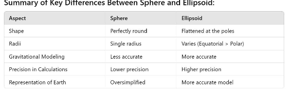 ### Conclusion:

  The use of ellipsoids as a reference body instead of a sphere is critical for achieving \*\*high precision in geodesy, navigation, and mapping\*\*. The Earth’s true shape is better approximated by an oblate spheroid (ellipsoid), accounting for its equatorial bulge and polar flattening, ensuring accuracy in \*\*geographical coordinates\*\*, \*\*gravitational modeling\*\*, and \*\*engineering applications\*\*.

  **Q27(b): explain in brief the conical projection with one standard parallel and show the procedure for the construction of the graticule for a given standard parallel .**

  **Ans:** ### \*\*Conical Projection with One Standard Parallel:\*\*

  A \*\*conical projection\*\* is a type of \*\*map projection\*\* where the surface of the Earth is projected onto a \*\*cone\*\*, which is then unwrapped into a flat surface. In the case of a \*\*conical projection with one standard parallel\*\*, the cone touches the Earth along a single line of latitude, called the \*\*standard parallel\*\*. This method is commonly used for mid-latitude regions where the map area is wider east-west than north-south, such as in \*\*topographical maps\*\* and \*\*regional charts\*\*.

  #### \*\*Key Characteristics of Conical Projection with One Standard Parallel:\*\*

1. \*\*Standard Parallel\*\*: This is the line of latitude where the cone touches the Earth. Along this line, there is no distortion in the map.
1. \*\*Distortion\*\*: Distortion increases as you move further away from the standard parallel, either towards the poles or the equator.
1. \*\*Meridians\*\*: Meridians are projected as straight lines that radiate from a central point (the pole) like the spokes of a wheel.
1. \*\*Parallels\*\*: Parallels are arcs of concentric circles centered on the pole.

   ### \*\*Procedure for Constructing a Graticule with One Standard Parallel:\*\*

   To construct a \*\*graticule\*\* (the network of latitude and longitude lines) for a conical projection with one standard parallel, follow these steps:

   #### \*\*1. Define Key Elements:\*\*

- \*\*Standard Parallel\*\* (\(\phi\_1\)): Choose a latitude (e.g., 45°N) where the cone touches the Earth. This is where scale is accurate.
- \*\*Central Meridian\*\* (\(\lambda\_0\)): This is the meridian that runs vertically through the center of the map.
- \*\*Pole\*\*: The apex of the cone, often placed at the North or South Pole.
- \*\*Scale Factor\*\*: Choose a scale factor, usually 1.0, meaning the scale is true along the standard parallel.

  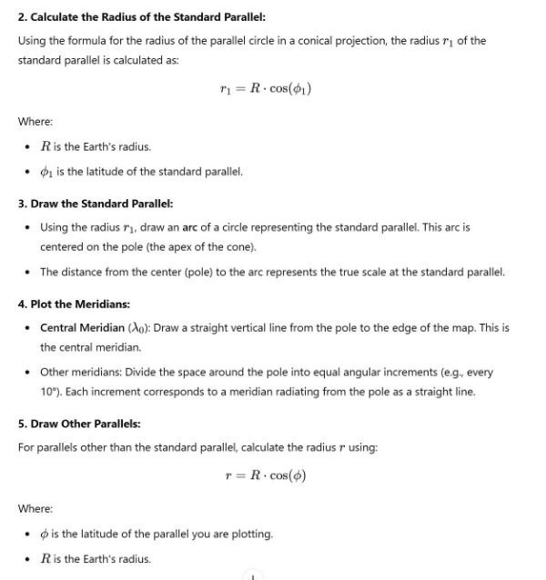

  Draw these parallels as concentric arcs centered on the pole. These parallels are increasingly distorted as you move away from the standard parallel.

  

  ### \*\*Conclusion:\*\*

  The conical projection with one standard parallel is ideal for mid-latitude areas with wide east-west expanses. The procedure for constructing a graticule involves drawing meridians as radiating lines and parallels as concentric arcs, with the standard parallel being the point of true scale. This method minimizes distortion along the standard parallel while managing distortion away from it.

  **Q28 (a) : Explain the following in brief:**

1) **Magnetic Elements and Types of changes in the same**

**Ans:** ### \*\*(I) Magnetic Elements\*\*:

Magnetic elements are the fundamental components that describe the Earth's magnetic field at any given point on the Earth's surface. These elements are used in navigation, geophysics, and for determining magnetic variations over time. The \*\*five primary magnetic elements\*\* are:

1. \*\*Magnetic Declination (D)\*\*:
- The angle between the \*\*true geographic north\*\* and the \*\*magnetic north\*\* (the direction in which the

compass needle points).

- It is measured in degrees east or west depending on whether the magnetic north is to the east or west of true

north.

2. \*\*Magnetic Inclination (I) or Dip\*\*:
- The angle that a freely suspended magnetic needle makes with the horizontal plane. It shows how steeply the

magnetic lines of force enter the Earth.

- At the magnetic equator, inclination is \*\*0°\*\*, while at the magnetic poles, it is \*\*90°\*\* (perpendicular to the

Earth's surface).

3. \*\*Horizontal Component (H)\*\*:
- The component of the Earth's magnetic field that acts in the horizontal direction. It is the strength of the magnetic

field along the Earth's surface.

4. \*\*Vertical Component (Z)\*\*:
- The component of the Earth's magnetic field that acts vertically. It represents the strength of the magnetic field in

the up-down direction, at right angles to the surface.

5. \*\*Total Magnetic Field Intensity (F)\*\*:
- The total strength of the Earth's magnetic field at a point. It is a vector quantity made up of both the horizontal

and vertical components.

- \( F = \sqrt{H^2 + Z^2} \)

\### \*\*Types of Changes in Magnetic Elements\*\*:

The Earth's magnetic field is not constant and undergoes variations over time, which can be categorized into the following types:

\#### \*\*1. Secular Variation\*\*:

- \*\*Long-term slow change\*\* in the Earth's magnetic field caused by movements within the Earth's core.
- These variations occur over decades or centuries and can cause shifts in the position of the magnetic poles, as

well as changes in magnetic declination.

- For example, the magnetic north pole has been drifting over time from Canada towards Russia.

\#### \*\*2. Diurnal Variation\*\*:

- \*\*Daily changes\*\* in the magnetic field caused by the interaction between the Earth's magnetic field and the

Sun's activity (solar winds and ionospheric currents).

- These variations are small (typically less than 1° in declination) and follow a regular pattern, with the magnetic

field being stronger during the day and weaker at night.

\#### \*\*3. Annual Variation\*\*:

- Slight \*\*seasonal variations\*\* in the Earth's magnetic field due to changes in solar radiation and the tilt of the

Earth's axis.

- The changes are much smaller compared to diurnal variations but occur on a yearly cycle.

\#### \*\*4. Irregular (Disturbance) Variation\*\*:

- \*\*Unpredictable changes\*\* in the Earth's magnetic field caused by solar storms, geomagnetic disturbances, and

other space weather events.

- \*\*Magnetic storms\*\* or \*\*substorms\*\* occur when solar wind interacts with the Earth's magnetosphere,

resulting in rapid changes in magnetic declination and intensity.

- These events can have significant impacts on navigation, communication, and electrical systems.

\#### \*\*5. Short-term Variations\*\*:

- \*\*Temporary fluctuations\*\* caused by local or regional geological conditions, such as volcanic activity or the

presence of certain minerals in the Earth's crust.

- These variations are usually local and can lead to anomalies in the magnetic field that are different from the

global trend.

\### \*\*Conclusion\*\*:

Magnetic elements describe the Earth's magnetic field through various components such as declination, inclination, and intensity. The field undergoes several types of changes, including long-term secular variations, daily diurnal shifts, and irregular disturbances due to solar and space phenomena. These changes are important for navigation, mapping, and understanding the Earth's geomagnetic environment.

2) **: Magnetic Effects of Electric current.**

**Ans:** ### \*\*(I) Magnetic Effects of Electric Current\*\*

The magnetic effects of electric current refer to the phenomenon where an electric current produces a magnetic field. This principle is fundamental to electromagnetism and underlies many technologies such as electric motors, generators, and transformers. The key aspects of the magnetic effects of electric current are as follows:

\#### \*\*1. Production of Magnetic Field:\*\*

- When an electric current flows through a conductor (such as a wire), it generates a magnetic field around it.
- The direction of the magnetic field can be determined using \*\*Ampère's Right-Hand Rule\*\*: If the thumb of the right hand points in the direction of the conventional current (from positive to negative), the curled fingers will indicate the direction of the magnetic field lines.

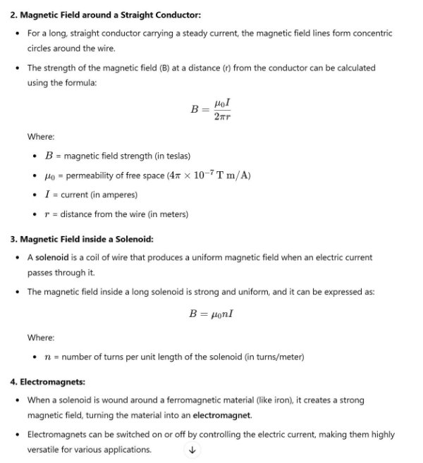

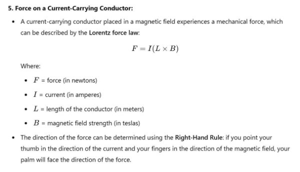

- The direction of the force can be determined using the \*\*Right-Hand Rule\*\*: if you point your thumb in the direction of the current and your fingers in the direction of the magnetic field, your palm will face the direction of the force.

  #### \*\*6. Applications:\*\*

- \*\*Electric Motors\*\*: Utilize the interaction between the magnetic field and the current-carrying conductors to produce rotational motion.
- \*\*Generators\*\*: Convert mechanical energy into electrical energy through electromagnetic induction.
- \*\*Transformers\*\*: Use the principle of magnetic induction to transfer electrical energy between circuits.
- \*\*Magnetic Levitation\*\*: Employ magnetic effects to levitate objects, as seen in maglev trains.

  ### \*\*Conclusion:\*\*

  The magnetic effects of electric current are fundamental to the field of electromagnetism. They involve the generation of magnetic fields by current-carrying conductors and the resulting forces on conductors in magnetic fields. These principles are critical for the operation of various electrical devices and systems, showcasing the interplay between electricity and magnetism.

  **Q29 : describe the various methods of separating components of co-efficient B**

  **Ans:** In the context of magnetism, the coefficient \( B \) usually refers to the magnetic flux density (or magnetic field density), which is a measure of the amount of magnetic field passing through a given area. In magnetic materials, separating the components of \( B \) can involve understanding its relationship with other magnetic quantities, such as magnetic field intensity \( H \), magnetization \( M \), and permeability \( \mu \). Below are methods to separate or analyze these components in magnetism:

  ### 1. \*\*Vector Decomposition\*\*

- \*\*Description\*\*: The magnetic flux density \( B \) can be expressed as a vector that has both magnitude and direction. It can be decomposed into its components along the x, y, and z axes in a Cartesian coordinate system.
- \*\*Application\*\*: Useful in analyzing magnetic fields in three-dimensional space, particularly in electromagnetic simulations and field calculations.

  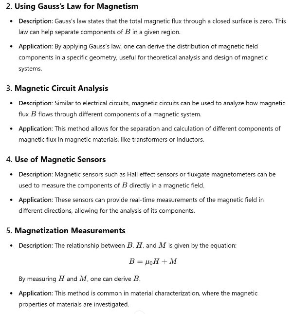

  ### 6. \*\*Magnetic Hysteresis Loop Analysis\*\*

- \*\*Description\*\*: The hysteresis loop characterizes the relationship between \( B \) and \( H \) for ferromagnetic materials. The loop provides information on the magnetization and demagnetization behavior of the material.
- \*\*Application\*\*: Analyzing the loop allows for the separation of different magnetic states and components, revealing how \( B \) varies with \( H \).

  ### 7. \*\*Numerical Simulation\*\*

- \*\*Description\*\*: Computational techniques, such as Finite Element Analysis (FEA), can be employed to simulate magnetic fields in complex geometries.
- \*\*Application\*\*: These simulations can calculate the components of \( B \) at various points in a magnetic field and analyze how they interact with materials.

  ### 8. \*\*Magnetic Resonance Imaging (MRI)\*\*

- \*\*Description\*\*: MRI techniques utilize the principles of magnetic resonance to separate and analyze different components of magnetic fields in medical applications.
- \*\*Application\*\*: MRI can visualize how \( B \) interacts with different tissues, which have varying magnetic properties.

  ### Conclusion

  Separating the components of the coefficient \( B \) in magnetism can be achieved through various methods ranging from theoretical analysis using laws of magnetism to practical measurements and simulations. These methods are essential for understanding magnetic fields in different materials and applications, aiding in the design and optimization of magnetic devices. If you have a specific application or context in mind, feel free to provide more details!

  **Q30(a) : Describe the basic principle and use of Dynamic Positioning Systems in modern shipping. Ans: #**## \*\*Dynamic Positioning Systems in Modern Shipping\*\*

  #### \*\*Basic Principle\*\*

  Dynamic Positioning (DP) systems are automated control systems used to maintain a vessel's position and heading using its own propulsion systems. The basic principle involves a combination of sensors, computer algorithms, and thrusters to counteract environmental forces such as wind, waves, and current, allowing the vessel to stay in a specific location without anchoring.

1. \*\*Sensors\*\*: Various sensors are employed to measure the vessel's position, heading, speed, and environmental conditions. Common sensors include:
   1. \*\*GPS (Global Positioning System)\*\*: Provides accurate location data.
   1. \*\*Gyroscopes and Compass\*\*: Measure the vessel's heading and orientation.
   1. \*\*Wind Sensors\*\*: Detect wind speed and direction.
   1. \*\*Current Meters\*\*: Measure the speed and direction of water currents.
1. \*\*Control System\*\*: The DP system's computer receives data from the sensors and uses algorithms to calculate the necessary thrust and direction from the propulsion systems to maintain the desired position.
1. \*\*Propulsion\*\*: The system controls multiple thrusters (either azimuth thrusters or bow/stern thrusters) to generate forces that counteract environmental effects. The precise adjustments allow the vessel to hold its position even in challenging conditions.

   #### \*\*Types of Dynamic Positioning Systems\*\*

- \*\*DP Class 1\*\*: Basic system that can maintain position under normal conditions, but lacks redundancy. If a single failure occurs, the system may lose positioning capability.
- \*\*DP Class 2\*\*: A more advanced system with redundant components that can maintain position under adverse conditions. It is designed to operate safely even if one component fails.
- \*\*DP Class 3\*\*: The most sophisticated system with full redundancy, ensuring continuous operation even with multiple failures. Used for critical operations where position accuracy is paramount.

  #### \*\*Uses of Dynamic Positioning Systems\*\*

1. \*\*Offshore Operations\*\*: DP systems are widely used in the offshore oil and gas industry for drilling, construction, and maintenance operations. They allow vessels to maintain position over subsea drilling rigs and installations without anchoring, reducing the risk of damage to the seabed.
1. \*\*Marine Research\*\*: Research vessels equipped with DP systems can maintain precise locations for scientific measurements, underwater sampling, and experiments in dynamic marine environments.

3. \*\*Cable and Pipeline Laying\*\*: DP systems enable vessels to lay cables and pipelines accurately on the seabed, essential for telecommunications and oil/gas transport.
3. \*\*Vessel Maneuvering\*\*: In ports and congested waters, DP systems assist in maneuvering vessels during loading and unloading operations, ensuring that they remain in the correct position relative to shore facilities.
3. \*\*Rescue Operations\*\*: In emergencies, DP-equipped vessels can remain in a fixed position to facilitate search and rescue operations in adverse weather or challenging sea conditions.
3. \*\*Wind Farm Installation\*\*: DP systems are used in the installation and maintenance of offshore wind farms, allowing installation vessels to position themselves accurately while working on turbines.

   #### \*\*Advantages of Dynamic Positioning Systems\*\*

- \*\*Increased Safety\*\*: Reduces the risk of accidents caused by traditional anchoring, especially in sensitive environments.
- \*\*Operational Flexibility\*\*: Allows for continuous operations regardless of weather and sea conditions.
- \*\*Efficiency\*\*: Improves the speed and efficiency of various marine operations, reducing downtime and operational costs.
- \*\*Environmental Protection\*\*: Minimizes disturbance to the seabed and marine life, especially during offshore drilling and construction activities.

  ### \*\*Conclusion\*\*

  Dynamic Positioning Systems are crucial for modern shipping, particularly in offshore operations and specialized marine activities. Their ability to maintain precise vessel positioning enhances safety, efficiency, and environmental protection in various maritime applications.

  **Q30(b): On what principle do the following function? (I) Sub-marine acoustic transponders (Ii) Split beam channel guidance systems**

  **Also state uses of these devices.**

  **Ans:** ### \*\*Principles and Uses of Submarine Acoustic Transponders and Split Beam Channel Guidance Systems\*\* #### \*\*(I) Submarine Acoustic Transponders\*\*

  \*\*Principle\*\*:

  Submarine acoustic transponders operate on the principle of \*\*acoustic signal transmission and reception\*\* through water. They utilize \*\*sound wave propagation\*\* to determine the position and communicate underwater.

1. \*\*Sound Wave Propagation\*\*: Acoustic transponders emit sound pulses that travel through water. The speed of sound in seawater is approximately 1,500 meters per second, though it can vary based on temperature, salinity, and depth.
1. \*\*Time-of-Flight Measurement\*\*: The transponder measures the time taken for an acoustic signal to travel from the vessel to the transponder and back. By calculating the time delay, the distance can be determined using the speed of sound. This is referred to as the time-of-flight (TOF) method.

   \*\*Uses\*\*:

- \*\*Underwater Navigation\*\*: Used by submarines and autonomous underwater vehicles (AUVs) for position determination.
- \*\*Seabed Mapping and Surveying\*\*: Employed in oceanographic surveys and geological studies to map underwater features.
- \*\*Remotely Operated Vehicle (ROV) Guidance\*\*: Provides positioning and navigation support for ROVs in underwater operations.
- \*\*Submarine Communications\*\*: Facilitates communication between submarines and surface vessels.

\---

\#### \*\*(II) Split Beam Channel Guidance Systems\*\*

\*\*Principle\*\*:

Split beam channel guidance systems function on the principle of \*\*beamforming\*\* and \*\*phase difference detection\*\* to determine the location and direction of targets. They split a single beam of acoustic or electromagnetic energy into multiple narrower beams.

1. \*\*Beamforming\*\*: The system generates multiple beams that can be aimed and focused on specific areas. Each beam can receive signals independently.
1. \*\*Phase Difference Detection\*\*: By analyzing the phase differences between signals received from each beam, the system can determine the angle of the target relative to the system. This allows for precise tracking and positioning.

   \*\*Uses\*\*:

- \*\*Sonar Applications\*\*: Used in underwater navigation and target detection, such as locating schools of fish or underwater objects.
- \*\*Radar Systems\*\*: Employed in air traffic control, missile guidance, and maritime surveillance for tracking and guiding vessels or aircraft.
- \*\*Marine Research\*\*: Assists in underwater exploration and monitoring of marine life and habitats.
- \*\*Navigation Systems\*\*: Helps provide precise directional guidance for vessels and underwater vehicles.

  ---

  ### \*\*Summary\*\*

- \*\*Submarine Acoustic Transponders\*\*: Rely on sound wave propagation and time-of-flight measurements for underwater positioning and communication. Commonly used in navigation, seabed surveying, and ROV guidance.
- \*\*Split Beam Channel Guidance Systems\*\*: Utilize beamforming and phase difference detection for accurate target location and tracking. Widely used in sonar, radar systems, and marine research.

  Both technologies are essential for modern maritime operations, enhancing safety, efficiency, and precision in underwater navigation and target detection.

  **Q31 why is the ship swung and compass compensated instead of being swung and deviations noted on each heading? What are acceptable deviations and why are they acceptable?**

  **Ans:** ### \*\*Q31: Ship Compass Swings and Compensation\*\* #### \*\*Why is the Ship Swung and Compass Compensated?\*\*

  \*\*Compass Swinging\*\*: The process of swinging a ship involves taking the vessel to a known heading (usually using a compass rose) and recording the compass readings for various headings. This helps in identifying deviations caused by the ship's magnetic influences.

  \*\*Compass Compensation\*\*: Instead of taking deviations on each heading, compensation is done through adjustments to the compass system, specifically by using compensating magnets or other devices. The reasons for this method include:

1. \*\*Efficiency\*\*: Swinging the ship and compensating allows for quicker adjustments to the compass without the need for multiple deviations to be recorded and corrected. This is particularly important for large vessels where maneuvering to each heading can be time-consuming.
1. \*\*Accuracy\*\*: By compensating the compass for known deviations, the compass reading can be calibrated to provide more accurate navigational data across all headings. This holistic approach minimizes errors throughout the entire range of headings rather than just at specific points.
1. \*\*Magnetic Interference\*\*: Ships are subject to magnetic interference from various sources, including metal structures and electronic equipment. By compensating the compass during a swing, these influences can be accounted for more effectively.
1. \*\*Standardization\*\*: The compensation process is a standardized method in marine navigation that adheres to best practices and regulatory requirements. It provides a systematic approach to maintaining compass accuracy.

   ---

   #### \*\*Acceptable Deviations and Their Importance\*\*

   \*\*Acceptable Deviations\*\*: The deviations of a compass are generally expressed in degrees and can vary based on the vessel's magnetic characteristics, heading, and local magnetic anomalies.

1. \*\*Standard Acceptable Limits\*\*: Acceptable deviations are typically considered to be within ±5 degrees for navigational purposes, though this may vary depending on the type of vessel and the specific regulations governing navigation in different waters.
1. \*\*Operational Factors\*\*: The acceptable range of deviations is influenced by the operational context, such as the navigational environment (e.g., coastal vs. open sea) and the specific tasks being performed (e.g., docking vs. open water navigation).
1. \*\*Safety\*\*: Acceptable deviations are critical to ensuring safe navigation. If the deviations are too large, they could lead to significant navigational errors, particularly in confined waters or during critical maneuvers.
1. \*\*Regulatory Compliance\*\*: Marine regulatory bodies often set standards for acceptable compass deviations to ensure that all vessels maintain a minimum level of navigational accuracy. Compliance with these standards is essential for safety and legal reasons.

   ### \*\*Conclusion\*\*

   Swinging the ship and compensating the compass is a more efficient and accurate method of ensuring navigational reliability compared to merely noting deviations on each heading. Acceptable deviations, typically within ±5 degrees, are crucial for safe navigation, operational efficiency, and compliance with maritime regulations. These practices help maintain the integrity of navigational systems and enhance the safety of maritime operations.

   **Q32(a) : Bearing of three shore objects when plotted on the chart produce a cocked hat. What may be possible reasons for this cocked hat and where is the most probable position of the ship ? Give reasons.**

   **Ans:** ###Cocked Hat in Nautical Navigation\*\* #### \*\*Understanding the Cocked Hat\*\*

   When the bearings of three shore objects are plotted on a nautical chart and they do not converge to a single point, but instead form a "cocked hat" (a triangular shape), it indicates that the ship’s position is uncertain. This phenomenon can occur due to various reasons.

   #### \*\*Possible Reasons for the Cocked Hat\*\*

1. \*\*Measurement Errors\*\*:
- \*\*Bearing Errors\*\*: Inaccurate readings of the bearings due to human error, equipment malfunction, or

environmental conditions (e.g., refraction, magnetic variation).

- \*\*Distance Errors\*\*: If distances to the objects are inaccurately estimated, this can lead to discrepancies in

plotting.

2. \*\*Charting Errors\*\*:
   1. \*\*Incorrect Chart Use\*\*: Using outdated or inaccurate charts can lead to misinterpretation of positions.
   1. \*\*Projection Errors\*\*: Misalignment due to the chart projection method used can distort distances and angles.
2. \*\*Environmental Influences\*\*:
- \*\*Current and Wind\*\*: Strong currents or winds can drift the vessel away from its expected position, causing the

bearings to appear as a cocked hat.

- \*\*Refraction\*\*: Atmospheric conditions can bend light and alter the apparent position of distant objects, leading

to incorrect bearings.

4. \*\*Inherent Limitations of Bearings\*\*:
- \*\*Range Limitations\*\*: Bearings taken from a distance may not accurately represent the position due to the

curvature of the earth and other physical factors.

- \*\*Non-Visible Objects\*\*: If one or more of the objects are partially obscured or not clearly visible, this can

affect the accuracy of the bearings.

\#### \*\*Most Probable Position of the Ship\*\*

- \*\*Position Within the Cocked Hat\*\*: The most probable position of the ship is typically at the centroid or the geometric center of the cocked hat area. However, it’s essential to consider the following:
1. \*\*Closer to the Side with the Narrowest Angle\*\*: The position may be more likely closer to the side of the

cocked hat that forms the narrowest angle between the bearings. This is because the tighter the angle, the greater the confidence in that particular bearing, which suggests a higher probability of the ship being in that direction.

2. \*\*Error Ellipse\*\*: If statistical analysis is performed on the bearings, the position can be further refined by

creating an error ellipse, showing the most probable position based on the distribution of the bearings.

3. \*\*Additional Bearings\*\*: To enhance position accuracy, additional bearings from other fixed points or objects

can be taken to triangulate the position more effectively.

\#### \*\*Conclusion\*\*

A cocked hat indicates navigational uncertainty due to various potential errors in measurement, charting, and environmental conditions. The most probable position of the ship is generally at the centroid of the cocked hat, leaning toward the side with the narrowest angle between bearings. By considering additional data and error analysis, navigators can refine their position estimates for better accuracy.

**Q32(b) : Bearing of three shore objects when plotted on the chart produce a cocked hat, describe a method to find the true position of the ship and to find the uncertain compass error if any. What are the main criteria to ensure a reliable fix when this method is adopted?**

**Ans:** ### Finding the True Position of the Ship and Identifying Compass Error Using Cocked Hat Method #### \*\*Method to Determine True Position of the Ship\*\*

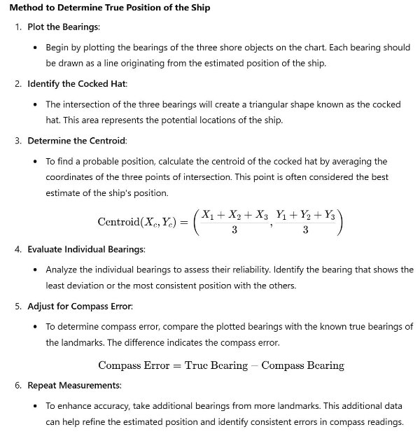

\#### \*\*Criteria for a Reliable Fix\*\*

To ensure a reliable fix when using the cocked hat method, consider the following criteria:

1. \*\*Clear Visibility\*\*:
- Ensure that the landmarks are clearly visible and identifiable. Obscured or indistinct objects can lead to

inaccurate bearings.

2. \*\*Adequate Angle Between Bearings\*\*:
- Aim for a minimum angle of at least 30 degrees between the bearings. This ensures better triangulation and

reduces uncertainty in the position fix.

3. \*\*Limitations of Bearing Ranges\*\*:
- Avoid taking bearings from excessive distances, as accuracy decreases. Bearings taken from a closer range are

generally more reliable.

4. \*\*Check Consistency\*\*:
- Verify that the bearings are consistent with previous readings. If there is significant deviation, investigate

possible errors or changing environmental conditions.

5. \*\*Compensate for Compass Errors\*\*:
- Regularly check and correct for compass errors through calibration and comparison with known true bearings.

This is essential to improve overall navigation accuracy.

6. \*\*Environmental Conditions\*\*:
- Consider environmental factors that may affect accuracy, such as wind, current, and refraction. Take note of

conditions that may distort the bearings.

7. \*\*Utilize Multiple Methods\*\*:
- Employ other methods of position fixing, such as GPS, radar, or dead reckoning, to cross-check and validate the

position determined by the cocked hat method.

\---

\### \*\*Conclusion\*\*

The cocked hat method provides a systematic approach to determining a ship’s true position while also allowing for the identification of compass errors. By following the outlined steps and adhering to the criteria for reliable fixes, navigators can enhance their situational awareness and ensure safe maritime operations.

**Q32(c ): Discuss the latest advancements in navigational equipment such as Laser beams and Infra-red techniques.**

**Ans: #**## Latest Advancements in Navigational Equipment: Laser Beams and Infrared Techniques #### \*\*1. Laser Beam Technology in Navigation\*\*

\*\*Overview\*\*:

Laser technology has emerged as a significant advancement in navigational equipment, providing high precision and accuracy in various maritime applications.

\*\*Applications\*\*:

- \*\*Laser Range Finders (LRFs)\*\*: Used for measuring distances to objects with high precision. These devices use laser beams to calculate the distance based on the time it takes for the light to return after reflecting off the target. They are increasingly used in surveying, harbor management, and offshore construction.
- \*\*Lidar (Light Detection and Ranging)\*\*: A remote sensing method that uses laser beams to measure distances. It is used for mapping coastal and underwater features, ensuring safe navigation in shallow waters, and identifying potential hazards.
- \*\*Laser-based Navigation Aids\*\*: Some advanced systems use laser beams to create virtual beacons for navigation, providing real-time positional data to vessels.

  \*\*Advantages\*\*:

- \*\*High Accuracy\*\*: Laser technology allows for precise measurements, which is crucial for navigation, especially in restricted waters.
- \*\*Speed of Measurement\*\*: Laser systems provide instantaneous readings, which can enhance decision-making in dynamic environments.
- \*\*Reduced Environmental Impact\*\*: Laser systems typically require less power and can be less intrusive than traditional methods.

  ---

  #### \*\*2. Infrared (IR) Techniques in Navigation\*\*

  \*\*Overview\*\*:

  Infrared technology utilizes infrared radiation for various navigational purposes, providing solutions that enhance situational awareness and safety at sea.

  \*\*Applications\*\*:

- \*\*Infrared Cameras\*\*: Used for night vision and surveillance, infrared cameras can detect heat signatures, allowing mariners to navigate safely in low visibility conditions. This is particularly useful for avoiding collisions with other vessels or obstacles.
- \*\*IR Range Finding\*\*: Infrared range finders measure distance using IR radiation, often employed in various marine applications such as docking, mooring, and target tracking.
- \*\*Search and Rescue Operations\*\*: Infrared technology aids in locating distressed vessels or individuals by detecting their heat signatures, significantly improving response times in emergencies.

  \*\*Advantages\*\*:

- \*\*Visibility in Low Light\*\*: Infrared systems enable navigation and monitoring in darkness or poor weather conditions, enhancing safety.
- \*\*Detection of Living Beings\*\*: IR cameras can easily detect people or animals in the water, assisting in rescue missions and reducing the risk of accidents.
- \*\*Integration with Other Systems\*\*: Infrared technology can be integrated with other navigational systems, such as radar and AIS (Automatic Identification System), for comprehensive situational awareness.

  ---

  ### \*\*Conclusion\*\*

  The latest advancements in navigational equipment, particularly through laser beam and infrared technologies, are revolutionizing maritime navigation. These technologies offer high accuracy, enhanced safety, and improved operational efficiency. As the maritime industry continues to evolve, the integration of these advanced systems will play a crucial role in enhancing navigation, ensuring safety, and reducing environmental impacts on marine operations.

  **Q33 (a): Explain the word “Cookies” as applied to computers. What advantages does a website get by using cookies in a user’s computer? What are its risks? Should cookies be allowed in one’s computer if a website requests so?**

  **Ans:** Explanation of "Cookies" in Computing

  #### \*\*What are Cookies?\*\*

  In computing, a \*\*cookie\*\* is a small piece of data that a website stores on a user's computer or device when they visit the site. These cookies are used to remember information about the user, such as login details, user preferences, or tracking information, to enhance the browsing experience. Cookies are stored as text files and are read by the website when the user visits again.

  There are two main types of cookies:

1. \*\*Session Cookies\*\*: Temporary cookies that are deleted once the browser is closed. These are used to remember temporary information, like items in a shopping cart.
1. \*\*Persistent Cookies\*\*: These cookies remain on the user's device for a set period, even after the browser is closed. They are used to remember user settings or login details across sessions.

   ---

   ### \*\*Advantages for Websites Using Cookies\*\*

1. \*\*Personalized User Experience\*\*:
- Cookies help websites remember user preferences (e.g., language, theme) and login credentials, providing a

seamless and personalized browsing experience.

2. \*\*Session Management\*\*:
- Websites use cookies to maintain user sessions, like staying logged into an account or saving items in a shopping

cart.

3. \*\*Analytics and Performance Tracking\*\*:
- Websites use cookies to track visitor behavior and usage patterns. This data helps improve site performance,

layout, and user engagement by identifying popular content and areas that need optimization.

4. \*\*Targeted Advertising\*\*:
- Cookies are commonly used in online advertising to track users' browsing habits and display relevant ads based

on their interests and past behavior (retargeting). This helps improve ad relevance and conversion rates for businesses.

\---

\### \*\*Risks of Using Cookies\*\*

1. \*\*Privacy Concerns\*\*:
- Cookies can be used to track users across different websites (third-party cookies), leading to privacy issues. This

tracking enables the creation of detailed user profiles, which can be shared or sold to advertisers without the user’s consent.

2. \*\*Security Vulnerabilities\*\*:
- If cookies are not secured properly, they can be intercepted by attackers through methods such as \*\*cross-site

scripting (XSS)\*\* or \*\*man-in-the-middle (MITM)\*\* attacks. This could allow attackers to steal sensitive information, such as login credentials.

3. \*\*Data Collection without Consent\*\*:
- Some websites may collect data through cookies without properly informing the user or obtaining explicit

consent, violating privacy regulations like GDPR (General Data Protection Regulation).

\---

\### \*\*Should Cookies Be Allowed?\*\*

Allowing cookies on your computer depends on the type of cookies, the website’s reputation, and your privacy preferences.

\#### \*\*Reasons to Allow Cookies\*\*:

1. \*\*Improved User Experience\*\*: Enabling cookies can lead to a more convenient and personalized browsing experience, especially on frequently visited websites.
1. \*\*Session Management\*\*: Some websites may not function properly without cookies (e.g., online banking, shopping carts).

   #### \*\*Reasons to Block or Limit Cookies\*\*:

1. \*\*Privacy Concerns\*\*: Blocking third-party cookies or only allowing cookies from trusted websites can prevent unnecessary tracking and data collection.
1. \*\*Security\*\*: Disabling cookies or using a browser that offers enhanced cookie management can reduce the risk of cookie-based attacks.

   #### \*\*Best Practices\*\*:

- \*\*Use Browser Settings\*\*: Most modern browsers allow users to manage cookie settings, such as enabling only first-party cookies or blocking third-party cookies.
- \*\*Clear Cookies Regularly\*\*: Periodically clearing cookies from your browser helps minimize privacy risks and removes any unwanted tracking data.
- \*\*Use Private Browsing\*\*: Incognito or private browsing mode ensures that no cookies are saved after a session, offering temporary privacy.

  ---

  ### \*\*Conclusion\*\*

  Cookies are a powerful tool for enhancing the functionality of websites and providing a personalized user experience. However, they come with privacy and security risks. It’s generally safe to allow cookies from trusted websites, but users should be cautious of third-party tracking cookies. Managing cookies through browser settings and clearing them periodically are effective ways to balance convenience and privacy.

  **Q33(b): Differentiate between Information technology and Operational technology in the Shipboard environment as advised by IMO. Give few examples of operational technology and enumerate the cyber risk to ship operations.**

  **Ans:** ### Differentiating Information Technology (IT) and Operational Technology (OT) in the Shipboard Environment

  #### \*\*1. Information Technology (IT)\*\*

- \*\*Definition\*\*: Information Technology (IT) refers to the use of systems, primarily computers and telecommunications, to store, retrieve, transmit, and manipulate data.
- \*\*Purpose\*\*: IT systems manage data and communication on the ship, typically involving administrative and business operations, such as email, cargo documentation, payroll systems, or enterprise resource planning (ERP) software.
- \*\*Characteristics\*\*:
  - \*\*Data-Centric\*\*: IT systems handle the processing, storage, and transfer of data.
  - \*\*Standardization\*\*: IT systems are often more standardized across industries and may be subject to frequent

updates.

- \*\*Cyber Risks\*\*: Vulnerable to common cyberattacks such as phishing, malware, data breaches, and network

intrusions.

`  `\*\*Examples of IT in the Shipboard Environment\*\*:

- Internet access and communication systems (e.g., satellite communications).
- Administrative software for managing cargo, crew documentation, and inventory.
- Shipboard network systems (e.g., Local Area Network, WAN for data transfer).

\#### \*\*2. Operational Technology (OT)\*\*

- \*\*Definition\*\*: Operational Technology (OT) refers to hardware and software that detects or causes changes through direct monitoring and control of physical devices, processes, and events. OT systems are essential for the operation of shipboard equipment and systems that ensure the vessel’s safe and efficient running.
- \*\*Purpose\*\*: OT manages the control and monitoring of machinery and equipment critical to ship operations, such as engine room systems, navigation systems, and safety management systems.
- \*\*Characteristics\*\*:
  - \*\*Machine-Centric\*\*: OT involves the control of physical processes and equipment.
  - \*\*Real-Time Operation\*\*: OT systems are time-sensitive and are designed for safety and operational continuity.
  - \*\*Cyber Risks\*\*: OT systems are becoming increasingly interconnected with IT systems, making them

vulnerable to cyberattacks targeting critical operations.

`  `\*\*Examples of OT in the Shipboard Environment\*\*:

- \*\*Bridge Navigation Systems\*\*: Radar, Electronic Chart Display and Information System (ECDIS), Automatic

Identification System (AIS).

- \*\*Engine Control and Monitoring Systems\*\*: Engine Room Management Systems (ERMS), remote monitoring,

and automation systems.

- \*\*Ballast Water Management System\*\*: Monitors and controls ballast water treatment.
- \*\*Fire and Safety Systems\*\*: Automatic fire detection and suppression systems.
- \*\*Cargo Handling Systems\*\*: Systems used to control and monitor cargo operations.

\### Cyber Risks to Ship Operations

As vessels adopt more connected and automated systems, the risk of cyberattacks increases, particularly due to the convergence of IT and OT systems on board. Some of the significant cyber risks include:

1. \*\*Ransomware Attacks\*\*:
- Attackers can infiltrate IT systems and lock critical data, potentially impacting both business and operational

functions. This could disrupt cargo operations or even lead to the malfunction of critical OT systems.

2. \*\*Navigational System Manipulation\*\*:
- Attacks on OT systems such as GPS or ECDIS could lead to incorrect positioning data or cause vessels to veer

off course, potentially leading to groundings, collisions, or piracy.

3. \*\*Engine and Machinery Disruption\*\*:
- Cyberattacks could target systems controlling the ship's propulsion, engine room monitoring, or fuel

management, leading to system failures, overheating, or damage to critical machinery.

4. \*\*Data Theft or Manipulation\*\*:
- Sensitive data related to cargo, crew, or ship management can be stolen or manipulated. This can lead to financial

loss, legal liabilities, or threats to personal safety (e.g., piracy).

5. \*\*Communication System Sabotage\*\*:
- Interruption of communication systems could impair the ability of ship personnel to contact shore management,

leading to delays in decision-making and crisis management.

6. \*\*Unauthorized Access\*\*:
- Hackers gaining unauthorized access to OT systems could manipulate ship operations, causing damage to

equipment, loss of control, or hazardous conditions onboard.

\### IMO's Guidelines on Cyber Risk Management

The \*\*International Maritime Organization (IMO)\*\*, through \*\*Resolution MSC.428(98)\*\*, mandates that cyber risks be appropriately addressed in the Safety Management System (SMS) of ships. The resolution outlines the following principles for mitigating cyber risks:

1. \*\*Identify\*\*: Understand and identify vulnerabilities and critical systems that need protection.
1. \*\*Protect\*\*: Implement protective measures and defenses for both IT and OT systems.
1. \*\*Detect\*\*: Implement monitoring systems to detect unauthorized access or anomalies.
1. \*\*Respond\*\*: Develop contingency plans to respond to cyber incidents effectively.
1. \*\*Recover\*\*: Establish recovery processes to restore systems after an attack.

\### Conclusion

In the shipboard environment, IT and OT serve different but interconnected functions. IT systems manage data and communications, while OT systems are critical for controlling and monitoring physical ship operations. As ships become more digitally connected, cyber risks to both IT and OT systems increase, making it essential to implement robust cyber risk management strategies as advised by IMO.
